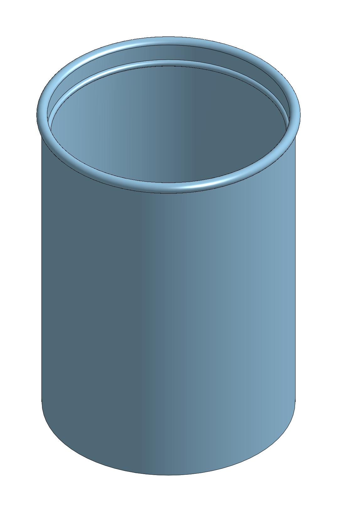

.. role:: hidden

==============================
elephant cup: the conversation
==============================

The session of 2026-09-30 on branch ``elephant``, from Mike's first message to Claude's answer to *Please take a note of this time and message.* Every time, message, tool call and token count below is read from Claude Code's transcript of the session by ``make_report.py``. Times are Eastern Daylight Time.

   The cup, isometric, rendered by Onshape from the named version “cup, 12 fl oz with 1 fl oz headroom”.

Where the work is
=================

.. list-table::
   :widths: 28 72
   :class: summary

   * - Onshape document
     - ``elephant cup``, id ``9a8f8614c04120c0a8f85448``
   * - Workspace
     - ``Main``, id ``2ba8fa28d04af5579c057984``
   * - Part Studio
     - ``cup``, element ``993e7039919edc785df99d49``, one part ``Cup``
   * - Named version
     - “cup, 12 fl oz with 1 fl oz headroom”, id ``1f0631a4e8285baf2d33f860``
   * - Version link
     - https://cad.onshape.com/documents/9a8f8614c04120c0a8f85448/v/1f0631a4e8285baf2d33f860
   * - Git
     - branch ``elephant``, commit ``1fba2b3``, pushed to ``origin``
   * - Repository record
     - ``.docs/experiments/2026-09-30-elephant-cup/README.md``

The session
===========

.. list-table::
   :widths: 28 72
   :class: summary

   * - Model
     - Claude Opus 5.5 (``claude-opus-5-5``), effort ``high``, both as the transcript records them
   * - Started
     - 2026-09-30 13:17:12 EDT
   * - Ended
     - 2026-09-30 16:18:46 EDT
   * - Elapsed
     - 3 h 1 min 34 s, most of it waiting on Mike between messages
   * - Claude working
     - 12 min 39 s, the sum of the turn durations
   * - Messages from Mike
     - 9
   * - Tool calls
     - 58
   * - Replies from the model
     - 55
   * - Output tokens
     - 49,545, of which 19,312 were thinking
   * - Input tokens, new
     - 325,697 (112 uncached, 325,585 written to the cache)
   * - Input tokens, from cache
     - 7,423,351
   * - Input tokens, all
     - 7,749,048

Each reply sends the whole conversation so far as input, so the input total counts the same early context once per reply; most of it is served from the cache. The counts cover the main session only. No subagent was started.

The timeline
============

One section per message from Mike. Each opens with his message, then Claude's tool calls and messages in the order they happened. What came back is the last line a shell command printed, or the first line of an error, cut short where it is long. Paths under the session's temporary directory are shortened to ``session-tmp/``.

13:17:12 EDT
------------

*Working time 11 s; 1 reply; 978 output tokens.*

.. admonition:: Mike, 13:17:12
   :class: from-mike

   hi

.. admonition:: Claude, 13:17:23
   :class: from-claude

   Hi Mike.

   **The Constitution (v8.1.0).** It governs all work here and overrides ``CLAUDE.md`` and any other ad-hoc guidance. In brief:

   - **Working rules.**

     - Think before acting, and ask when unsure.
     - Keep changes simple, and touch only what the task needs.
     - Read what exists before adding to it.
     - Fail loudly, and never claim a check I didn't run.
     - Keep code in evergreen paths free of version names.
     - Give work units dotted names, not numbers.
     - Checkpoint long tasks.
     - Update the docs in the same commit as the change.

   - **Plans.** ``active-plan.md`` points at the plan in force. A plan stays active until you and I agree it's finished, and then the pointer is emptied.
   - **Quality gates.** "Done" means the gates are green and I watched them go green. ``ninja check`` covers spelling, capture-out and imports. The rest (steps reproduce, names are real, links resolve, model inspected, floor and ceiling, recovery point, prose style) are checked by hand. For a run, we agree which gates apply before it starts.
   - **Evidence.** Build it before writing it. Look at the model in views that show each feature, and compare it with its source. Pictures beat measurements.
   - **Branches and publishing.** Work on a feature branch and push only when you ask. Only the live draft gets written to. A cited Onshape workspace is not moved.
   - **Prose.** The rule goes in the bold title, and each thing is said once. Every quantity carries its unit. RFC 2119 words appear only where obligations are set. Student text is at grade 8 or below.
   - **Skills and memories.** I invoke a skill before the work it covers starts, and I read the memories that bear on the task.

   **Where things stand.** ``active-plan.md`` still points at draft9p5. Every tab and ring item is checked off except the per-tab versions. Those were not published because a version covers the whole document; the recovery point is ``the robot, all ten tabs``. The plan stays active until we agree it's finished, so you might want to decide whether to close it.

   There's no task yet, so which parts apply comes later. I agree to follow the Constitution, so help me 'bot. What would you like to work on?

13:19:29 EDT
------------

*Working time 11 s; 2 replies; 592 output tokens.*

.. admonition:: Mike, 13:19:29
   :class: from-mike

   can you create a new branch fr an experiment cab project?

.. list-table::
   :header-rows: 1
   :widths: 10 12 50 28
   :class: actions

   * - Time
     - Tool
     - What was done
     - What came back
   * - 13:19:33
     - Bash
     - List branches and compare main2 to main

       ``git branch -a --sort=-committerdate | head -15 && git log --oneline -1 main && git rev-list --count main..main2`` :hidden:`codespell:ignore`
     - 105 :hidden:`codespell:ignore`

.. admonition:: Claude, 13:19:40
   :class: from-claude

   Yes, I can. I need two things from you first:

   - **What the experiment is.** I read "cab" as CAD, but I'd rather check than guess. It also sets the branch name. ``experiment-<topic>`` would match the plain names you use now, like ``main2``.
   - **Which branch to start from.** I'd use ``main2``. It's 105 commits ahead of ``main`` and has all of draft9p5. ``main`` is still at Constitution 5.8.0.

   Also, draft9p5 is still the active plan. If this experiment is new work, we should agree to close draft9p5, or point ``active-plan.md`` at the new plan, before any of its work starts.

13:20:40 EDT
------------

*Working time 6 s; 2 replies; 231 output tokens.*

.. admonition:: Mike, 13:20:40
   :class: from-mike

   yes, CAD, branch is off of main2, and we cak=n call it elephant

.. list-table::
   :header-rows: 1
   :widths: 10 12 50 28
   :class: actions

   * - Time
     - Tool
     - What was done
     - What came back
   * - 13:20:42
     - Bash
     - Create and switch to branch elephant from main2

       ``git switch -c elephant main2 && git status -sb | head -1`` :hidden:`codespell:ignore`
     - ## elephant :hidden:`codespell:ignore`

.. admonition:: Claude, 13:20:46
   :class: from-claude

   I created the branch ``elephant`` from ``main2`` and switched to it. The working tree is clean. It's only local: I haven't pushed it, and I'll wait until you ask.

   ``active-plan.md`` still points at draft9p5, so before any experiment work starts we need to decide whether to close that plan or point at a new one.

13:24:00 EDT
------------

*Working time 40 s; 3 replies; 3,543 output tokens.*

.. admonition:: Mike, 13:24:00
   :class: from-mike

   in a new scratch on shape document cad using the api, create a cup to hold 12 ounces of water and a one ounce for liquid over fill. dont cad this until we agree on final design

.. list-table::
   :header-rows: 1
   :widths: 10 12 50 28
   :class: actions

   * - Time
     - Tool
     - What was done
     - What came back
   * - 13:24:15
     - Skill
     - Loaded the modeling-practice skill
     -  
   * - 13:24:17
     - Bash
     - Read the memories that bear on designing a model

       ``cat memory/cad-models-need-design-intent.md memory/draw-it-and-print-it.md memory/design-intent-is-not-sacred.md memory/numbers-carry-units.md`` :hidden:`codespell:ignore`
     - hundredths of a millimeter, even where the value is exact inside \`make\_plans.py\`. :hidden:`codespell:ignore`
   * - 13:24:22
     - Bash
     - Compute cup inner dimensions for 12 and 13 US fl oz

       ``python3 -c "`` :hidden:`codespell:ignore`
     - d for brim at 100 69.96459355365411 :hidden:`codespell:ignore`

.. admonition:: Claude, 13:24:40
   :class: from-claude

   Here's a proposed design. I haven't touched Onshape and won't until we agree on it.

   .. rubric:: Proposed cup

   **The cup's size comes from the volume you want.** You set the volume and the inside diameter, and the heights are calculated from them. Change the volume and the cup gets taller on its own.

   .. list-table::
      :header-rows: 1
      :class: summary

      * - Variable
        - Value
        - Meaning
      * - ``#fill``
        - 12 fl oz (354.88 cm³)
        - Water it holds up to the fill line
      * - ``#overfill``
        - 1 fl oz (29.57 cm³)
        - Space between the fill line and the top edge
      * - ``#innerD``
        - 70 mm
        - Inside diameter
      * - ``#wall``
        - 2 mm
        - Side wall thickness
      * - ``#floor``
        - 3 mm
        - Bottom thickness
      * - ``#fillH``
        - ``#fill / (π (#innerD/2)²)`` = 92.2 mm
        - Fill line height, above the inside floor
      * - ``#brimH``
        - ``(#fill + #overfill) / (π (#innerD/2)²)`` = 99.9 mm
        - Inside depth up to the top edge

   That makes the outside 74 mm across and about 102.9 mm tall. The 1 fl oz of extra space is 7.7 mm of wall above the fill line.

   **How it's built.** One sketch on the Front plane: a half cross-section drawn against the origin, dimensioned only with the variables above, and fully defined. A revolve around the vertical axis turns it into the cup. A straight-sided cup is the simplest shape where "height from volume" is one exact formula.

   .. rubric:: What I need you to decide

   - **US or imperial ounces?** I assumed US (29.57 mL). Imperial (28.41 mL) makes every height about 4 % smaller.
   - **How is the fill line shown?** It could be a small ridge on the inside wall at ``#fillH``, a groove on the outside, or nothing (the math is the only line).
   - **Straight sides or tapered?** A taper lets cups stack. The catch: its fill height comes from solving a cubic, so it can't be a simple Onshape expression and would have to be computed outside the model.
   - **Handle, and rounded rim?** Neither is in the design yet.
   - **Will you print it?** If so, I'll keep 2 mm walls and a flat bottom. I won't change the shape to suit the printer.
   - **Document name.** For example ``elephant cup``. Your API permission for draft9p5 named that document only, so I'm reading your message as permission to build this new document over the API, under whatever name you pick.

   **Two things I'll check when I build it, not before.** Whether an Onshape variable can take a volume unit like fl oz; if not, I'll write the volume in mm³. And whether a revolve's height can be driven by an expression that divides one variable by another.

   **About the plan file.** ``active-plan.md`` still points at draft9p5. Once we agree on the design, I suggest writing it into a plan under ``.docs/experiments/runs/`` and pointing ``active-plan.md`` at that instead. Shall I close draft9p5 then?

13:27:53 EDT
------------

*Working time 29 s; 1 reply; 2,700 output tokens.*

.. admonition:: Mike, 13:27:53
   :class: from-mike

   us ounces, a ridge line is great idea, document name is great too, make wall thickness 1.5 mm. no handle, lip style rim at the top

.. admonition:: Claude, 13:28:22
   :class: from-claude

   Here's the full design with your changes. Nothing is built yet.

   .. rubric:: Cup design, for your sign-off

   .. list-table::
      :header-rows: 1
      :class: summary

      * - Variable
        - Value
        - Meaning
      * - ``#fill``
        - 12 fl oz (354.88 cm³)
        - Water up to the fill line
      * - ``#overfill``
        - 1 fl oz (29.57 cm³)
        - Space between the fill line and the top edge
      * - ``#innerD``
        - 70 mm
        - Inside diameter
      * - ``#wall``
        - 1.5 mm
        - Side wall
      * - ``#floor``
        - 3 mm
        - Bottom
      * - ``#lipR``
        - 1.5 mm
        - Radius of the round lip at the top
      * - ``#ridgeR``
        - 1 mm
        - Radius of the fill-line ridge
      * - ``#fillH``
        - ``#fill / (π (#innerD/2)²)`` = 92.2 mm
        - Center of the ridge, above the inside floor
      * - ``#brimH``
        - ``(#fill + #overfill) / (π (#innerD/2)²)`` = 99.9 mm
        - Top of the lip, above the inside floor

   - **Shape.** Straight sides, no handle. Outside wall 73 mm across; the lip sticks out to 76 mm. Overall height 102.9 mm. The bottom of the cup sits on the origin, standing on the Top plane.
   - **Lip.** A round bead of radius ``#lipR`` at the top of the wall. It lines up with the inside wall and sticks out 3 mm past it, so the wall's outside gets a 1.5 mm step up to the bead. Its top is at ``#brimH``, so the cup overflows exactly at 13 fl oz.
   - **Ridge.** A half-round bump of radius ``#ridgeR`` running around the inside wall, centered at ``#fillH``. Water filled to the middle of the ridge is 12 fl oz.
   - **Construction.** One sketch on the Front plane: the half cross-section, with the lip and ridge as arcs, tied to the origin and the vertical axis, using only the variables above, and fully defined. Then one revolve around that axis.
   - **Two small errors I'd leave alone:**

     - The ridge takes up about 0.17 cm³ below the fill line (0.05 % of 12 fl oz).
     - The lip's curve adds about 0.1 cm³ at the top.

   Both are far smaller than you can pour to. If you'd rather cancel them out in the formulas, say so.

   You didn't answer about printing or closing draft9p5, so I'm taking both as no. The cup won't be shaped around a printer. ``active-plan.md`` keeps pointing at draft9p5 until you say otherwise, so this cup gets no active plan.

   If you agree, next I'll invoke the ``onshape`` skill, create ``elephant cup``, read its name back before the first write, and build it.

13:29:33 EDT
------------

*Working time 10 min 35 s; 40 replies; 40,285 output tokens.*

.. admonition:: Mike, 13:29:33
   :class: from-mike

   i agree please proceed

.. list-table::
   :header-rows: 1
   :widths: 10 12 50 28
   :class: actions

   * - Time
     - Tool
     - What was done
     - What came back
   * - 13:29:35
     - Skill
     - Loaded the onshape skill
     -  
   * - 13:29:37
     - Bash
     - Read Onshape API memories and list existing REST scripts

       ``cat memory/onshape-api-via-browser-session.md memory/agent-browser-borrows-its-session.md memory/onshape-bodydetails-beats-featurescript.md; ls .docs…`` :hidden:`codespell:ignore`
     - socket\_spring.py :hidden:`codespell:ignore`
   * - 13:29:42
     - Bash
     - Read document-creation scripts and the session helper

       ``cd .docs/experiments/runs/2026-09-18-draft9p5/scripts && cat a0_create.py a0_units.py; sed -n 1,80p ../../../../../src/stickbot/onshape_session.py; g…`` :hidden:`codespell:ignore`
     - 616\:def solid\_boxes(page\: Page, doc\: Doc) -\> list\[tuple\[list\[float\], list\[float\]\]\]\: :hidden:`codespell:ignore`
   * - 13:29:45
     - Bash
     - Read the session helper's API and feature builders

       ``cd ~/projects/first/2027/stick-e-bot && sed -n 150,640p src/stickbot/onshape_session.py`` :hidden:`codespell:ignore`
     - "delete\_feature", :hidden:`codespell:ignore`
   * - 13:29:50
     - Bash
     - Read the build script header and list results

       ``sed -n 1,60p .docs/experiments/runs/2026-09-18-draft9p5/scripts/b_build.py; ls .docs/experiments/runs/2026-09-18-draft9p5/results/ | head -50`` :hidden:`codespell:ignore`
     - variable-first-reader.md :hidden:`codespell:ignore`
   * - 13:29:52
     - Bash
     - Show the parent record's first features as JSON templates

       ``python3 - <<'EOF'`` :hidden:`codespell:ignore`
     - \---- :hidden:`codespell:ignore`
   * - 13:30:00
     - Bash
     - Extract a revolve profile sketch and its constraints as a template

       ``python3 - <<'EOF'`` :hidden:`codespell:ignore`
     - \[{"type"\: 145, "typeName"\: "BTMParameterEnum", "message"\: {"enumName"\: "ExtendedToolBodyType", "value"\: "SOLI… :hidden:`codespell:ignore`

.. admonition:: Claude, 13:30:05
   :class: from-claude

   I'm reading the draft9p5 build scripts to reuse their REST feature format (variables, sketch constraints, revolve) before writing the cup builder. Nothing has been created in Onshape yet.

.. list-table::
   :header-rows: 1
   :widths: 10 12 50 28
   :class: actions

   * - Time
     - Tool
     - What was done
     - What came back
   * - 13:30:08
     - Bash
     - Show revolve axis, dimension and variable JSON details

       ``python3 - <<'EOF'`` :hidden:`codespell:ignore`
     - {"featureType"\: "assignVariable", "featureId"\: "FXvcwPOAOM0kail\_0", "name"\: "###name = #value", "parameters"\:… :hidden:`codespell:ignore`
   * - 13:30:15
     - Bash
     - Search for how sketch entities are referenced by geometry id

       ``grep -rn "deterministicId\|sketchEntityId\|SketchUniqueIds\|geometryIds\b" src/stickbot/*.py .docs/experiments/runs/2026-09-18-draft9p5/scripts/*.py …`` :hidden:`codespell:ignore`
     - 258\:  Derived will not "just take everything" — every part must be named by its \*\*\`geometryId\`\*\*, :hidden:`codespell:ignore`
   * - 13:30:18
     - Bash
     - Read the API doc on geometry ids and constraints

       ``sed -n 80,200p .docs/onshape-api.md`` :hidden:`codespell:ignore`
     - regenerated fine at creation and only broke later, when a metadata write triggered a rebuild. :hidden:`codespell:ignore`
   * - 13:31:16
     - Bash
     - Check running browsers, sketch reader, and experiments folder

       ``ps -eo pid,etime,command | grep -E "agent_browser|browser.py|remote-debugging-port" | grep -v grep | head; sed -n 1,40p src/stickbot/read_sketches.py…`` :hidden:`codespell:ignore`
     - taught-path.md :hidden:`codespell:ignore`
   * - 13:31:20
     - Bash
     - Read how the agent browser is launched

       ``sed -n 1,30p src/stickbot/agent_browser.py`` :hidden:`codespell:ignore`
     - \""" :hidden:`codespell:ignore`
   * - 13:31:23
     - Bash
     - Launch the headless agent browser, borrowing the session (in the background)

       ``uv run python -m stickbot.agent_browser`` :hidden:`codespell:ignore`
     - Command running in background with ID\: br4x7q80b. Output is being written to\: session-tmp/tasks/br4x7q80b.out… :hidden:`codespell:ignore`

.. admonition:: Claude, 13:31:27
   :class: from-claude

   I'm starting the agent browser and writing the cup build script. It goes in ``.docs/experiments/2026-09-30-elephant-cup/``.

.. list-table::
   :header-rows: 1
   :widths: 10 12 50 28
   :class: actions

   * - Time
     - Tool
     - What was done
     - What came back
   * - 13:31:27
     - Bash
     - Read the agent browser's launch output

       ``sleep 20; cat session-tmp/tasks/br4x7q80b.output`` :hidden:`codespell:ignore`
     - \[exited with code 1\] :hidden:`codespell:ignore`
   * - 13:31:51
     - Bash
     - Check the signed-in browser and sign it back in

       ``uv run python -m stickbot.browser --status; uv run python -m stickbot.browser --signin`` :hidden:`codespell:ignore`
     - signed in as Mike Stitt :hidden:`codespell:ignore`
   * - 13:32:19
     - Bash
     - Relaunch the agent browser with a fresh session (in the background)

       ``uv run python -m stickbot.agent_browser`` :hidden:`codespell:ignore`
     - Command running in background with ID\: b0i4m4ekf. Output is being written to\: session-tmp/tasks/b0i4m4ekf.out… :hidden:`codespell:ignore`
   * - 13:32:31
     - Write
     - Wrote a file

       ``.docs/experiments/2026-09-30-elephant-cup/create.py`` :hidden:`codespell:ignore`
     -  
   * - 13:32:32
     - Bash
     - Check the agent browser came up signed in

       ``sleep 5; cat session-tmp/tasks/b0i4m4ekf.output`` :hidden:`codespell:ignore`
     - (Bash completed with no output) :hidden:`codespell:ignore`
   * - 13:32:41
     - Bash
     - Wait for the agent browser and read its status

       ``for i in 1 2 3 4 5 6; do sleep 5; if [ -s session-tmp/tasks/b0i4m4ekf.output ]; then break; fi; done; cat session-tmp/tasks/b0i4m4ekf.output; uv run …`` :hidden:`codespell:ignore`
     - agent browser is up; signed in as Mike Stitt :hidden:`codespell:ignore`
   * - 13:33:15
     - Bash
     - Create the elephant cup document and record its ids

       ``uv run python .docs/experiments/2026-09-30-elephant-cup/create.py`` :hidden:`codespell:ignore`
     - wrote .docs/experiments/2026-09-30-elephant-cup/ids.json :hidden:`codespell:ignore`

.. admonition:: Claude, 13:33:52
   :class: from-claude

   Created ``elephant cup`` with its Part Studio renamed to ``cup``. Next I'm writing the builder: variables, one constrained sketch, one revolve, with a read-back after each write.

.. list-table::
   :header-rows: 1
   :widths: 10 12 50 28
   :class: actions

   * - Time
     - Tool
     - What was done
     - What came back
   * - 13:33:53
     - Bash
     - Find how variable features were posted before

       ``grep -n "def variable\|assignVariable\|anyValue\|lengthValue\|variableType" .docs/experiments/runs/2026-09-18-draft9p5/scripts/*.py src/stickbot/*.py…`` :hidden:`codespell:ignore`
     - .docs/experiments/runs/2026-09-18-draft9p5/scripts/b\_build.py\:500\:                shown = m.get("name") if m.… :hidden:`codespell:ignore`
   * - 13:34:04
     - Bash
     - Search for how full definition of a sketch was checked

       ``grep -rln "fully.defined\|underConstrained\|UNDERCONSTRAINED\|under-defined" src/stickbot/ .docs/experiments/runs/2026-09-18-draft9p5/scripts/ .docs/…`` :hidden:`codespell:ignore`
     - .docs/robot-build-plan.md :hidden:`codespell:ignore`
   * - 13:34:07
     - Bash
     - Read how fully-defined status is detected

       ``grep -n -i -B2 -A6 "fully.defined\|under-defined" src/stickbot/onshape_screen.py .docs/onshape-api.md .docs/verification-lessons.md | head -80`` :hidden:`codespell:ignore`
     - .docs/onshape-api.md-176-For the body's front face (normal −Y), sketch-local \`(u, v)\` mapped \*\*directly to wo… :hidden:`codespell:ignore`
   * - 13:35:11
     - Write
     - Wrote a file

       ``.docs/experiments/2026-09-30-elephant-cup/build.py`` :hidden:`codespell:ignore`
     -  
   * - 13:35:14
     - Bash
     - Build the cup's variables, sketch and revolve with read-backs

       ``uv run python .docs/experiments/2026-09-30-elephant-cup/build.py 2>&1 | tail -40`` :hidden:`codespell:ignore`
     - ring 1\: 11 features, state OK, rollback 11 :hidden:`codespell:ignore`

.. admonition:: Claude, 13:36:01
   :class: from-claude

   All eleven features are in and every one reads back OK. Next I'm checking what the model actually measures: variable values, where the sketch landed, and the cup's faces and volume.

.. list-table::
   :header-rows: 1
   :widths: 10 12 50 28
   :class: actions

   * - Time
     - Tool
     - What was done
     - What came back
   * - 13:36:12
     - Write
     - Wrote a file

       ``.docs/experiments/2026-09-30-elephant-cup/verify.py`` :hidden:`codespell:ignore`
     -  
   * - 13:36:14
     - Bash
     - Measure the built cup's variables, sketch and faces

       ``uv run python .docs/experiments/2026-09-30-elephant-cup/verify.py session-tmp/scratchpad/verify.json 2>&1 | tail -40`` :hidden:`codespell:ignore`
     - part volume\: 47274.390 mm^3 :hidden:`codespell:ignore`
   * - 13:36:36
     - Bash
     - Compute capacities and solid volume from the measured faces

       ``python3 - <<'EOF'`` :hidden:`codespell:ignore`
     - analytic solid 47274.5 mm3 vs measured 47274.390 :hidden:`codespell:ignore`
   * - 13:36:57
     - Write
     - Wrote a file

       ``.docs/experiments/2026-09-30-elephant-cup/drive.py`` :hidden:`codespell:ignore`
     -  
   * - 13:36:58
     - Bash
     - Name the part and run the drive test on the inside diameter

       ``uv run python .docs/experiments/2026-09-30-elephant-cup/drive.py 2>&1 | tail -20`` :hidden:`codespell:ignore`
     - inside r 35.0 mm, floor z 3.0 mm, ridge centre z 95.2143 mm, lip top z 102.8989 mm; cylinder to the ridge cen… :hidden:`codespell:ignore`
   * - 13:37:14
     - Bash
     - List GUI helpers and find a shadedviews caller

       ``grep -n "^def " src/stickbot/onshape_gui.py | head -80; grep -rn "shadedviews" src/stickbot/*.py .docs/experiments/runs/2026-09-18-draft9p5/scripts/*…`` :hidden:`codespell:ignore`
     - 776\:def zoom\_to(page, target\: float, at\_px=None, tries\: int = 4)\: :hidden:`codespell:ignore`
   * - 13:37:23
     - Bash
     - Read the GUI helpers for opening, framing and tree rows

       ``sed -n 40,100p src/stickbot/onshape_gui.py; sed -n 223,250p src/stickbot/onshape_gui.py; sed -n 557,580p src/stickbot/onshape_gui.py; sed -n 676,724p…`` :hidden:`codespell:ignore`
     - def one\_camera(page, tries\: int = 3)\: :hidden:`codespell:ignore`
   * - 13:37:36
     - Write
     - Wrote a file

       ``.docs/experiments/2026-09-30-elephant-cup/look.py`` :hidden:`codespell:ignore`
     -  
   * - 13:37:37
     - Bash
     - Render the cup and screenshot its sketch in the GUI

       ``uv run python .docs/experiments/2026-09-30-elephant-cup/look.py session-tmp/scratchpad/look 2>&1 | tail -20`` :hidden:`codespell:ignore`
     - states not OK after leaving the sketch\: none :hidden:`codespell:ignore`

.. admonition:: Claude, 13:38:06
   :class: from-claude

   The renders and the sketch screenshot are taken. I'm opening them now to look at the model.

.. list-table::
   :header-rows: 1
   :widths: 10 12 50 28
   :class: actions

   * - Time
     - Tool
     - What was done
     - What came back
   * - 13:38:08
     - Read
     - Read a file

       ``session-tmp/scratchpad/look/cup-isometric.png`` :hidden:`codespell:ignore`
     -  
   * - 13:38:09
     - Read
     - Read a file

       ``session-tmp/scratchpad/look/cup-front.png`` :hidden:`codespell:ignore`
     -  
   * - 13:38:11
     - Read
     - Read a file

       ``session-tmp/scratchpad/look/cup-profile-sketch.png`` :hidden:`codespell:ignore`
     -  
   * - 13:38:23
     - Bash
     - Count under-defined blue pixels and crop the lip region

       ``uv run python - <<'EOF'`` :hidden:`codespell:ignore`
     - blue px 3319 x range 21 1594 y range 3 997 :hidden:`codespell:ignore`
   * - 13:38:29
     - Bash
     - Count blue sketch pixels on the canvas only

       ``uv run python - <<'EOF'`` :hidden:`codespell:ignore`
     - blue px on canvas 0 :hidden:`codespell:ignore`
   * - 13:38:31
     - Read
     - Read a file

       ``session-tmp/scratchpad/look/crop-top.png`` :hidden:`codespell:ignore`
     -  
   * - 13:38:37
     - Read
     - Read a file

       ``session-tmp/scratchpad/look/cup-bottom.png`` :hidden:`codespell:ignore`
     -  
   * - 13:38:45
     - Write
     - Wrote a file

       ``.docs/experiments/2026-09-30-elephant-cup/units.py`` :hidden:`codespell:ignore`
     -  
   * - 13:38:46
     - Bash
     - Set the cup document's workspace units to millimeters

       ``uv run python .docs/experiments/2026-09-30-elephant-cup/units.py 2>&1 | tail -8`` :hidden:`codespell:ignore`
     - read back from a fresh dialog\: Millimeter, 0.12345 :hidden:`codespell:ignore`
   * - 13:38:59
     - Bash
     - Read draft9p5's version-publishing script

       ``sed -n 1,200p .docs/experiments/runs/2026-09-18-draft9p5/scripts/publish_version.py | grep -v "^$" | head -70`` :hidden:`codespell:ignore`
     - sys.exit(main(sys.argv\[1\])) :hidden:`codespell:ignore`

.. admonition:: Claude, 13:39:03
   :class: from-claude

   The units now read in millimeters. Next I'm publishing a named version as the recovery point, then writing the record.

.. list-table::
   :header-rows: 1
   :widths: 10 12 50 28
   :class: actions

   * - Time
     - Tool
     - What was done
     - What came back
   * - 13:39:08
     - Bash
     - Publish and read back a named version of the cup

       ``cat > .docs/experiments/2026-09-30-elephant-cup/version.py <<'EOF'`` :hidden:`codespell:ignore`
     - } :hidden:`codespell:ignore`
   * - 13:39:33
     - Write
     - Wrote a file

       ``.docs/experiments/2026-09-30-elephant-cup/README.md`` :hidden:`codespell:ignore`
     -  
   * - 13:39:34
     - Bash
     - Run the repository's mechanical checks

       ``ninja check 2>&1 | tail -25`` :hidden:`codespell:ignore`
     - \[4/5\] no tracked python edits sys.path :hidden:`codespell:ignore`
   * - 13:39:42
     - Bash
     - Run ninja check and capture its exit status and step lines

       ``ninja check > session-tmp/scratchpad/check.txt 2>&1; echo "exit $?"; grep -n "^\[\|FAIL\|error\|elephant" session-tmp/scratchpad/check.txt | head -20`` :hidden:`codespell:ignore`
     - 81\:\[4/5\] no tracked python edits sys.path :hidden:`codespell:ignore`
   * - 13:39:50
     - Bash
     - Stage the experiment files and rerun ninja check against them

       ``git status --short; git add .docs/experiments/2026-09-30-elephant-cup/*.py .docs/experiments/2026-09-30-elephant-cup/README.md .docs/experiments/2026…`` :hidden:`codespell:ignore`
     - 5\:.docs/experiments/2026-09-30-elephant-cup/drive.py\:69\: centre ==\> center :hidden:`codespell:ignore`
   * - 13:39:56
     - Bash
     - Fix the British spelling and rerun ninja check

       ``sed -i '' 's/centre/center/g' .docs/experiments/2026-09-30-elephant-cup/drive.py && git add .docs/experiments/2026-09-30-elephant-cup/drive.py && nin…`` :hidden:`codespell:ignore`
     - 81\:\[4/5\] no tracked python edits sys.path :hidden:`codespell:ignore`

.. admonition:: Claude, 13:40:08
   :class: from-claude

   The cup is built in ``elephant cup`` and matches the design we agreed.

   **Where it is**

   - Document ``elephant cup`` (``9a8f8614c04120c0a8f85448``), Part Studio ``cup``, one part named ``Cup``.
   - Named version ``cup, 12 fl oz with 1 fl oz headroom``: https://cad.onshape.com/documents/9a8f8614c04120c0a8f85448/v/1f0631a4e8285baf2d33f860
   - I built that link from the ids the API returned and haven't opened it as another account would. I only opened the workspace, in the agent browser, as you.

   **What's in it:** the nine agreed variables, then the sketch ``cup profile`` on the Front plane, then ``revolve cup``. All eleven read back OK after each write.

   **What I checked**

   - **Sketch:** fully defined. I opened it in the GUI and looked square on; every entry is black and the blue-pixel check finds 0 px. The entries sit exactly where the design puts them.
   - **Model:** 36.5 mm outside radius and 35.0 mm inside, ridge center at 95.21 mm, lip top at 102.90 mm, flat bottom.
   - **Capacity**, worked out from the measured faces:

     - 11.994 fl oz to the fill line (1 fl oz ≈ 29.57 cm³).
     - 12.992 fl oz to the brim.
     - Both misses are the small ridge and lip effects we agreed to leave alone.

   - **Drive test:** at ``#innerD`` 80 mm the fill line and brim dropped, the cup still held 12.0000 fl oz, and nothing broke. It's back at 70 mm and measures the same as before.
   - **Views:** isometric, front and bottom look right: lip bead on the outside, ridge ring on the inside. I didn't render a cross-section.

   **Other things to know**

   - A pale blue horizontal line crosses the sketch screenshot at the ridge's height. It isn't a sketch entity, and I didn't work out what draws it.
   - The new document came with an unused ``Assembly 1`` tab. I left it; say if you want it deleted.
   - I set the document's units to millimeters so the variables read in mm instead of inches.
   - The Onshape session on your browser had signed out; I signed it back in with the repo's ``--signin`` script, which lets Chrome's saved credential fill the password.

   **In the repo:** the scripts and a record (``README.md``, ``ids.json``) are in ``.docs/experiments/2026-09-30-elephant-cup/`` on ``elephant``. They're staged but not committed. ``ninja check`` passes; its reading-level step only lists paragraphs, it doesn't fail. ``active-plan.md`` still points at draft9p5.

   Shall I commit?

16:17:27 EDT
------------

*Working time 4 s; 1 reply; 69 output tokens.*

.. admonition:: Mike, in the shell, 16:17:27
   :class: from-mike

   .. code-block:: text

      $ git status
      On branch elephant
      Changes to be committed:
        (use "git restore --staged <file>..." to unstage)
      	new file:   .docs/experiments/2026-09-30-elephant-cup/README.md
      	new file:   .docs/experiments/2026-09-30-elephant-cup/build.py
      	new file:   .docs/experiments/2026-09-30-elephant-cup/create.py
      	new file:   .docs/experiments/2026-09-30-elephant-cup/drive.py
      	new file:   .docs/experiments/2026-09-30-elephant-cup/ids.json
      	new file:   .docs/experiments/2026-09-30-elephant-cup/look.py
      	new file:   .docs/experiments/2026-09-30-elephant-cup/units.py
      	new file:   .docs/experiments/2026-09-30-elephant-cup/verify.py
      	new file:   .docs/experiments/2026-09-30-elephant-cup/version.py

.. admonition:: Claude, 16:17:30
   :class: from-claude

   That's the nine experiment files, staged on ``elephant`` and not yet committed. Want me to commit them?

16:17:45 EDT
------------

*Working time 16 s; 3 replies; 740 output tokens.*

.. admonition:: Mike, 16:17:45
   :class: from-mike

   commit and push

.. list-table::
   :header-rows: 1
   :widths: 10 12 50 28
   :class: actions

   * - Time
     - Tool
     - What was done
     - What came back
   * - 16:17:48
     - Bash
     - Read recent commit messages for style

       ``git log --format=%B -3 | head -30`` :hidden:`codespell:ignore`
     - which is the test the Constitution names for moving a probe out of the :hidden:`codespell:ignore`
   * - 16:17:56
     - Bash
     - Commit the cup experiment and push the elephant branch

       ``git commit -q -F - <<'EOF'`` :hidden:`codespell:ignore`
     - ## elephant...origin/elephant :hidden:`codespell:ignore`

.. admonition:: Claude, 16:18:01
   :class: from-claude

   I committed the nine cup files and pushed ``elephant`` to ``origin``. Your local branch now tracks ``origin/elephant``, and they match.

   If you want a pull request, GitHub's link is https://github.com/MikeStitt/stick-e-bot/pull/new/elephant. I haven't opened one.

16:18:39 EDT
------------

*Working time 7 s; 2 replies; 407 output tokens.*

.. admonition:: Mike, 16:18:39
   :class: from-mike

   Please take a note of this time and message.

.. list-table::
   :header-rows: 1
   :widths: 10 12 50 28
   :class: actions

   * - Time
     - Tool
     - What was done
     - What came back
   * - 16:18:43
     - Bash
     - Read the current time and the last commit's time

       ``date "+%Y-%m-%d %H:%M:%S %Z"; cd ~/projects/first/2027/stick-e-bot && git log -1 --format="%h %ci"`` :hidden:`codespell:ignore`
     - 1fba2b3 2026-09-30 16\:17\:57 -0400 :hidden:`codespell:ignore`

.. admonition:: Claude, 16:18:46
   :class: from-claude

   Noted: your message "Please take a note of this time and message." came in at 2026-09-30 16:18:44 EDT. That's 47 seconds after the cup commit ``1fba2b3`` (16:17:57 EDT).

   For now it's only in this conversation. Do you want it written into a file, for example the cup's ``README.md``, or into a memory?

A correction
============

Claude's last reply says the message came in at 16:18:44 EDT, 47 s after the commit. 16:18:44 EDT is when Claude read the clock. The transcript records the message at 16:18:39 EDT, 43 s after commit ``1fba2b3`` at 16:17:57 EDT.

