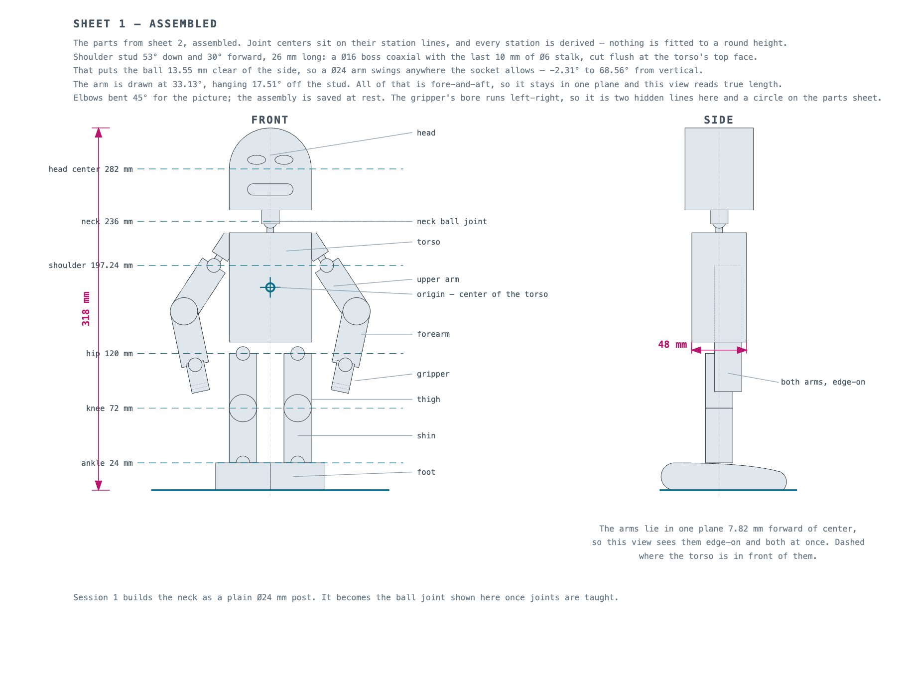
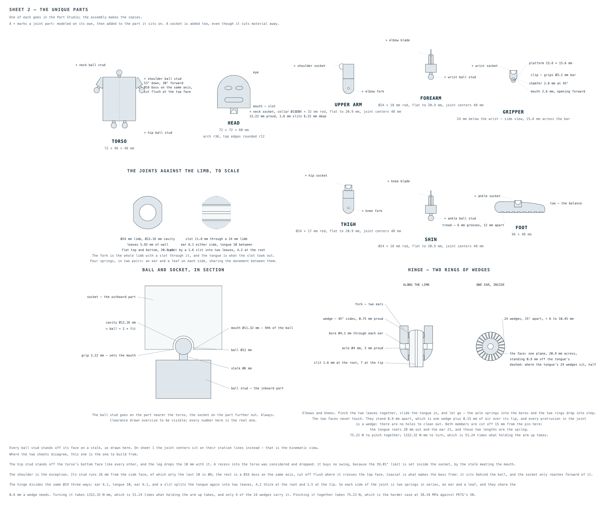

Session 1 — the body and the face
=================================

Building the torso, neck and head of a 150 mm robot out of a single sketch, and then
putting a face on it.

.. admonition:: Where this text has been proved, and where it has not
   :class: warning

   **Both parts have now been built from these words, from an empty document, and every
   dimension measured**, in three test runs, each one from the text the run before it
   corrected. The corrections from all three are below.

   The second run gave the text most of what it says about *doing*: dimensions are committed
   with **Enter**, the mouth is a slot around a line you draw first, Midpoint became Symmetric,
   and the Linear pattern gained the fields it actually needs.

   The third run finished cleanly and found the failures that do not announce themselves —
   a pupil extrude that silently builds surfaces instead of solids and still passes every
   check at the end, a solid that swallows clicks meant for the vertical line, and Slot glyphs
   that no amount of zooming gets out of the way.

   Not yet proved: nobody has walked this at student pace, and no link on this page has been
   opened from a school account.

Before you start
----------------

You need an Onshape document with an empty Part Studio. Everything below happens in it.

.. admonition:: Set the units first, before anything else

   A new Onshape document is in **inches**. This robot is in millimeters.

   1. Click the **☰ menu** to the left of the document name.
   2. Choose **Workspace units…**
   3. Set **Length default unit** to **Millimeter**.
   4. Set **Display decimals** to **0.1** — there is one of these for every kind of unit
      in the dialog, about a dozen in all. You want the one beside the length unit you
      just set. The others do no harm.
   5. Click the **green ✓** to close the dialog.

   The red ✗ throws the change away and puts you back on inches, silently. Every dimension
   after that is wrong.

The plan
--------

Two sheets, and both are **drawings, not CAD sketches** — nothing in Onshape is made from
them. They exist so you know where you are going before you start clicking.

.. The two images below are copies. ``src/stickbot/make_plans.py`` generates the sheets into
   ``.docs/experiments/build-briefs/images/``, and ``ninja plan`` regenerates them there. A
   guide takes a copy when it wants one; nothing copies them here automatically, so they go
   stale unless somebody re-copies them. These are the 150 mm robot and the design is now
   318 mm, which is what that costs.

   **Sheet 1 — assembled.** Where everything ends up, and how the 150 mm is spent. The
   dashed lines are the **stations** — the height of each joint center.

   **Sheet 2 — the eight parts.** One of each goes in the Part Studio; the assembly makes
   the copies, so a left arm and a right arm are the same part inserted twice. The two
   details at the bottom name the halves of each joint.

**This session builds the first three parts on sheet 2** — the torso, and the head, joined
for now by a plain post where the neck joint will eventually go.

Everything about this robot is a fraction of one number — the torso height, **48 mm**.
48 divides evenly by 2, 3, 4, 6, 8, 12, 16 and 24, so nothing ever lands on a fraction of
a millimeter. The torso is 36 × 48 × 24, a clean 2 : 3 : 4 box, and the whole figure
stands 150 mm tall.

The one thing worth memorizing from these sheets: **the origin is the center of the
torso.** Every dimension in Part one is measured from there.

**Different numbers make a different robot, and that is fine.** A taller, wider or smaller
one is built with exactly these tools in exactly this order.

What will bite you
------------------

These caused every delay in the test run. Read them now; they are referred back to by name.

**Shortcuts need the pointer over the graphics area.** Move the mouse over the model
before pressing a key. Keys pressed over the Features list do nothing.

**One Escape puts down the tool. Two Escapes throw the whole sketch away.** Finish a sketch
with the green ✓ at the top right of the graphics area, never with Escape.

**Tools stay armed.** The Dimension tool is still switched on after you place a dimension,
so the next plain click gets eaten by it instead of selecting. Every step below that starts
with an ordinary click says **Escape first**. Nothing warns you when you forget — the click
simply does nothing.

**Zoom in before you aim.** Scroll to zoom; Onshape zooms towards the pointer, so put the
pointer on the thing you want bigger first. The neck is 6 mm across and at the zoom you
start at that is a smear about forty pixels wide, with things floating on top of it.

**Constraint symbols are clickable, and they cover what is underneath.** Every constraint
drops a small glyph on the sketch, and at normal zoom a glyph is as big as the neck. If a
rectangle refuses to start, or a click selects something you cannot see, you landed on a
glyph. Zoom in until the glyphs are small compared with the geometry — and when that does
not help, because the glyphs are sitting *on* the line you are trying to click, untick
**Show constraints** in the Sketch panel at the top left. Glyphs are a fixed size in pixels,
so zooming never shrinks them out of the way; the checkbox is one click and it stays off for
later sketches.

**Once the body is solid, the solid steals clicks meant for the plane lines.** This is the
mirror of the deselecting problem below. Every step that says *shift-click the vertical line
through the origin* has it, because by Part two the robot is there — click the line where it
crosses the body and you get the body's front face instead, with no warning. Zoom out until
the line runs past the robot into empty space, and click it there.

**To deselect, click an empty patch of background — and mean *empty*.** Escape is unreliable
for this, and the default planes fill most of the window, so a click meant for background often
lands on the **Front** plane and selects that instead. Zoom out until there is real background
outside the planes, and click there. A selection left over from the previous step turns the next
measurement into nonsense — an angle, say, instead of an area.

**Keep the planes shown while you are sketching.** Every step that says *the vertical line
through the origin* means the **Right** plane seen edge-on, and *the horizontal line* means the
**Top** plane. Hide them and those steps have nothing to click. Hide them at the very end, for
measuring, and show them again if you go back to a sketch.

Part one — the body
===================

One sketch, three features
--------------------------

Here is the idea that shapes the whole session, and it is worth reading twice.

You are going to draw **one** sketch, from the front, containing three rectangles: torso,
neck and head. Then you will make three different features out of it — **extruding** two
of the rectangles to different depths, and **revolving** the third.

A sketch in Onshape is not one part's outline. It is a pool of shapes, and each feature
reaches in and takes the piece it wants.

.. admonition:: A sketch is not a drawing

   It does not have to look like the robot. It has to contain the shapes the features
   need. The neck below is drawn as *half* a rectangle, because half is what a revolve
   needs — spin that half around the centerline and you get a full cylinder.

Step 1 — Start the sketch
-------------------------

1. In the Features list, open the **Default geometry** folder and click **Front**.
2. Click **Sketch** on the toolbar.
3. Press **n** once to look straight at the plane.

.. admonition:: n is a toggle

   Press **n** a second time and you are looking at the *back* of the plane, with left and
   right swapped. On a symmetric block nothing looks wrong, which is what makes it
   dangerous later. Press it once.

Step 2 — The torso
------------------

1. Press **r** for **Center point rectangle**.
2. Click **on the origin** — the small circle in the middle. Onshape snaps to it.
3. Click out to one corner. The size does not matter.
4. Press **Escape** once to put the tool down.

Now say how big it is.

5. Press **d** for **Dimension**. *Press it once.* The tool stays on.
6. Click the **bottom edge**, then click a clear spot below it, type **36**, press **Enter**.
7. Click the **left edge**, then click a clear spot to the left, type **48**, press **Enter**.
8. Press **Escape** to put the Dimension tool down.

.. admonition:: Where to click, and in what order

   **Click the line first, then the point.** If you click a point first and a line second,
   Onshape sometimes gives you a *diameter* instead of a distance.

   **"A clear spot" means clear of everything** — geometry, the faint plane lines through
   the origin, constraint glyphs, and any dimension you have already placed. A label
   dropped on one of those is silently swallowed, or turns into an angle.

The rectangle should now be **black**. Black means fully defined: there is nothing left to
move. Drag a corner to check — nothing should shift.

A center point rectangle placed on the origin is held there by the origin itself. That is
why this course never uses the **Fix** constraint: Fix pins a shape down without saying
why, and a rectangle centered on the origin says exactly why.

Step 3 — The neck, as half a rectangle
--------------------------------------

The neck is a cylinder, so you draw half of it and spin it. Zoom in on the top edge of the
torso first — this is the smallest thing you will draw all session.

1. Press **g** for **Corner rectangle**.
2. Draw a small rectangle sitting on top of the torso, starting a little to the **right**
   of the centerline and going right. Roughly is fine; the constraints will move it.
3. Press **Escape**.
4. Press **d** and dimension it **6** wide and **6** tall, pressing **Enter** after each
   number. **Escape** when you are done.
5. Click its **left edge**, shift-click the **vertical line through the origin** — that is the
   **Right** plane seen edge-on — then apply **Coincident** from the **toolbar button**. The
   rectangle snaps onto the centerline.

   **The `i` shortcut does nothing here, silently.** It works for line-to-line later, but not
   for a line against a plane. Use the button. And click the neck's edge *outside* the torso:
   clicking it where it crosses the torso selects the torso's region instead.
6. Click its **bottom edge**, shift-click the **torso's top edge**, then press **i** again.
   The neck sits on the torso.

.. admonition:: shift-click, not ctrl-click

   On a Mac, ctrl-click opens the operating system's menu and nothing gets selected.
   **shift-click** is how you add to a selection.

Step 3.5 has just put your sketch line in the same place as the Right plane's edge-on
line. That is deliberate — the neck's edge *has* to be on the centerline for the revolve
to come out centered — and Step 7 shows you how to tell the two apart.

Step 4 — The head
-----------------

1. **Zoom back out first** — the head is six times the neck, and at the zoom Step 3 needed it
   runs off the top of the window before you finish the drag. Then press **g** and draw a
   bigger rectangle above the neck.
2. Press **Escape**, then **d**, and dimension it **36** wide and **36** tall, **Enter** after
   each. **Escape**.
3. Click the head's **bottom edge**, shift-click the **neck's top edge**, press **i**.
4. Click the head's **left edge**, shift-click its **right edge**, shift-click the
   **vertical line through the origin**, and press **shift + q** for **Symmetric**. The
   head centers itself on the centerline.

Every rectangle should now be black, and every endpoint too.

.. admonition:: Black lines can still have blue endpoints

   That is not fully defined. Onshape colors a *line* black once its direction and
   position are fixed, but its **endpoints** stay blue while they can still slide. Look at
   the dots, not just the lines, and drag anything blue to see what it does.

5. Take the green **✓** to finish the sketch.

Step 5 — Extrude the torso
--------------------------

1. Click once **inside the torso rectangle**, on the fill rather than a line. It turns
   orange, and the bottom-right corner reads **Area: 1728.0 mm²** — because 36 × 48 = 1728.
2. Press **shift + e** for **Extrude**.
3. The **Depth** field already has a number in it. Select what is there and type **24** over
   the top. Press **Tab**.
4. Tick **Symmetric**.
5. Green **✓**.

.. admonition:: Enter commits a dimension. Escape throws it away.

   **In a sketch, finish every typed dimension with Enter.** If you type a number and then
   press Escape to put the Dimension tool down, Onshape discards what you typed and keeps the
   size you happened to drag to. The sketch still turns black and nothing warns you.

   In the test build this produced a torso **34.8 mm instead of 48**, and a neck **5.9 instead
   of 6** — and the neck error is invisible to anyone.

   **Inside a feature dialog it is the opposite**: there, Enter means *accept the whole
   feature*, so use **Tab** to move between fields and save the green ✓ for the end.

   **And check the number afterwards.** Even with Enter, a typed value occasionally does not
   take — twice in eleven dimensions in one test run. It costs a second to glance at the label
   and see that it says what you typed. If it does not, double-click it and retype.

**Symmetric** splits the depth evenly either side of the sketch, so the torso ends up
centered on the origin in all three directions. Everything else is measured from it, so this
one tickbox saves arithmetic all the way through.

Step 6 — Get the sketch back
----------------------------

The head and neck have just vanished. This is expected and it stops a lot of people.

**Accepting an extrude hides the sketch it consumed**, so the view is not cluttered with
lines you have finished with. But you have not finished with this one — two features still
to come out of it.

In the Features list, **right-click Sketch 1** and choose **Show**. The rectangles come
back, drawn over the solid.

Step 7 — Revolve the neck
-------------------------

1. Zoom in on the neck. Click inside the **neck half-rectangle** — the fill, not a line.
2. Press **shift + w** for **Revolve**.
3. **Click into the Revolve axis field first.** Until you do, focus is still on *Faces and
   sketch regions*, so your next click will empty the region you just picked instead of
   setting the axis.
4. Now click the **neck's own left edge**: the short vertical line running up the centerline
   from the torso. The field should fill in and read **Edge of Sketch 1**.
5. Leave **Full revolve** ticked. The operation will read **New** until the axis is picked and
   then flip to **Add** by itself — check it says Add before you accept.
6. Green **✓**.

Half a rectangle, spun all the way round, is a cylinder **12 mm** across — twice the 6 mm
you drew. That is why the neck was drawn as a half.

.. admonition:: Two lines in the same place, and how to tell them apart

   There are two vertical lines up the centerline now: your sketch edge, and the **Right**
   plane seen edge-on. They are drawn on top of each other and a click gets one or the
   other.

   Onshape tells you which one you caught. A sketch line reads **Edge of Sketch 1** in the
   field; the plane instead highlights the **Right** row in the Features list. **The plane
   will not work here** — if the axis field stays empty and red, that is what you picked.
   Aim at the neck's edge itself, well away from the origin, and try again.

   This is the argument for the rule about construction geometry: **do not draw a
   construction line where a real edge already is.** Here two things share a spot and it is
   already fiddly; a construction line would make it three. Draw one where nothing else
   gives you what you need — for a revolve axis that is usually the case, just not this
   time, because the neck brought its own edge.

Step 8 — Extrude the head
-------------------------

1. Click inside the **head** rectangle. It should read **Area: 1296.0 mm²** — 36 × 36.
2. **shift + e**. Type **30** over the depth, **Tab**, tick **Symmetric**.
3. Set the operation to **Add**.
4. Green ✓.

Three features out of one sketch, and nothing was drawn twice.

.. admonition:: New or Add — a real question, not a setting

   **New** makes a separate body. **Add** fuses onto what is already there.

   The neck and head are **Add** because they are the same object as the torso: one solid
   robot body. Later, when parts have to *move* relative to each other, they will be
   **New** — and that is the whole difference. Ask "is this the same lump of plastic?" and
   the answer picks the option for you.

Step 9 — Tidy up and name things
--------------------------------

1. Right-click **Sketch 1** and choose **Hide**. Its lines sit on top of the solid and will
   steal clicks meant for faces from here on.
2. Right-click each feature in the Features list, choose **Rename**, and call them
   **Torso**, **Neck** and **Head**.
3. In the **Parts** list, rename **Part 1** to **Robot**. Renaming a feature does not
   rename the part it made; they are separate lists and separate names.

By the end of this course there will be twenty-odd features. ``Extrude 4`` tells you
nothing.

Check Part one by measuring
---------------------------

**Measure, do not eyeball.** You need to see the model from an angle: use the **view cube**
in the top-right corner, or the view menu, and pick **Isometric**. Click an empty patch of
background first so nothing is left selected.

- **Parts (1)** — one body, not three. If it says 3, an operation was left on New.
- Click the torso's **front face** → **1728.0 mm²** (36 × 48).
- Click the torso's **side face** → **1152.0 mm²** (24 × 48).
- Click the head's **front face** → **1296.0 mm²** (36 × 36).

Between them those three prove every dimension of the body.

.. admonition:: Do not use the top of the torso

   It looks like the obvious face to click and it is the one face that will not give you a
   round number. The neck is fused into it, so its area is 864 minus the neck's circle.
   The head is also 30 deep against the torso's 24, so from an isometric view the top of
   the torso is a sliver a few pixels wide. That overhang is on purpose — it is a big
   goofy head — but it makes a poor target.

Change one number
-----------------

Step 9 hid the sketch, so there is no **48** on screen to double-click. Get it back:

1. Right-click **Sketch 1** in the Features list and choose **Show**.
2. Right-click it again and choose **Show dimensions** — the numbers only appear with this on.
3. **Double-click the 48**, type **60**, press **Enter**.

Two double-clicks, not one: the first opens the dimension, the second lets you edit it.

**The robot vanishes while the sketch is open, and it is supposed to.** Opening Sketch 1 rolls
the model back to before the solids existed: the Parts list goes to **(0)**, the robot
disappears from the screen, and Torso, Neck and Head go gray in the list. Nothing has been
destroyed. It all comes back when you close the sketch.

4. Undo with ⌘Z, then **close the sketch dialog** the double-click opened, and **hide Sketch 1
   again**. Neither closes itself, and a shown sketch steals clicks from every face in Part
   two.

The neck and head ride up with it, because they were never given a position of their own —
they were attached to the torso's top edge. Undo it with ⌘Z.

That is what all the constraint work was for, and it is the difference between a model and
a drawing.

Part two — the face
===================

.. note::

   Part two has now been built twice, end to end, each time from the text the run before it
   corrected. Everything below has been performed as written at least once.

Everything so far was drawn on the Front plane, floating in space. Now you will draw on the
robot itself.

Sketching on a face
-------------------

1. From **Isometric**, click **Sketch**, then click the **flat front face of the head**.
   That face becomes the sketch plane.
2. Press **n** to look straight at it.

.. admonition:: Why this matters

   A sketch drawn on a face **belongs to that face**. Make the head deeper later and the
   eyes stay on the front of it. A sketch on the Front plane would have stayed where it was
   and ended up buried inside.

   Pick the face that is parallel to the shape you want to draw. If a projected shape comes
   out shorter than it should, or an extrude heads off sideways, you are on a face at an
   angle to the one you meant.

Eyes and pupils — one sketch, Equal, Symmetric, Concentric
----------------------------------------------------------

Both eyes and both pupils go in **one** sketch, and then two extrudes take different pieces
of it — the same trick as Part one.

1. Press **c** for **Center point circle** and draw four circles: two big ones roughly
   where the eyes go, and a small one loosely inside each. **Escape**.
2. Click a small circle, shift-click the big one it sits in, press **shift + o** for
   **Concentric**. It snaps to share the center. Repeat for the other pair.
3. Click one big circle, shift-click the other, press **e** for **Equal**. Do the same for
   the two small ones.
4. Click the **center point** of one eye, shift-click the **center point** of the other,
   shift-click the **vertical line through the origin**, press **shift + q** for
   **Symmetric**. They jump to matching distances either side.
5. Press **d**. Dimension one big circle **10** and one small circle **4**. Equal carries
   both numbers across to the other side.
6. Still in Dimension: one eye's center to the **vertical line**, **8**. Then the same
   center to the **head's top edge**, **10**. **Escape**.

Four circles and four dimensions, and everything else is held by Concentric, Equal and
Symmetric. Change the 10 later and both eyes change together.

7. Green ✓.
8. Click inside the two **rings** — the area between each big circle and its pupil.
   **shift + e**, depth **3**, operation **Add**, green ✓.
9. The sketch has been hidden again, exactly as in Step 6. Right-click it → **Show**.
10. Click inside the two **pupil discs**. **shift + e**, depth **5**, **Add**, green ✓.
11. Right-click the sketch → **Hide**.

A circle drawn inside another circle splits that area into two regions — a ring and a disc —
and a feature can take either one. The pupils end up standing 2 mm proud of the eyes.

.. admonition:: A pupil is a small target, and Onshape takes the wrong thing quietly

   Step 10 is the most delicate click in the session. Zoom until each pupil is about the size
   of a fingertip on screen before you click into it — much further in than feels necessary.

   Then read the Extrude dialog before you accept it:

   - **No Depth field at all** means you picked the two center *points* instead of the discs.
   - **Surface** instead of **Solid**, previewing *Surfaces (2)*, means you picked the circles'
     *edges*. This one is dangerous: it is a perfectly valid feature, nothing turns red, and
     the model it builds still passes every check in *What you should have at the end*.

   Cancel with the red ✗ — do not try to correct it inside the dialog — zoom in further, and
   click again. It should say *Face of Sketch 2*, twice.

A mouth — the Slot tool, and Symmetric
--------------------------------------

1. New sketch on the head's front face.
2. Draw a **line** first — press **l**, draw a short horizontal line roughly where the mouth
   goes, then **Escape**. The Slot tool works by offsetting around a line you have already
   drawn; it will not draw one for you.
3. Choose **Slot** from the **Offset** dropdown on the sketch toolbar — *not* from the
   rectangle dropdown. Click your line, then move out to set the width. **Escape**.
4. Click the line's **left endpoint**, shift-click its **right endpoint**, shift-click the
   **vertical line through the origin**, and press **shift + q** for **Symmetric**. The mouth
   centers itself.
5. **The Slot tool has already made its own width dimension.** Do not add another one — that
   is what over-constrains the sketch. **Double-click the width dimension the tool created**
   and type **5**. If you cannot see it, press **f** to zoom to fit: the slot's dimension is
   often placed off the top of the window, on a leader that runs out of sight.
6. **Untick Show constraints** in the Sketch panel at the top left. The Slot drops a pile of
   glyphs directly along the line, and they will eat every click you aim at it.
7. Press **d**. Dimension the line **15** long, and put it **9** above the head's **bottom
   edge**. **Enter** after each, then **Escape**.
8. Green ✓. Click inside the slot's **enclosed region** — the fill, not the line down its
   middle — then extrude it **Remove**, depth **2**, so it cuts a groove.

.. admonition:: A slot's length is measured center to center

   The **15** is the distance between the two end *centers*, not the mouth's overall width.
   The round ends add half the slot's width at each end, so 15 + 5 gives the **20 mm** mouth
   the plan draws.

   Get this wrong and nothing complains — the test build asked for 20 and produced a 25 mm
   mouth, and the area check still looked plausible.

.. admonition:: Midpoint will not work here

   **Midpoint needs a point and a line**, so it refuses a line-to-line selection with
   *"Midpoint constraint requires a point and a line or arc."* Symmetric on the two endpoints
   does the same job, and it is a constraint you have already used on the head.

.. admonition:: Which way does Remove go?

   In testing, every Remove in this session cut inward without being touched, so expect the
   mouth simply to appear. It is worth knowing why it can go the other way: an extrude that
   starts on a face can point **away** from the material, and then it cuts thin air and reports
   no error at all. If that happens, look for the small arrow beside the end-condition dropdown
   and flip it. It is not the **Direction** checkbox lower down — that does something else.

A chest panel — Symmetric twice, then a pattern
-----------------------------------------------

1. New sketch on the **flat front face of the torso**.
2. Press **g** and draw a rectangle. Make its left and right edges **Symmetric** about the
   vertical line, and its top and bottom edges Symmetric about the **horizontal** line —
   now it is centered on the origin without a single position dimension.
3. Dimension it **24** wide and **20** tall. Green ✓.
4. Extrude **Remove**, depth **1**. A shallow recessed panel.

5. New sketch on the **bottom face of that recess**. Press **c**, draw one small circle and
   dimension it **4** across. Then dimension its center **6** from the panel's **left edge**
   and **5** from the panel's **top edge**, so it is fully defined — "near the top-left" is not
   a position, and a blue circle here will drift.
6. Green ✓, extrude it **Remove**, depth **1**.
7. **Linear pattern**, and this one needs more from you than the others:

   - It opens on **Part pattern**. Switch it to **Feature pattern**.
   - It will have dropped whatever you had selected. Pick **Extrude 5** from the Features list.
   - **Direction** is a required field and starts empty. Click it, then click a **horizontal
     edge of the panel** for the across direction.
   - Set **Instance count 3** and **Distance 6**.
   - Tick **Second direction**, click a **vertical edge** of the panel, count **2**,
     distance **10**.

One circle drawn, six holes made. Patterns are the second thing after Mirror that stops you
drawing the same shape twice.

Lettering — the Text tool
-------------------------

1. New sketch on the torso's front face, below the panel.
2. Choose **Text** from the sketch toolbar and drag a box across the chest. **Text opens its
   own dialog with its own green ✓** — type the name, then accept that dialog before you accept
   the sketch.
3. Green ✓. Now **select the whole sketch from the Features list** — click **Sketch 6** — and
   extrude that, **Remove**, depth **0.5**.

.. admonition:: Do not try to click the letters

   Letter strokes are two or three pixels wide on screen, and clicking inside one to select its
   region does not work at any reasonable zoom. Selecting the sketch by name in the Features
   list takes every region in it at once, which is what you want here anyway.

.. admonition:: Text is heavier than it looks

   Each letter becomes many small edges. Extruding text is slow to regenerate and is a
   common source of failures on a school laptop. Keep it short.

What you should have at the end
-------------------------------

- **Parts (1)** — one solid body called **Robot**.
- Torso **36 × 48 × 24**, centered on the origin.
- Head **36 × 36 × 30**, joined to it by a Ø12 neck.
- Two eyes with proud pupils, a slot mouth, a recessed chest panel with six holes, and a
  name.
- Every sketch black, endpoints included.

**Check by measuring**, from Isometric, with nothing selected:

- Torso **side face** → **1152.0 mm²**.
- Head **side face** → **1080.0 mm²** (30 × 36).

The side faces are the honest check now: the front faces have had the panel, the lettering
and the mouth cut out of them, so they no longer read as whole rectangles.

If something else happened
--------------------------

**My click did nothing at all**
    A tool was still armed — almost always Dimension. Escape once, then click.

**A dimension came out as Ø something**
    You picked the point before the line. Undo, and click the line first.

**Nothing happens when I click to place a dimension label**
    The spot was not clear — a dimension already there, a constraint glyph, or one of the
    plane lines. Try further out.

**Pressing d again did nothing, and now clicking just selects things**
    Dimension stays switched on after each dimension. A second press turns it *off*.

**I canceled a dimension with the red ✗ and it stayed anyway**
    It keeps the measured value. Delete it, or it will fight the next one.

**My whole sketch vanished**
    Two Escapes. Undo with ⌘Z, and use the green ✓ to finish a sketch.

**The head and neck disappeared after the first extrude**
    Expected — Onshape hides a consumed sketch. Right-click **Sketch 1** → **Show**.

**The Revolve axis field stays empty and red**
    You are catching the Right plane instead of the sketch line. The field must read
    **Edge of Sketch 1**. Zoom in and aim at the neck's own edge, away from the origin.

**I get 3 parts instead of 1**
    The neck or head was left on New. Double-click the feature and change it to Add.

**The mouth cut nothing**
    The Remove went outward. Flip the small arrow beside the end-condition dropdown.

**Onshape will not let me add a constraint**
    Something already says it. Click the entity to see the constraints on it, or click a
    constraint symbol to see what it holds, and delete the one that duplicates yours.

**The line is black but the endpoints are blue**
    Still not fully defined. The endpoints can slide. Drag one and see.

**A measurement came out as an angle**
    Something was still selected from the previous step. Click empty background, then click
    the face.

**Everything is in inches**
    The units step was skipped, or closed with the red ✗. Set them, then double-click each
    dimension and retype it.
