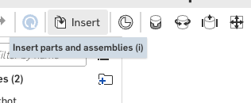

The assembly, with two parts in it
===================================

Three pages in, there is a robot on the screen. It is not a finished robot; nothing holds the head
on yet. But it is the first time the two tabs you have built meet in one place, and everything
after this page adds to something that already looks like the thing you are making.

.. step: cad.hero

.. figure:: images/assembly/hero-01.png
   :alt: the torso and the head from a corner, the head floating clear above the torso with nothing
         joining them
   :width: 1130px
   :class: shot

   **The assembly at the end of this page.** Press **shift+7** for the corner view and **f** to
   zoom until both parts fill the window. The head is floating: it is above the torso because you
   put it there, not because anything holds it.

Press **shift+1** to look at it from the front.

.. figure:: images/assembly/hero-02.png
   :alt: the same two parts from the front, reading as a robot three tutorials in
   :width: 1130px
   :class: shot

   **The same two parts, from the front.** Down the left is the assembly's own tree: **Instances
   (2)**, with ``torso <1>`` and ``head <1>`` under the assembly's name, and **Mate features (0)**
   below them.

.. admonition:: The name in the title bar is not the one you typed
   :class: advice

   The pictures come from the documents this guide was built and checked in, and those have
   longer names than yours. Yours reads ``stickbot``. Everything else in the pictures is what
   you will see.

Nothing is mated on this page. The head has no socket and the torso has no stud, so there is
nothing to mate them with. Both parts land on the assembly's origin, one inside the other, and you
move the head up by hand so the pair reads as a robot while you work on it.

Insert the two parts
---------------------

.. step: cad.assembly.place_body_head
.. req: req.model.one_document

Open ``Assembly 1``, the tab the document arrived with. Click **Insert**.

         and assemblies i
   :class: button

.. image:: images/assembly/assembly.place_body_head-01.png
   :alt: the Insert parts and assemblies button at the left of the assembly toolbar, ringed
   :class: shot

The panel opens on **Current document** and lists your own Part Studios: ``body`` and ``head``. The
counter along the bottom reads ``Inserted: 0``.

.. image:: images/assembly/assembly.place_body_head-02.png
   :alt: the Insert panel open beside an empty assembly, on Current document, with body and head
         under Part Studios and the counter reading Inserted: 0
   :class: shot

Click the ``body`` row.

.. image:: images/assembly/assembly.place_body_head-03.png
   :alt: the body row of the Insert panel, ringed
   :class: shot

The torso is in. The part inside the ``body`` studio is called ``torso``, and that is the name the
tree uses: it now reads **Instances (1)** with ``torso <1>`` under it, and the counter reads
``Inserted: 1``.

.. image:: images/assembly/assembly.place_body_head-04.png
   :alt: the tree reading Instances (1) with torso <1> under it, and the panel beside it counting
         Inserted: 1
   :class: shot

The panel is still open. Click the ``head`` row.

.. image:: images/assembly/assembly.place_body_head-05.png
   :alt: the head row of the Insert panel, ringed
   :class: shot

The tree behind the panel now reads **Instances (2)**, with ``torso <1>`` and ``head <1>`` under
it, and the counter reads ``Inserted: 2``.

.. image:: images/assembly/assembly.place_body_head-06.png
   :alt: the tree reading Instances (2) with torso <1> and head <1> under it, and the panel
         counting Inserted: 2
   :class: shot

.. admonition:: One click inserts, and the panel stays open
   :class: advice

   A single click on a row is the whole insert. There is no second confirming click, and the panel
   does not close afterwards, which is what lets you put both parts in without reopening it.

   There is no *insert them together* option to look for. One row at a time is how it works, and
   the counter is how you know each one landed.

Click the green tick to close the panel, then press **f** to zoom to fit. Both parts come into the
window together, the head buried inside the torso with only its face standing out of the front.

.. image:: images/assembly/assembly.place_body_head-07.png
   :alt: the assembly with both parts in it and no panel open, the head buried inside the torso
         with only its face standing out of the front, because nothing has been mated
   :class: shot

.. admonition:: Close the panel with the green tick, not the red cross
   :class: advice

   The panel holds everything it has inserted until you accept it. The cross beside the tick puts
   all of it back: click it after two rows and the counter's work goes with it, and the tree is
   empty again.

   Reloading the page mid-panel does not rescue you either. Onshape reopens the panel with the
   same count still pending, so the only thing that makes an insert permanent is the tick.

.. admonition:: Press **f** after the panel is closed, not before
   :class: advice

   While the Insert panel is open it holds the keyboard, so **f** goes into its search box and the
   view does not move. If a part arrives filling the whole window, or off the edge of it, scroll to
   zoom out until you can see it, and leave **f** until the tick has closed the panel.

.. admonition:: Insert from the workspace, which is what the panel already offers
   :class: advice

   Under the document's name the panel reads ``Main``. That is your workspace, and a part inserted
   from it follows the tab it came from: fix the head tomorrow and the assembly shows the fix.

   The two small buttons to the right of the name switch that to a version. A version is a
   snapshot, and an assembly pointed at one goes on showing the snapshot after you have moved on.
   Leave them alone. Every page of this guide inserts from the workspace.

Move the head up where it belongs
----------------------------------

.. step: cad.assembly.pose
.. req: req.page.view_keys

Both parts were drawn around their own origins, and an inserted part lands on the assembly's
origin, so the two of them share a middle. That is why the head is inside the box. Nothing has gone
wrong.

It is still not how you want to leave it. Every picture you take from here on has a head buried in
a torso in it, and so does every screen you show a teacher. Move it.

Press **shift+1** to look from the front, so up on the screen is up on the robot. Then scroll to
zoom out until there is empty space above the head, because that is where the head is going.

Click the head's face, off to one side, and hold the button down.

.. image:: images/assembly/assembly.pose-01.png
   :alt: the head's face in the middle of the torso, the click ringed out to one side of the middle
   :class: shot

.. admonition:: Click the face, not the middle of it
   :class: advice

   The assembly's origin is drawn as a small dot at dead center, right on top of the head's face.
   A click there selects the origin, which is a point and cannot be dragged, so the head sits
   still no matter how far you move the mouse.

   Click a bit to the left or the right, on plain face with no eye or mouth under it, and the
   whole head lights up orange.

Drag straight up. The head comes with the pointer, the torso stays where it is, and a line grows
between the two with a box on the end of it counting how far you have gone.

.. image:: images/assembly/assembly.pose-02.png
   :alt: the head part way up, still held by the mouse, with the distance box counting up beside it
   :class: shot

Let go, and the box stays. Type ``90`` and press **Enter**.

.. image:: images/assembly/assembly.pose-03.png
   :alt: the distance box beside the head with 90 typed into it, over the free-hand number the drag
         left
   :class: shot

.. admonition:: The box is why the height is yours to choose
   :class: advice

   Nothing is measuring this. The head is a part floating in space, not a joint, and no later page
   reads the number. 90 mm leaves the head's underside 6 mm clear of the torso's top, which is
   enough of a gap to see.

   Type a bigger number if you want more air under it. The box takes whatever you type and moves
   the head exactly that far, which is easier than trying to let go in the right place.

.. image:: images/assembly/assembly.pose-04.png
   :alt: the head standing clear above the torso, the two of them reading as a robot with nothing
         joining them yet
   :class: shot

.. admonition:: Dragging is not mating, and the tree says so
   :class: advice

   **Mate features (0)** is still the honest reading. You moved the head; you did not attach it.
   Open the assembly tomorrow and the head is where you left it, because Onshape remembers where an
   unmated instance was put, but nothing holds it there and a stray drag moves it again.

   Page 7 is where the head gets pinned to the neck, and the mate is what stops it moving for good.
   Until then, hand-placed is the best this assembly can be.

Name the tab ``stickbot``
--------------------------

.. step: cad.assembly.rename

Right-click the ``Assembly 1`` tab and choose **Rename**.

.. image:: images/assembly/assembly.rename-01.png
   :alt: the menu on the Assembly 1 tab with Rename ringed
   :class: shot

Select all, type ``stickbot``, and press **Enter**. There is no confirming dialog; the name is
committed when you press Enter, and the top row of the tree takes it a moment later.

.. image:: images/assembly/assembly.rename-02.png
   :alt: the tab's name box with stickbot typed into it
   :class: shot

The strip now ends with ``stickbot``, behind ``body``, ``head`` and ``robot sizes``.

.. image:: images/assembly/assembly.rename-03.png
   :alt: the tab strip with the last tab now reading stickbot
   :class: shot

Move it to the front of the strip
----------------------------------

.. step: cad.assembly.first_tab

The assembly is what you open the document to see, so it belongs where your hand lands first. Here
is the strip before the move.

.. image:: images/assembly/assembly.first_tab-01.png
   :alt: the tab strip before the drag, stickbot last behind body, head and robot sizes
   :class: shot

Drag the ``stickbot`` tab to the left, past the others.

.. image:: images/assembly/assembly.first_tab-02.png
   :alt: the drag part way, stickbot carried left along the strip with the mouse button still down
   :class: shot

Let go. ``stickbot`` is now the first tab in the strip, ahead of ``body``.

.. image:: images/assembly/assembly.first_tab-03.png
   :alt: the tab strip after the drag, stickbot first with body, head and robot sizes behind it
   :class: shot

.. admonition:: The strip reorders while you are still dragging
   :class: advice

   Onshape moves the tab as the pointer passes each neighbor, so there is no moment where you are
   holding a tab over a gap. By the time the pointer reaches the far left the tab has already
   arrived, and letting go only settles it there.

   If it does not seem to be working, let go and read the strip rather than dragging further.

Check the tree
---------------

.. step: cad.tree

The tree is this page's check list. It runs ``stickbot``, then **Origin**, then ``torso <1>`` and
``head <1>`` under **Instances (2)**, then **Loads (0)** and **Mate features (0)**.

.. image:: images/assembly/tree-01.png
   :alt: the assembly's own list, two instances under Instances (2) and Mate features (0) below
         them
   :class: shot

Two instances and no mates is exactly right for page 3. The counts are the check: three instances
means something got inserted twice, and one means a row click did not land.

Publish a version
------------------

.. step: cad.version
.. req: req.page.document

Click **Create version…** in the left icon strip, under **Versions and history**. The dialog opens
with a name of Onshape's own already in the box, selected, so what you type replaces it. Type
``tutorial 3 - the assembly``, then click **Create**.

.. image:: images/toolbar/tb-create-version.png
   :alt: Close-up of the Create version button in the left icon strip, its tooltip reading Create
         version…
   :class: button

.. image:: images/assembly/version-01.png
   :alt: the Create version dialog with tutorial 3 - the assembly typed into the Name box
   :class: shot

Open **Versions and history**. The list under **Main** now runs ``tutorial 3 - the assembly``,
``tutorial 2 - the head``, ``tutorial 1 - variables and torso`` and ``Start``.

.. image:: images/assembly/version-02.png
   :alt: the Versions and history panel listing Main with tutorial 3 - the assembly at the top
   :class: shot

What you should be able to read off the model
----------------------------------------------

.. list-table::
   :header-rows: 1
   :widths: 42 28 30

   * - Check
     - Expected
     - Where to look
   * - instances
     - two, ``torso <1>`` and ``head <1>``
     - the tree
   * - mate features
     - none
     - **Mate features (0)** in the tree
   * - the head
     - 90 mm up, clear of the torso
     - the graphics area, from the front
   * - the tabs
     - four, ``stickbot`` first
     - the tab strip

An assembly with two parts in it, one of them moved where you want it by hand. The next page builds
the joint that will hold them together, and it builds it in a tab of its own.
