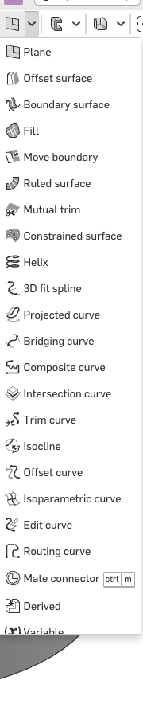
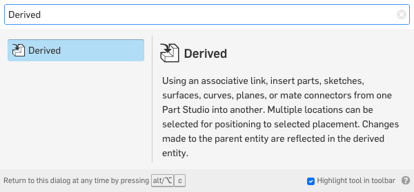
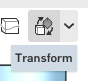
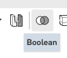
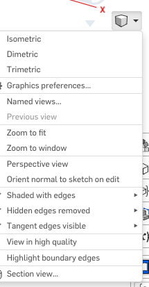
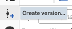

The head gains its socket
==========================

The head has a face and nothing to hang it on. This page gives it the socket half of the joint, and
it does that without drawing the socket again. The socket comes across from the ``ball and socket``
tab as a linked copy, moves into place by its own mate connector, and becomes part of the head.

.. step: cad.hero
.. req: req.page.hero

Press **shift+7** for the corner view, then the **up arrow** four times. That drops the camera under
the head, which is where the socket is.

.. figure:: images/head-socket/hero-01.png
   :alt: the finished head from a corner and a little from below: two eyes and a mouth on the front,
         and the socket standing under its chin with the four slits down its rim and the two mate
         connectors drawn on it
   :width: 1130px
   :class: shot

   **The head at the end of this page.** One part, with the socket under its chin where the torso's
   neck ball will go. The two sets of arrows are the mate connectors: one on the underside, one
   inside the socket.

Press **shift+1** to look at the head from the front.

.. figure:: images/head-socket/hero-02.png
   :alt: the same head from the front, the socket hanging below it on the middle line
   :width: 1130px
   :class: shot

   **The same head, from the front.** The socket hangs on the middle line, so the head will sit
   square on the neck.

Mark where the socket goes
---------------------------

.. step: cad.parts.head.socket.mount_point
.. req: req.model.named_features
.. req: req.page.view_keys

Open the ``head`` tab. Press **shift+6** to look at the head from below, and **f** to fit it in the
window. The flat underside filling the window is where the socket goes.

.. image:: images/head-socket/parts.head.socket.mount_point-01.png
   :alt: the head seen from below, its flat underside filling the window with the chamfer round the
         outside of it
   :class: shot

You met mate connectors on the last page. This one marks the spot the socket will land on, and the
move later in this page reads it. Open **Mate connector**.

         shortcut ctrl m beside it
   :class: button

.. image:: images/head-socket/parts.head.socket.mount_point-02.png
   :alt: the Mate connector dialog open, its Origin entity box empty and waiting
   :class: shot

Click the middle of the underside. Three small arrows stand at the middle of the face, and
**Owner entity** fills with ``head``.

.. image:: images/head-socket/parts.head.socket.mount_point-03.png
   :alt: the flat underside picked, the connector's three arrows standing at the middle of it and
         head filling the Owner entity box
   :class: shot

Click the pencil beside the dialog's title and type ``socket mount point`` over the name Onshape
offered.

.. image:: images/head-socket/parts.head.socket.mount_point-04.png
   :alt: socket mount point typed into the dialog's name box
   :class: shot

Accept it. The arrows stay standing on the head's underside.

.. image:: images/head-socket/parts.head.socket.mount_point-05.png
   :alt: the connector accepted, socket mount point the last row in the tree and its arrows standing
         on the head's underside
   :class: shot

Bring the socket in
--------------------

.. step: cad.parts.head.socket.derive
.. req: req.model.derive
.. req: req.model.one_document

**Derived** copies a part out of another Part Studio in the same document, and keeps the link.
Change the joint later and every copy of it changes too. It has no button on the toolbar, so find
it through the **Search tools** box at the right-hand end of the toolbar and click the ``Derived``
row.

         the left and its description on the right
   :class: button

The dialog opens with its **Select Part Studio** button red and empty. **Placement** reads
``Base origin``, and **Include mate connectors** and **Include properties** are ticked already.
Click the red button.

.. image:: images/head-socket/parts.head.socket.derive-01.png
   :alt: the Derived dialog open, its Select Part Studio button red and empty, Placement reading
         Base origin and both tick boxes already ticked
   :class: shot

The panel opens on **Current document** and lists the other Part Studios in it, ``ball and socket``
and ``body``. The tab you are standing in is not on the list.

.. image:: images/head-socket/parts.head.socket.derive-02.png
   :alt: the Select Part Studio panel open on Current document, listing the two other Part Studios
         in it, ball and socket and body
   :class: shot

Click the little arrow at the left of ``ball and socket``, not the name. The arrow opens the studio
and lists its two parts and its three sketches. The name takes the whole studio, which would bring
the ball across as well as the socket.

.. image:: images/head-socket/parts.head.socket.derive-03.png
   :alt: the ball and socket studio opened by its caret, listing its two parts and its three
         sketches, with the Derived dialog still red and empty and the parts list behind it still
         reading head alone
   :class: shot

Click ``Socket body``. The head needs the socket and not the ball. The dialog fills with
``ball and socket``, and behind the panel the parts list goes to ``head`` and ``Socket body``.

.. image:: images/head-socket/parts.head.socket.derive-04.png
   :alt: Socket body picked in the panel, the Derived dialog now reading ball and socket, and the
         parts list behind it reading head and Socket body
   :class: shot

Close the panel with the cross in its corner. The dialog keeps ``ball and socket``, with
**Placement** on ``Base origin`` and **Include mate connectors** ticked. Leave both alone. Base
origin is what puts the socket at this tab's origin, and the tick is what brings the socket's own
mate connector across with it. You need that connector on the next step.

.. image:: images/head-socket/parts.head.socket.derive-05.png
   :alt: the Derived dialog with ball and socket in its Part Studio box, Placement on Base origin
         and Include mate connectors ticked
   :class: shot

Name it ``get socket``.

.. image:: images/head-socket/parts.head.socket.derive-06.png
   :alt: get socket typed into the dialog's name box
   :class: shot

Accept it. The socket is nowhere on screen, and nothing has gone wrong. It arrived at the tab's
origin, which is the middle of the head, and the head is drawn around it. The parts list is where it
shows.

.. image:: images/head-socket/parts.head.socket.derive-07.png
   :alt: the socket sitting at the origin, inside the head, with get socket the last row in the tree
   :class: shot

.. admonition:: A linked copy, not a second drawing
   :class: advice

   Everything the last page settled comes along: the hole, the fit, the slits and the connector.
   Nothing about the socket is drawn or dimensioned in this tab, so nothing about it can drift.

   Change ``#ball`` in ``robot sizes`` and the socket under the head changes with it, without this
   tab being opened.

Drop it to the neck
--------------------

.. step: cad.parts.head.socket.place
.. req: req.model.design_intent

Press **shift+7** for the corner view. Then press the **up arrow** four times. The camera is now
under the head, where the socket is going.

Open ``get socket`` in the tree. ``socket connect to robot`` is under it: the connector you made on
the last page, come across with the part.

.. image:: images/head-socket/parts.head.socket.place-01.png
   :alt: get socket opened in the tree, showing the mate connector that came in with the socket
   :class: shot

**Transform** moves a part. This one moves the socket by pointing one mate connector at another, so
no distance is typed and nothing has to be retyped when the robot changes size. The dialog opens on
**Translate by line** with its entity box empty.

.. image:: images/head-socket/parts.head.socket.place-02.png
   :alt: the Transform dialog open on Translate by line, its entity box empty
   :class: shot

Click ``Socket body`` in the parts list to fill the entity box.

.. image:: images/head-socket/parts.head.socket.place-03.png
   :alt: Socket body picked from the parts list into the entity box
   :class: shot

Open the list that says **Translate by line**.

.. image:: images/head-socket/parts.head.socket.place-04.png
   :alt: the kind list open, reading Translate by line, Translate by distance, Translate by XYZ,
         Transform by mate connectors, Rotate, Copy in place and Scale
   :class: shot

Choose **Transform by mate connectors**. The dialog changes and asks for a **From mate connector**
and a **To mate connector**.

.. image:: images/head-socket/parts.head.socket.place-05.png
   :alt: Transform by mate connectors chosen, and the dialog now asking for a From mate connector
         and a To mate connector
   :class: shot

For **From**, pick ``socket connect to robot``, the row you just opened in the tree. That is the
place on the socket that is going to be moved.

.. image:: images/head-socket/parts.head.socket.place-06.png
   :alt: socket connect to robot, the connector that came in with the socket, picked as the From
         mate connector
   :class: shot

For **To**, pick ``socket mount point``, the connector on the head's underside. That is the place it
is going to. The socket goes up inside the head, and all that shows of it is the ring of its rim,
flush with the underside.

.. image:: images/head-socket/parts.head.socket.place-07.png
   :alt: socket mount point picked as the To mate connector, and the socket gone up inside the
         head: all that shows is the ring of its rim, flush with the underside
   :class: shot

Under the **To mate connector** box are two small buttons. Hover the left one; its tooltip reads
**Flip primary axis**. Click it, and the socket swings down below the head with its slit rim
pointing away from the chin.

.. image:: images/head-socket/parts.head.socket.place-08.png
   :alt: Flip primary axis clicked, and the socket now standing below the head's chin with its slit
         rim pointing down
   :class: shot

.. admonition:: The flip is what puts the socket below the head
   :class: advice

   Both connectors point out of their own material, so lining them up the plain way drives the
   socket up inside the head. Nothing new shows on screen, and the model's lowest point stays at the
   head's underside, −36 mm.

   Flipped, the socket hangs below the underside and the lowest point goes to −48.2205 mm, which is
   where the neck ball has to reach it. While the socket is hidden the bounding box is what tells
   you which way round it went.

Name it ``drop socket to neck``.

.. image:: images/head-socket/parts.head.socket.place-09.png
   :alt: drop socket to neck typed into the dialog's name box
   :class: shot

Accept it. The socket stands below the head with its rim pointing down.

.. image:: images/head-socket/parts.head.socket.place-10.png
   :alt: the socket standing below the head, its slit rim pointing down, with drop socket to neck
         the last row in the tree
   :class: shot

Weld it on
-----------

.. step: cad.parts.head.socket.combine
.. req: req.model.named_features

Two parts that touch are still two parts. **Boolean** on **Union** makes them one. The dialog opens
on **Union** with its **Tools** box empty.

.. image:: images/head-socket/parts.head.socket.combine-01.png
   :alt: the Boolean dialog open on Union with its Tools box empty, and the two solids still
         separate on screen
   :class: shot

Pick ``head`` and ``Socket body``, either on screen or in the parts list. **Keep tools** appears
under the box, already ticked, and the parts list behind the dialog goes to three: ``head``,
``Socket body`` and ``Part 3``.

.. image:: images/head-socket/parts.head.socket.combine-02.png
   :alt: head and Socket body both picked into the Boolean's Tools box, with Keep tools ticked
         under it
   :class: shot

Untick **Keep tools**. Ticked, it keeps the two you picked and adds a third part made out of them,
which is the three parts you just watched arrive. Unticked, the two become one.

.. image:: images/head-socket/parts.head.socket.combine-03.png
   :alt: Keep tools unticked, so the two solids become one part rather than three
   :class: shot

Name it ``add socket to head``.

.. image:: images/head-socket/parts.head.socket.combine-04.png
   :alt: add socket to head typed into the dialog's name box
   :class: shot

Accept it. One part is left, still called ``head``, and the socket is part of it.

.. image:: images/head-socket/parts.head.socket.combine-05.png
   :alt: one part again in the parts list, the socket now part of the head, with add socket to head
         the last row in the tree
   :class: shot

Give the head its own mate connector
-------------------------------------

.. step: cad.parts.head.connector
.. req: req.model.named_features

The head is going to hang off the torso's neck ball, and the mate that does it needs a named place
on the head to point at. That place is inside the socket, at the ball-shaped hollow the neck ball
will turn in.

The hollow opens downward, so from straight below the socket's own rim is all you see. Press
**shift+7** for the corner view, then the **up arrow** eight times to get the camera under the head
and the **left arrow** three times to come off the socket's axis. Press **f** to fit, then zoom in
until the socket fills the middle of the window. You are now looking past the rim at the inside of
the ball.

.. image:: images/head-socket/parts.head.connector-01.png
   :alt: the socket seen from under the head and turned off its axis, its mouth open and the
         ball-shaped hollow showing inside
   :class: shot

Open **Mate connector** and name it ``head mate`` from the pencil before you pick anything. The
dialog keeps the name while you work.

.. image:: images/head-socket/parts.head.connector-02.png
   :alt: the Mate connector dialog named head mate before anything is picked, its Origin entity box
         empty
   :class: shot

Hover the inside of the hollow, hold **shift** down, and click. Shift locks the pick onto the face
under the pointer, so it cannot slide onto an edge behind it.

**Origin entity** reads ``Face of get socket``, and the three arrows stand at the middle of the
ball. The hollow is a face of the part the derived copy brought in, so Onshape names it after the
feature that brought it. If the box names an edge instead, click again a little off the middle. The
new pick replaces the old one.

.. image:: images/head-socket/parts.head.connector-03.png
   :alt: the ball-shaped hollow picked, with Origin entity reading Face of get socket and the
         connector's three arrows standing in the ball
   :class: shot

Accept it. ``head mate`` is the last row in the tree, and its arrows stand at the ball the neck stud
sits in.

.. image:: images/head-socket/parts.head.connector-04.png
   :alt: head mate the last row in the tree, its arrows standing in the hollow with the whole head
         in view
   :class: shot

Zoom in on the neck and the origin is at the middle of the hollow rather than on the socket's rim.
That is what the mate on page 7 will hang the head from.

.. image:: images/head-socket/parts.head.connector-05.png
   :alt: the same connector close up, its origin at the middle of the ball-shaped hollow rather than
         on the socket's rim
   :class: shot

.. admonition:: Two connectors on one part, doing two jobs
   :class: advice

   ``socket mount point`` is scaffolding. It was made so the transform had somewhere to aim, and
   nothing after this page reads it.

   ``head mate`` is the head's handle. Page 7 points the assembly's mate at it, and the head hangs
   off it for the rest of the robot's life. It is worth being careful about which one you name what.

Read the parts and the tree
----------------------------

.. step: cad.part_list

The parts list holds one part. The socket is inside the head now, rather than beside it.

.. image:: images/head-socket/part_list-01.png
   :alt: the parts list reading head, one part: the socket is inside it now rather than beside it
   :class: shot

.. step: cad.tree

Five rows went on this page. ``socket connect to robot`` sits under ``get socket`` rather than on
its own, because it came across with the socket instead of being made here.

.. image:: images/head-socket/tree-01.png
   :alt: the whole feature tree, ending in socket mount point, get socket, drop socket to neck, add
         socket to head and head mate
   :class: shot

Cut it open and look inside
----------------------------

.. step: cad.section
.. req: req.page.view_keys

The hollow is a ball, and from outside you can only see its mouth. **Section view** cuts the model
open so you can look at the whole of it. Press **shift+7** for the corner view, so you can watch the
cut arrive. Open Section view from the view menu beside the view cube and pick ``Right``. The dialog
names the cut ``Section plane 1 (Right)``.

.. image:: images/head-socket/section-01.png
   :alt: Right picked in the section view dialog, which names the cut Section plane 1 and keeps the
         half of the head the camera is not standing in
   :class: shot

Press **shift+4** to look straight at the cut, from the side the dialog named in brackets. From the
other side the camera stands inside the half that was taken away, and all you see is an ordinary
uncut head.

.. image:: images/head-socket/section-02.png
   :alt: the whole cut face hatched, the head above and the socket below it, with the ball-shaped
         hollow open in the socket
   :class: shot

Zoom in on the neck. The round hollow is where the ball turns, and the narrower gap under it is the
mouth the ball has to push past. The white slot straight through the middle is one of the four
slits: the cut runs down it, so there is no material there to hatch.

.. image:: images/head-socket/section-03.png
   :alt: the same cut close in on the neck: the round hollow the ball turns in, the mouth of the
         socket under it that the ball pushes past, and one of the slits cut open down the middle
   :class: shot

.. admonition:: Nothing on this page was typed as a length
   :class: advice

   The socket is a linked copy and the move that placed it read two mate connectors. Every number
   the joint has came from the last page, and every number the head has came from page 2.

   That is the test worth running on your own work at the end of a page: look back over what you
   typed and count the lengths. On this page the count is zero.

Publish a version
------------------

.. step: cad.version
.. req: req.page.document

Save the tab as a version, so the pages after this one can point at a head that will not move under
them. Click **Create version…** in the strip of icons down the far left. The dialog offers a name of
its own, already selected.

         version…
   :class: button

.. image:: images/head-socket/version-01.png
   :alt: the Create version from Main dialog with the name Onshape offers already in the Name box
         and selected
   :class: shot

Type ``tutorial 5 - the head gains its socket``, then click **Create**.

.. image:: images/head-socket/version-02.png
   :alt: the same dialog with tutorial 5 - the head gains its socket typed into the Name box
   :class: shot

The new version arrives at the top of the ``Versions and history`` panel, above the four the earlier
pages left.

.. image:: images/head-socket/version-03.png
   :alt: the Versions and history panel listing Main with tutorial 5 - the head gains its socket at
         the top, above tutorial 4, tutorial 3, tutorial 2, tutorial 1 and Start
   :class: shot

What you should be able to read off the head
---------------------------------------------

.. list-table::
   :header-rows: 1
   :widths: 42 28 30

   * - Check
     - Expected
     - Where to look
   * - parts in the tab
     - one, named ``head``
     - the parts list
   * - the head's highest point
     - 36 mm
     - the bounding box
   * - the socket's lowest point
     - −48.2205 mm
     - the bounding box, or Measure on the rim
   * - the hollow
     - 6.08 mm radius, 46 mm below the head's middle
     - Measure, on the hollow's face
   * - ``head mate``
     - inside the socket, not on the underside
     - where its arrows are drawn
   * - the socket's connector
     - ``socket connect to robot``, under ``get socket``
     - the feature tree

The head's own origin is not the robot's. This tab measures from the middle of the head, so the
socket comes out at a negative height. The assembly page is where the head and the torso are put in
the same frame. Each part is built around its own joint center, and the numbers meet there.
