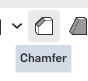

The head, and twelve numbers of its own
========================================

The head is a box with a rounded top, two eyes standing proud of its face, and a mouth sunk into
it. The joint that will hold it on does not exist until page 4, so this page ends with a head that
is a part on its own.

.. step: cad.hero

.. figure:: images/head/hero-01.png
   :alt: the finished head seen from a corner, two eyes standing proud of the face and a mouth sunk
         into it
   :width: 1130px
   :class: shot

   **The head at the end of this page.** Press **shift+7** for the corner view and **f** to zoom
   until it fills the window. It is 72 mm wide, 72 mm tall and 60 mm deep, with eyes standing 3 mm
   out of the face and a mouth sunk 3 mm into it.

Press **shift+1** to turn and look it in the face. That is the view worth checking your own work
against, because it shows both eyes at once and whether the mouth sits square under them.

.. figure:: images/head/hero-02.png
   :alt: the head straight on, both eyes level and the mouth centered below them
   :width: 1130px
   :class: shot

   **The same head, straight on.** Both eyes level with each other, the same distance either side
   of the middle, and the mouth centered below them.

Page 1 put three numbers in one place and read them from another tab. This page does the same
thing one level down: the head gets **twelve numbers of its own**. The first reaches back to
``#torsoW``, the second to ``#torsoD``, and the other ten are written in terms of the first.
Change the robot's width and the eyes, the mouth and the rounds all move with it.

Nobody types all twelve at once. Each one goes in just before the feature that reads it, so a
number never arrives with nothing on screen to say what it is for.

.. admonition:: The name in the title bar is not the one you typed
   :class: advice

   The pictures come from the documents this guide was built and checked in, and those have
   longer names than yours. Yours reads ``stickbot``. Everything else in the pictures is what
   you will see.

Make the head its own tab
--------------------------

.. step: cad.parts.head.tab

Click the **+** at the bottom left of the tab strip and choose **Create Part Studio**.

.. image:: images/toolbar/tb-new-tab.png
   :alt: Close-up of the plus button at the bottom left of the tab strip, its tooltip reading
         Insert new tab
   :class: button

.. image:: images/head/parts.head.tab-01.png
   :alt: the tab strip's plus menu, with Create Part Studio ringed
   :class: shot

You land in a new, empty Part Studio, and its tab is called ``Part Studio 1``. Onshape numbers each
kind of tab on its own, so this is the second Part Studio in the document and still the first with
that number.

.. image:: images/head/parts.head.tab-02.png
   :alt: the new empty Part Studio, its tab called Part Studio 1
   :class: shot

Right-click the tab, choose **Rename**, and type ``head``. The new tab went in beside the one you
were on, so the strip now reads ``body``, ``head``, ``robot sizes`` and ``Assembly 1``.

.. image:: images/head/parts.head.tab-03.png
   :alt: the tab strip reading body, head, robot sizes and Assembly 1
   :class: shot

Rename before you draw anything. Every picture you take in this tab from here on shows the tab
strip, and a tab still called ``Part Studio 1`` in a picture is a picture you take again.

Name how wide the head is
--------------------------

.. step: cad.parts.head.width_variable
.. req: req.model.design_intent

The head is drawn from twelve numbers, and they go in the **head tab itself**, not in
``robot sizes``. They are the head's own business: no other part reads ``#eyeUp``. The rows in
``robot sizes`` are the ones the whole robot shares, and the first number below reaches back to
one of them.

Click **Search tools** at the right of the toolbar, or press **alt/⌥+c**, type ``variable``, and
pick **Variable**. The dialog opens on **Length**, with its **Name** box empty and **Value**
reading ``0 mm``.

Type ``headW`` into **Name** and ``#torsoW`` into **Value**, then press **Tab**. Leave the ``#``
off the name; Onshape puts it on for you. **Value** changes to ``72 mm`` and the title at the top
of the dialog reads ``#headW = 72 mm``, which is Onshape saying it found ``#torsoW`` in the other
tab and worked out what it comes to. Click the **green ✓**.

.. image:: images/head/parts.head.width_variable-01.png
   :alt: the Variable dialog, its title reading #headW = 72 mm, headW in the Name box and 72 mm in
         the Value box
   :class: shot

That one line is the whole idea of the page. ``#torsoW`` lives in ``robot sizes``, and the head now
reads it. The head is exactly as wide as the torso, and it stays that way.

``#headW`` lands at the bottom of the feature list, which is where every feature you make lands.

.. image:: images/head/parts.head.width_variable-02.png
   :alt: the feature list with #headW below Default geometry and nothing else in the tree
   :class: shot

Draw the head's outline
------------------------

.. step: cad.parts.head.profile_sketch
.. req: req.model.design_intent, req.page.view_keys

Click the **Front** plane in the feature list.

.. image:: images/head/parts.head.profile_sketch-01.png
   :alt: the head Part Studio with the Front plane ringed in the feature list
   :class: shot

Click **Sketch**.

.. image:: images/toolbar/tb-sketch.png
   :alt: Close-up of the Sketch button at the left of the Part Studio toolbar, its tooltip reading
         Create new sketch shift+s
   :class: button

Press **n** to look **n**\ ormal, which means square on, at the plane. The view cube reads
**Front** and the sketch's name written on the plane reads the right way round, which is the side
you are standing on. A plane has two square-on views, and **n** is how you get from one to the
other: press it again and the cube reads **Back** and the name reads backwards. Then name the
sketch ``head profile`` from the pencil beside the dialog's title, before you draw anything in it.

.. image:: images/head/parts.head.profile_sketch-02.png
   :alt: the sketch dialog titled head profile, its plane field reading Front
   :class: shot

The shape is an arch: an arc across the top, a straight side down each edge, and a straight line
along the bottom. Start with the arc. Open the dropdown beside the arc button and choose **Center
point arc**, then put the pointer on the origin and wait for it to light up.

.. image:: images/toolbar/tb-arc.png
   :alt: Close-up of the arc button in the sketch toolbar, its tooltip reading 3 point arc a
   :class: button

.. image:: images/head/parts.head.profile_sketch-03.png
   :alt: the center point arc tool armed, the pointer on the origin
   :class: shot

Click the origin for the arc's center, then a point out to the left, then a point out to the right.
You get a half-round over the origin with its two ends level with each other.

.. image:: images/head/parts.head.profile_sketch-04.png
   :alt: an arc over the origin, its two ends level with each other on the horizontal axis
   :class: shot

Now close the arch with **Line**. Draw down from one end of the arc, along the bottom, and back up
to the other end.

.. image:: images/toolbar/tb-line.png
   :alt: Close-up of the Line button in the sketch toolbar, its tooltip reading Line l
   :class: button

.. image:: images/head/parts.head.profile_sketch-05.png
   :alt: the arch closed: the arc across the top, a line down each side and one along the bottom
   :class: shot

Lean the sides out a little as you draw them, clear of straight up and down. That looks wrong and it
is deliberate: the next step is the one that makes a side vertical, and a line Onshape guessed was
vertical is a line you cannot see the relation on. Click one side, then hold **shift** and click the
other, so both are picked at once.

.. image:: images/head/parts.head.profile_sketch-06.png
   :alt: both sides picked, ready to be told they are vertical
   :class: shot

Open the relations dropdown at the right of the sketch toolbar and choose **Vertical**. Both sides
snap straight up and down, and each picks up a small vertical marker beside it. Those markers are
the point of doing it by hand: they are there to be seen, and a side that lost its relation shows it
by losing its marker.

.. image:: images/head/parts.head.profile_sketch-07.png
   :alt: both sides straight up and down, each carrying a vertical relation marker
   :class: shot

Each side needs its own relation. The arc's two ends are level with each other and the bottom line
joins them, but nothing in that ties one side's lean to the other's, so squaring up one leaves the
other free to lean.

Two dimensions finish the outline. Click **Dimension**, click the arc, drop the label clear of the
shape, and type ``#headW / 2`` instead of a number. The radius resolves and reads ``36``, with a
small **fx** in front of it. That **fx** is how a driven number looks; a number you typed has none.

.. image:: images/toolbar/tb-dimension.png
   :alt: Close-up of the Dimension button on the sketch toolbar, its tooltip reading Dimension d
   :class: button

.. image:: images/head/parts.head.profile_sketch-08.png
   :alt: the arc's radius resolved and reading 36
   :class: shot

Dimension one of the straight sides the same way, also ``#headW / 2``. The whole outline goes
black. Black means fully defined: every point in it is pinned, and there is nothing left you could
drag.

.. image:: images/head/parts.head.profile_sketch-09.png
   :alt: both dimensions on the arch, 36 on the arc and 36 down the side
   :class: shot

Click the **green ✓**. The sketch closes and ``head profile`` takes its place in the feature list.

.. image:: images/head/parts.head.profile_sketch-10.png
   :alt: the closed sketch head profile in the feature list
   :class: shot

.. admonition:: Name the feature before you fill it in
   :class: advice

   Hover the dialog's title and click the pencil that appears beside it; the title becomes a box,
   and typing into it is the whole job. A tab full of ``Sketch 1``, ``Sketch 2``, ``Extrude 3`` is
   a tab nobody can read three pages later, including you. Naming it first also means a step you
   abandon halfway leaves something readable behind. Every feature on this page gets its name this
   way.

Name how deep the head is
--------------------------

.. step: cad.parts.head.depth_variable

The extrude you are about to make asks for a depth, so the depth gets its name first. Open
**Variable** again, type ``headD`` into **Name** and ``#torsoD * 5 / 4`` into **Value**, and press
**Tab**. It comes to 60 mm.

.. image:: images/head/parts.head.depth_variable-01.png
   :alt: the Variable dialog, its title reading #headD = 60 mm, headD in the Name box and 60 mm in
         the Value box
   :class: shot

That value does arithmetic on a number from another tab. The head is a quarter deeper than the
torso, front to back, so it hangs 6 mm over the body's front face and 6 mm over its back. Drive
``#torsoD`` to anything you like and it is still a quarter.

.. image:: images/head/parts.head.depth_variable-02.png
   :alt: the feature list reading #headW, head profile, #headD, the new number directly above the
         extrude that will read it
   :class: shot

Give the outline its depth
---------------------------

.. step: cad.parts.head.body
.. req: req.model.design_intent, req.page.view_keys

Press **shift+7** for the corner view, where depth is something you can see. Then click **Extrude**
and move the pointer inside the arch, into the middle of the region rather than onto one of its
edges.

.. image:: images/toolbar/tb-extrude.png
   :alt: Close-up of the Extrude button on the Part Studio toolbar, its tooltip reading Extrude
         shift+e
   :class: button

.. image:: images/head/parts.head.body-01.png
   :alt: the pointer inside the head profile region, before the click
   :class: shot

Click. The region turns orange and a preview grows one way out of the plane.

.. image:: images/head/parts.head.body-02.png
   :alt: the region picked, drawn in orange
   :class: shot

Name it ``head body``, then tick **Symmetric**. The preview stops growing one way out of the Front
plane and straddles it instead, half the depth each side.

.. image:: images/head/parts.head.body-03.png
   :alt: the Extrude dialog with Symmetric ticked, the head now straddling the Front plane
   :class: shot

Symmetric is worth the tick. It puts the middle of the head on the Front plane, which is the plane
the eyes and the mouth are drawn on, so every depth on this page is measured from the middle of the
part rather than from one of its faces.

Now type ``#headD`` into **Depth**. It resolves to ``60 mm``, and symmetric splits that rather than
doubling it: 30 mm each side of the plane.

.. image:: images/head/parts.head.body-04.png
   :alt: the depth field reading #headD
   :class: shot

Accept the dialog, then rename the part underneath **Parts**: right-click ``Part 1``, choose
**Rename**, and call it ``head``.

.. image:: images/head/parts.head.body-05.png
   :alt: the parts list holding one part called head
   :class: shot

Press **p** to put the three planes away, so from here on your picks land on the part and not on a
plane. The head is now 72 mm across, 72 mm tall and 60 mm deep, centered on the origin.

.. image:: images/head/parts.head.body-06.png
   :alt: the head, an arch as wide as it is tall, with the planes put away
   :class: shot

Name the size of the round
---------------------------

.. step: cad.parts.head.round_variable

Open **Variable**, type ``round`` into **Name** and ``#headW / 6`` into **Value**, and press
**Tab**. It comes to 12 mm.

.. image:: images/head/parts.head.round_variable-01.png
   :alt: the Variable dialog, its title reading #round = 12 mm, round in the Name box and 12 mm in
         the Value box
   :class: shot

This is the first number written in terms of ``#headW``, and the eight after it are written the
same way. The head is one number wide, and everything on it is a fraction of that number.

.. image:: images/head/parts.head.round_variable-02.png
   :alt: the feature list reading #headW, head profile, #headD, head body, #round
   :class: shot

Round the top corners
----------------------

.. step: cad.parts.head.upper_rounds

Click **Fillet**. The dialog opens with its **Entities to fillet** field empty and waiting.

.. image:: images/toolbar/tb-fillet.png
   :alt: Close-up of the Fillet button in the Part Studio toolbar, its tooltip reading Fillet
         shift+f
   :class: button

Two arcs run where the round top meets the flat faces, one at the front and one at the back. Click
the front one, then hold **shift** and click the back one.

.. image:: images/head/parts.head.upper_rounds-01.png
   :alt: both rim arcs picked and lit orange, the whole rounded rim in one shot
   :class: shot

The arc and the face behind it sit under the same pixel, so look at what the dialog caught.
**Entities to fillet** should read two edges. If it reads a face, clear it and click again a little
closer to the rim.

.. image:: images/head/parts.head.upper_rounds-02.png
   :alt: the front rim arc ringed close up, so which edge was picked is not a guess
   :class: shot

Two picks give you the whole rounded rim. A fillet carries along tangent edges. The arc and the
straight side below it meet smoothly, so Onshape treats them as one run and follows it to the
bottom.

Name it ``upper rounds`` and type ``#round`` into **Radius**. It resolves to ``12 mm``, and the
round previews over the top and down both sides.

.. image:: images/head/parts.head.upper_rounds-03.png
   :alt: #round in the Fillet dialog's Radius field, the round previewed over the top and down both
         sides
   :class: shot

Accept it. The round carries over the top and down both sides to the bottom.

.. image:: images/head/parts.head.upper_rounds-04.png
   :alt: the head with its rims rounded, the round carrying over the top and down both sides
   :class: shot

Name the size of the bevel
---------------------------

.. step: cad.parts.head.chamfer_variable

Open **Variable**, type ``chamfer`` into **Name** and ``#headW / 12`` into **Value**, and press
**Tab**. It comes to 6 mm, half the round.

.. image:: images/head/parts.head.chamfer_variable-01.png
   :alt: the Variable dialog, its title reading #chamfer = 6 mm, chamfer in the Name box and 6 mm
         in the Value box
   :class: shot

.. image:: images/head/parts.head.chamfer_variable-02.png
   :alt: the feature list with #chamfer below upper rounds, ready for the bevel that reads it
   :class: shot

Bevel the bottom edge
----------------------

.. step: cad.parts.head.lower_chamfer
.. req: req.page.view_keys

Press **shift+6** to look up at the head from underneath, where the face you are about to bevel is
the one you can see. Click **Chamfer**, then click the **bottom face** itself, not one of its
edges. One pick, and the bevel previews all the way round.

.. image:: images/head/parts.head.lower_chamfer-01.png
   :alt: the bottom face picked and lit orange
   :class: shot

Picking the face is what makes this one pick instead of eight. A chamfer given a face bevels every
edge of that face, including the rounded corners the fillet just made, and it does it in the order
that keeps them smooth.

Name it ``lower head chamfer`` and type ``#chamfer`` into **Width**. It resolves to ``6 mm``.

.. image:: images/head/parts.head.lower_chamfer-02.png
   :alt: #chamfer in the Chamfer dialog's Width field, a bevel previewed all the way round the
         bottom
   :class: shot

Accept it, and press **shift+7** to get back to the corner view where the whole head is in sight.

.. image:: images/head/parts.head.lower_chamfer-03.png
   :alt: the head with a bevel running right round its bottom edge
   :class: shot

Name the four numbers an eye is drawn from
------------------------------------------

.. step: cad.parts.head.eye_variables
.. req: req.model.design_intent

The sketch you draw next reads four numbers, so all four go in before it. That is four dialogs,
one after another, each one **Search tools**, ``variable``, **Variable**, a name, a value, **Tab**
and the **green ✓**.

.. list-table::
   :header-rows: 1
   :widths: 18 24 12 46

   * - Name
     - Value
     - mm
     - What it is
   * - ``eyeX``
     - ``#headW / 6``
     - 12
     - how far one eye sits from the middle
   * - ``eyeUp``
     - ``#headW / 9``
     - 8
     - how far above the middle the eyes sit
   * - ``eyeRx``
     - ``#headW / 9``
     - 8
     - half an eye's long way across
   * - ``eyeRy``
     - ``#headW / 18``
     - 4
     - half an eye's short way

.. image:: images/head/parts.head.eye_variables-01.png
   :alt: the Variable dialog, its title reading #eyeX = 12 mm, eyeX in the Name box and 12 mm in
         the Value box
   :class: shot

Four numbers arriving together is not the block this page avoids. They are one idea — where an eye
sits and how big it is — and the sketch cannot be drawn without all four.

.. image:: images/head/parts.head.eye_variables-02.png
   :alt: the feature list with #eyeX, #eyeUp, #eyeRx and #eyeRy in a run below lower head chamfer
   :class: shot

Draw one eye
-------------

.. step: cad.parts.head.eye_sketch
.. req: req.model.design_intent, req.page.view_keys

Both eyes come from one sketch and one extrude. Draw the right-hand one, then mirror it.

Click the **Front** plane in the feature list, the same plane the outline was drawn on. It is
inside the head now, and you put the planes away a moment ago, so nothing lights up in the graphics
area. The feature list is where you pick it.

.. image:: images/head/parts.head.eye_sketch-01.png
   :alt: the Front plane ringed in the feature list, the plane itself still put away
   :class: shot

Click **Sketch**, name it ``eye profile``, and press **n** to look square on. The head's face is
behind the sketch. Open the dropdown beside the circle button and choose **Ellipse**.

.. image:: images/toolbar/tb-circle.png
   :alt: Close-up of the circle button in the sketch toolbar, its tooltip reading Center point
         circle c
   :class: button

.. image:: images/head/parts.head.eye_sketch-02.png
   :alt: the ellipse tool armed, the head's face behind it
   :class: shot

Click a center up and to the right of the origin, then a point out to the side for the long way,
then a point above for the short way. You get one ellipse lying on its side.

.. image:: images/head/parts.head.eye_sketch-03.png
   :alt: an ellipse lying on its side, up and to the right of the origin
   :class: shot

Four dimensions pin it, two for its size and two for where it goes. Do the size first. Click
**Dimension**, click the ellipse, and drop the label **above** it for the long way across: type
``#eyeRx * 2``. Click the ellipse again and drop the label **out to the side** for the short way:
type ``#eyeRy * 2``.

.. image:: images/head/parts.head.eye_sketch-04.png
   :alt: the ellipse 16 across its long way and 8 across its short one
   :class: shot

Where you drop the label is what picks the axis, not where you clicked the ellipse. Read the number
already in the box before you type over it: about 16 for the long way, about 8 for the short way.
If it opened on the wrong one, press **Escape** and drop the label the other way.

Now put the eye where it goes. Click the origin, click the eye's center, and drop the label
**below** the pair: that reads the distance across, and takes ``#eyeX``. Do it once more, the same
two points, with the label dropped **out to the side**: that reads the distance up, and takes
``#eyeUp``. The ellipse goes black.

.. image:: images/head/parts.head.eye_sketch-05.png
   :alt: the eye black and fully defined, 12 over from the origin and 8 up
   :class: shot

Click the **green ✓**.

.. image:: images/head/parts.head.eye_sketch-06.png
   :alt: the closed sketch eye profile in the feature list
   :class: shot

Name how far the face's detail sits
------------------------------------

.. step: cad.parts.head.face_variable

Open **Variable**, type ``face`` into **Name** and ``#headW / 24`` into **Value**, and press
**Tab**. It comes to 3 mm.

.. image:: images/head/parts.head.face_variable-01.png
   :alt: the Variable dialog, its title reading #face = 3 mm, face in the Name box and 3 mm in the
         Value box
   :class: shot

This one is a depth, and the eye's sketch has no depth, so it waits for the extrude. That is why
it comes after ``eye profile`` rather than with the other four.

.. image:: images/head/parts.head.face_variable-02.png
   :alt: the feature list with #face directly below eye profile
   :class: shot

.. admonition:: One number stands for one idea
   :class: advice

   ``#face`` is 3 mm, and it is used twice: the eyes stand ``#face`` out of the face and the mouth
   is sunk ``#face`` into it. That is on purpose. Both are the same idea, which is how far the
   face's detail sits from the face, so they are one number, and a robot printed at a different
   size keeps them matched. The mouth reads ``#face`` again and types nothing.

Stand the eye out of the face
------------------------------

.. step: cad.parts.head.eye_cut

Click **Extrude**. The dialog opens with its region field empty.

.. image:: images/head/parts.head.eye_cut-01.png
   :alt: the Extrude dialog open with its region field empty and waiting
   :class: shot

The sketch is inside the head, so there is nothing to click in the graphics area. Click **eye
profile** in the feature list instead, and the field fills with the whole sketch.

.. image:: images/head/parts.head.eye_cut-02.png
   :alt: eye profile picked in the feature list, its name now in the Extrude dialog's region field
   :class: shot

Set the dialog to **Add**, so the eye joins the head rather than becoming a part of its own, and
name it ``eye``.

.. image:: images/head/parts.head.eye_cut-03.png
   :alt: the Extrude dialog set to Add, so the eye joins the head instead of becoming a part of its
         own
   :class: shot

Type ``#headD / 2 + #face`` into **Depth**. It resolves to ``33 mm``.

.. image:: images/head/parts.head.eye_cut-04.png
   :alt: the depth reading #headD / 2 + #face, which reaches the face and then stands three
         millimeters proud of it
   :class: shot

That depth is the whole reason the head was made symmetric. The sketch is on the Front plane, in
the middle of the head. Half the depth, ``#headD / 2``, gets you out to the face; ``#face`` more
stands the eye 3 mm proud of it. Measure the eye from the face instead and it stops standing 3 mm
proud the moment the head gets deeper.

Accept it. One eye stands proud of the face, up and to one side of the middle.

.. image:: images/head/parts.head.eye_cut-05.png
   :alt: one eye standing proud of the head's face, up and to one side of the middle
   :class: shot

Mirror the eye to get the other one
------------------------------------

.. step: cad.parts.head.mirror_eye

Click **Mirror**. The dialog opens with nothing picked.

.. image:: images/toolbar/tb-mirror.png
   :alt: Close-up of the Mirror button in the Part Studio toolbar, its tooltip reading Mirror
   :class: button

.. image:: images/head/parts.head.mirror_eye-01.png
   :alt: the Mirror dialog open, with nothing picked yet
   :class: shot

Change the dropdown at the top of the dialog to **Feature mirror**. The fields change with it: it
now asks for features and a plane instead of for parts.

.. image:: images/head/parts.head.mirror_eye-02.png
   :alt: the Mirror dialog switched to Feature mirror, so it asks for features and a plane rather
         than for parts
   :class: shot

**Part mirror** would copy the whole head, eye and all. **Feature mirror** copies one feature and
replays it on the other side, which is what you want here: one eye, mirrored.

Click **eye** in the feature list as the feature to mirror.

.. image:: images/head/parts.head.mirror_eye-03.png
   :alt: eye picked in the feature list as the feature to mirror
   :class: shot

Click the **Right** plane in the feature list as the plane to mirror about. A second eye previews on
the other side. Name it ``second eye`` and accept it.

.. image:: images/head/parts.head.mirror_eye-04.png
   :alt: the Right plane picked as the plane to mirror about, and a second eye previewed on the
         other side
   :class: shot

Both eyes are level with each other, the same distance either side of the middle.

.. image:: images/head/parts.head.mirror_eye-05.png
   :alt: the head with both eyes, level with each other and the same distance either side of the
         middle
   :class: shot

The second eye is not a copy sitting in a new place: it is the same feature, run again on the other
side of the Right plane. Change ``#eyeX`` and both eyes move.

Name the three numbers the mouth is drawn from
----------------------------------------------

.. step: cad.parts.head.mouth_variables

Three more, the same way, before the sketch that reads them.

.. list-table::
   :header-rows: 1
   :widths: 18 24 12 46

   * - Name
     - Value
     - mm
     - What it is
   * - ``mouthW``
     - ``#headW * 5 / 9``
     - 40
     - how wide the mouth is, corner to corner
   * - ``mouthH``
     - ``#headW * 5 / 36``
     - 10
     - how tall the mouth is
   * - ``mouthDn``
     - ``#headW * 13 / 72``
     - 13
     - how far below the middle the top of the mouth sits

.. image:: images/head/parts.head.mouth_variables-01.png
   :alt: the Variable dialog, its title reading #mouthW = 40 mm, mouthW in the Name box and 40 mm
         in the Value box
   :class: shot

.. image:: images/head/parts.head.mouth_variables-02.png
   :alt: the feature list with #mouthW, #mouthH and #mouthDn in a run below second eye
   :class: shot

Draw the mouth
---------------

.. step: cad.parts.head.mouth_sketch
.. req: req.page.view_keys

Start a sketch on the **Front** plane again, name it ``mouth profile``, and press **n** to look
square on; the view cube reads **Front**. Click **Line** and draw one horizontal line below the
origin. Length and position come from dimensions next, so draw it roughly and let the numbers
place it.

.. image:: images/head/parts.head.mouth_sketch-01.png
   :alt: one horizontal line drawn below the origin
   :class: shot

Three dimensions hold that line still. Click **Dimension**, click the line, drop the label clear of
the head, and type ``#mouthW - #mouthH``: that is its length, and it reads 30 mm. Then click the
origin and the line's **left end**, and drop that label **out to the side**: that reads how far down
the line sits, and takes ``#mouthDn + #mouthH / 2``, which is 18 mm. Click the same two points
again and drop the label **below**: that reads how far out the left end is, and takes
``(#mouthW - #mouthH) / 2``, which is 15 mm and leaves the line centered. The line turns black.

Measure the drop to the **end** of the line, not to the line itself. Picking the line asks for the
shortest distance from a point to a segment. Onshape answers *Sketch could not be solved*, and the
line stays where it was.

.. image:: images/head/parts.head.mouth_sketch-02.png
   :alt: the line black, 30 long, 18 below the origin and its left end 15 out from the middle
   :class: shot

.. admonition:: Why the third dimension, and not a symmetric relation
   :class: advice

   Centering the line on the sketch's vertical axis would be tidier, and there is no such axis to
   pick. Onshape draws the origin point and nothing else, and a click where the axis would be lands
   on the solid behind the sketch. It answers *A symmetry constraint requires a line and two other
   geometries of the same type* and adds nothing. The third dimension does the same job: with its
   left end fixed and its length fixed, the line has nothing left to slide.

**The line is shorter than the mouth, by exactly the mouth's height.** The line is the mouth's
spine, not its outline. In a moment the **Slot** tool wraps it in a rounded band ``#mouthH`` across,
and that band puts a half-circle on each end. Each half-circle adds ``#mouthH / 2``, so the finished
mouth is ``#mouthW`` wide with a line ``#mouthW - #mouthH`` long inside it.

``#mouthDn`` is where the top of the mouth goes, 13 mm below the middle of the face. The spine sits
half the mouth's height below that, so the band reaches back up to ``#mouthDn``.

Click the line so it lights up orange. That single line is the whole of what the next tool needs.

.. image:: images/head/parts.head.mouth_sketch-03.png
   :alt: the line picked, orange, ready for the Slot tool
   :class: shot

Now click empty space to let it go again. **Slot makes its own pick**, and a line already selected
sends it straight past the pick and into setting the width.

Open the dropdown on the **Offset** button and pick **Slot**. **Slot does not draw a slot. It
wraps one you have already drawn.** Its own tooltip says so: *create a slot around continuous
sketch entities*. Arm it, click the line, then move the mouse away from the line to set the width
and click again. That second click leaves a preview; press **Enter** to keep it.

.. image:: images/head/parts.head.mouth_sketch-04.png
   :alt: the line wrapped in a slot with a round end at each side, and the diameter dimension
         Onshape wrote itself
   :class: shot

**The slot arrives with a dimension you did not ask for.** Onshape writes its own diameter
constraint as it builds, and parks the label four radii above one of the round ends, which for a
20 mm slot is 40 mm up and usually off the top of the window. Zoom out until you can see it, then
double-click it and type ``#mouthH``, which reads 10 mm. Editing the label that is already there is
what you want; adding a second width dimension over-constrains the sketch.

.. image:: images/head/parts.head.mouth_sketch-05.png
   :alt: the slot black and fully defined, 40 across its widest, 10 tall, sitting 13 below the
         origin
   :class: shot

Click the **green ✓**.

.. image:: images/head/parts.head.mouth_sketch-06.png
   :alt: the closed sketch mouth profile in the feature list
   :class: shot

Sink the mouth into the face
-----------------------------

.. step: cad.parts.head.mouth_cut

Click **Extrude**.

.. image:: images/head/parts.head.mouth_cut-01.png
   :alt: the Extrude dialog open with its region field empty and waiting
   :class: shot

Set it to **Remove** before you pick anything. The eye left the dialog on **Add**, and an **Add**
here would put the mouth's shape back onto a head that already fills it.

.. image:: images/head/parts.head.mouth_cut-02.png
   :alt: the Extrude dialog set to Remove, so the slot takes plastic out of the head
   :class: shot

Click **mouth profile** in the feature list, and name the feature ``mouth``.

.. image:: images/head/parts.head.mouth_cut-03.png
   :alt: mouth profile picked in the feature list, its name now in the Extrude dialog's region
         field
   :class: shot

Type ``#face`` into **Depth**, then tick **Starting offset** and type ``#headD / 2`` into it.

.. image:: images/head/parts.head.mouth_cut-04.png
   :alt: the depth reading #face and the starting offset reading #headD / 2, which brings the far
         end of the cut out to the front of the face
   :class: shot

**The sketch is in the middle of the head, and the mouth is on its face.** ``mouth profile`` sits on
the Front plane, which cuts the head in half, 30 mm behind the face. A starting offset of
``#headD / 2`` walks the cut forward to the face before it starts, and ``#face`` then takes it 3 mm
back in. That is the groove.

You will see the groove appear on the face, below the eyes, as soon as the offset is typed. Two
small arrows in the dialog decide where it lands: one beside **Blind**, for which way the cut runs,
and one on the starting offset's own row, for which side of the plane it starts on. If the groove
shows up on the back of the head instead, click the arrow beside **Blind**.

Accept it. The mouth is a long rounded groove sunk into the face below the eyes.

.. image:: images/head/parts.head.mouth_cut-05.png
   :alt: the head with its mouth, a long rounded groove sunk into the face below the eyes
   :class: shot

Check the tree
---------------

.. step: cad.tree

Look at the feature list. It should read a number and then the feature that reads it, all the way
down: ``#headW``, ``head profile``,
``#headD``, ``head body``, ``#round``, ``upper rounds``, ``#chamfer``, ``lower head chamfer``,
``#eyeX``, ``#eyeUp``, ``#eyeRx``, ``#eyeRy``, ``eye profile``, ``#face``, ``eye``, ``second eye``,
``#mouthW``, ``#mouthH``, ``#mouthDn``, ``mouth profile`` and ``mouth``, with one part named
``head`` under **Parts (1)**. No ``Sketch 1``, ``Extrude 1`` or ``Part 1`` anywhere.

.. image:: images/head/tree-01.png
   :alt: the head's feature list, a number and then the feature that reads it all the way down,
         with one part called head
   :class: shot

Nine features and twelve numbers, and every one is a sentence about the head. Name its width and
draw its outline. Name its depth and give it depth. Round its top and bevel its bottom. Draw an
eye, stand it out, mirror it. Draw a mouth and sink it in. Someone who opens this tab a year from
now can read what you did, without opening one dialog.

The order tells you one more thing: what each number is for. ``#round`` sits directly above
``upper rounds``, so that is the feature that reads it, and you can see as much without opening
either one.

Publish a version
------------------

.. step: cad.version
.. req: req.page.document

Click **Create version…** in the left icon strip, under **Versions and history**. The dialog opens
with a name of Onshape's own already in the box, selected, so what you type replaces it. Type
``tutorial 2 - the head``, then click **Create**.

.. image:: images/toolbar/tb-create-version.png
   :alt: Close-up of the Create version button in the left icon strip, its tooltip reading Create
         version…
   :class: button

.. image:: images/head/version-01.png
   :alt: the Create version dialog with tutorial 2 - the head typed into the Name box
   :class: shot

Open **Versions and history**. The new version is at the top of the list under **Main**, above
page 1's and above ``Start``.

.. image:: images/head/version-02.png
   :alt: the Versions and history panel listing Main with tutorial 2 - the head at the top
   :class: shot

What you should be able to read off the model
----------------------------------------------

.. list-table::
   :header-rows: 1
   :widths: 42 28 30

   * - Check
     - Expected
     - Where to look
   * - the box
     - 72 mm × 63 mm × 72 mm
     - the bounding box
   * - and where it sits
     - x ±36 mm, y −33 mm to 30 mm, z ±36 mm
     - the same box; the eyes are what reach past −30
   * - faces
     - 29
     - **Measure**, with the part selected
   * - parts in the tab
     - one, named ``head``
     - the **Parts** list
   * - features
     - twenty-one: twelve numbers and nine named features
     - the tree
   * - the sketches
     - all three fully defined
     - their color, and the tree

The head is 72 mm wide because ``#headW`` is ``#torsoW``, and 60 mm deep because ``#headD`` is
``#torsoD * 5 / 4``. Nothing on this page was typed as a length. Open ``robot sizes``, change
``#torsoW`` to 96, and the head grows with the body: the eyes stay a sixth of the width apart, the
mouth stays five ninths of the width across, and the rounds stay a sixth of the width.

The next page puts this head and page 1's torso into an assembly, and mates them.
