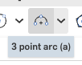
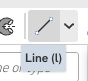
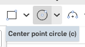
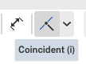
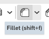
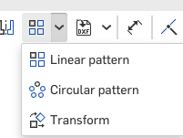

The hinge, the joint that clicks
=================================

This is the second joint on the robot, and it is the elbows and the knees. A flat **blade** stands
between the two ears of a **fork**, and a pin through all three lets it swing one way only. What
makes it worth building rather than buying is the ring of small bumps on the blade and the matching
ring of dimples in the ears: the joint clicks from angle to angle and stays where you put it.

Both halves are built in one tab and they are never joined. They meet in the assembly, where the
arm and the leg are put together.

It is the longest page in the guide, and it pays for itself. Four things on it come back later.
You pattern about a mate connector's axis. You mirror by feature, and then by part. And you cut one
part while another one stands in the same place.

Open ``stickbot``. You will make a new tab called ``hinge``.

.. step: cad.hero
.. req: req.page.hero

.. figure:: images/hinge/hero-01.png
   :alt: the finished hinge from a corner: the blade standing in the slot between the fork's two
         ears, with a rod out of each end
   :width: 1130px
   :class: shot

   **The hinge at the end of this page.** Two parts, one inside the other. Everything fits inside a
   round bar 24 mm across, which is the thickness every limb on this robot is made at.

.. figure:: images/hinge/hero-02.png
   :alt: the same hinge from the side, where the two rods are seen to point opposite ways along one
         line
   :width: 1130px
   :class: shot

   **The same hinge from the side.** The blade's rod points one way and the fork's rod points the
   other, along one line. The rings of teeth show up edge on, between the blade and each ear.

Make a Part Studio for the hinge
---------------------------------

.. step: cad.parts.hinge.tab
.. req: req.model.one_document

Click the **+** at the bottom left of the tab strip and choose **Create Part Studio**.

.. image:: images/toolbar/tb-new-tab.png
   :alt: Close-up of the plus button at the bottom left of the tab strip, its tooltip reading
         Insert new tab
   :class: button

.. image:: images/hinge/parts.hinge.tab-01.png
   :alt: the plus menu open at the bottom left, Create Part Studio above Create Assembly
   :class: shot

Right-click the new tab and choose **Rename**.

.. image:: images/hinge/parts.hinge.tab-02.png
   :alt: the right-click menu on the new Part Studio tab, with Rename on it
   :class: shot

Type ``hinge``. The new tab goes in beside the one you were on, at the end of the strip.

.. image:: images/hinge/parts.hinge.tab-03.png
   :alt: the tab strip alone, with hinge at the end of it
   :class: shot

Twenty numbers before any drawing
----------------------------------

.. step: cad.parts.hinge.variables
.. req: req.model.derive
.. req: req.page.typed_values

Twenty rows is more than any other page asks for, and it is the reason this joint can be resized in
one edit later. Only the first one reaches out to ``robot sizes``. Everything else on the page is
worked out from it, or is a size the printer cares about rather than a size the robot does.

Open **Variable** and add these, one row at a time. Type the value column exactly as it is written
here; a value with a ``#`` in it is read from another row.

.. list-table::
   :header-rows: 1
   :widths: 22 34 44

   * - Name
     - Value
     - What it is
   * - ``#limbD``
     - ``#torsoH / 4``
     - 24 mm, the round bar the whole joint has to fit inside
   * - ``#blade``
     - ``10 mm``
     - how thick the blade is
   * - ``#gap``
     - ``0.6 mm``
     - the clearance on each side of it
   * - ``#slot``
     - ``#blade + 2 * #gap``
     - 11.2 mm, the slot the fork has to leave for it
   * - ``#ear``
     - ``(#limbD - #slot) / 2``
     - 6.4 mm, whatever the slot leaves of the bar, split between two ears
   * - ``#nose``
     - ``#limbD / 2``
     - 12 mm, the radius every end on this joint is rounded on
   * - ``#blade_out``
     - ``32 mm``
     - how far the blade reaches out of the joint's middle
   * - ``#slot_deep``
     - ``#blade_out + 1 mm``
     - 33 mm, deep enough to swallow the blade with a millimeter to spare
   * - ``#blade_half``
     - ``sqrt(#limbD ^ 2 / 4 - #blade ^ 2 / 4)``
     - 10.91 mm, where the blade's straight side meets the round bar
   * - ``#stub``
     - ``4 mm``
     - the pin the joint turns on
   * - ``#stub_proud``
     - ``1.6 mm``
     - how far the pin stands out of each face of the blade
   * - ``#pocket_d``
     - ``4.4 mm``
     - the hole in the ear the pin turns in
   * - ``#teeth_ri``
     - ``8.8 mm``
     - the inside of the band the teeth live in
   * - ``#teeth_r``
     - ``10.4 mm``
     - and the outside of it
   * - ``#bump_r``
     - ``(#teeth_ri + #teeth_r) / 2``
     - 9.6 mm, the circle the teeth sit on
   * - ``#bump_d``
     - ``#teeth_r - #teeth_ri``
     - 1.6 mm, so one tooth fills the band exactly
   * - ``#valley_d``
     - ``2 mm``
     - the dimple a tooth drops into, a little wider than the tooth
   * - ``#valley_deep``
     - ``0.9 mm``
     - how deep that dimple is cut
   * - ``#tooth_proud``
     - ``1.2 mm``
     - how far a tooth stands out of the face it sits on
   * - ``#rod``
     - ``#ear``
     - 6.4 mm, the stub of limb on the back of each half

The dialog arrives on **Length**, with its Name and Value boxes empty. Leave the type alone; every
row here is a length.

.. image:: images/hinge/parts.hinge.variables-01.png
   :alt: the Variable dialog open, its type on Length and its Name and Value boxes empty
   :class: shot

The first row is the one that ties the joint to the robot. A limb a quarter of the torso's height
is a limb 24 mm across, and every part of this joint is measured against that.

.. image:: images/hinge/parts.hinge.variables-02.png
   :alt: limbD typed into the Name box and #torsoH / 4 into the Value box, so a limb is a quarter
         of the torso's height
   :class: shot

``#blade_half`` is the only row with a square root in it. The blade is a slab 10 mm thick inside a
bar 24 mm across, and this is how wide that slab is where it meets the outside of the bar. Write
the square root rather than 10.91 and the blade keeps meeting the bar however either one changes.

.. image:: images/hinge/parts.hinge.variables-03.png
   :alt: blade_half in the Name box and a square root in the Value box, which is how far off the
         middle the blade's round end meets the limb's outside
   :class: shot

Twenty rows stand above ``Default geometry`` when you are done.

.. image:: images/hinge/parts.hinge.variables-04.png
   :alt: the feature tree with twenty variables above Default geometry, limbD down to rod
   :class: shot

The frame this joint is built in
---------------------------------

The joint turns about the **Y axis**, which runs front to back through the origin. That is why so
much of this page sketches on the **Front** plane: the Front plane faces straight along that axis,
and the origin is the only thing that knows where the axis is.

The blade's tail runs down and the fork's body runs up. Both of them come back to the same round
end, 24 mm across, centered on the origin. The two halves can only touch there, and that is what
lets them swing past each other.

Draw the blade's profile
-------------------------

.. step: cad.parts.hinge.blade.profile_sketch
.. req: req.model.design_intent
.. req: req.model.anchored
.. req: req.page.view_keys

Pick the ``Front`` plane in the feature list and open **Sketch** (or press **shift+s**).

.. image:: images/toolbar/tb-sketch.png
   :alt: Close-up of the Sketch button at the left end of the toolbar, its tooltip reading Create
         new sketch shift s
   :class: button

.. image:: images/hinge/parts.hinge.blade.profile_sketch-01.png
   :alt: the Front plane picked in the list, which is the plane the blade is drawn on
   :class: shot

Press **n** to look straight at the plane, so what you draw is what you see. The origin is in the
middle.

.. image:: images/hinge/parts.hinge.blade.profile_sketch-02.png
   :alt: an empty sketch open on Front, seen face on, with the origin in the middle
   :class: shot

Open **Center point arc** and draw an arc over the top, starting from the origin as the center. Take
its two ends to the same height on either side.

.. image:: images/hinge/parts.hinge.blade.profile_sketch-03.png
   :alt: an arc over the top, centered on the origin, its two ends level with each other
   :class: shot

Open **Line** and close the shape: straight down from each end of the arc, then straight across the
bottom.

.. image:: images/hinge/parts.hinge.blade.profile_sketch-04.png
   :alt: the shape closed: two straight sides down from the arc and a straight tail across the
         bottom
   :class: shot

Click one side, then the other, then the vertical axis, and choose **Symmetric** from the
constraints at the right of the sketch toolbar. The two sides are now held the same distance from
the middle, so one dimension will place both of them.

.. image:: images/hinge/parts.hinge.blade.profile_sketch-05.png
   :alt: the two sides held mirrored about the vertical axis
   :class: shot

Open **Dimension** (or press **d**) and give the arc a radius of ``#nose``. It reads 12 mm, which is
half the bar the blade has to fit inside.

.. image:: images/toolbar/tb-dimension.png
   :alt: Close-up of the Dimension button in the sketch toolbar, its tooltip reading Dimension d
   :class: button

.. image:: images/hinge/parts.hinge.blade.profile_sketch-06.png
   :alt: the arc's radius typed as #nose, reading 12 mm, which is half the limb it has to fit
         inside
   :class: shot

Dimension the two sides apart at ``2 * #blade_half``. It reads 21.82 mm, and it is the width the
square root worked out: how wide a 10 mm blade is where it meets a 24 mm bar.

.. image:: images/hinge/parts.hinge.blade.profile_sketch-07.png
   :alt: the two sides dimensioned apart at 2 * #blade_half, reading 21.82 mm, which is how wide a
         10 mm blade is where it meets a 24 mm limb
   :class: shot

Dimension the tail down from the origin at ``#blade_out - #nose``. It reads 20 mm, so the blade
reaches ``#blade_out`` from the joint's middle once its round end is counted.

.. image:: images/hinge/parts.hinge.blade.profile_sketch-08.png
   :alt: the tail dimensioned down from the origin at #blade_out - #nose, reading 20 mm, so the
         blade reaches #blade_out from the joint's center
   :class: shot

The whole outline turns black. Black means every part of it is held: the arc by the origin and its
radius, the sides by the symmetry and one width, the tail by one distance.

.. image:: images/hinge/parts.hinge.blade.profile_sketch-09.png
   :alt: the finished profile, drawn in black because every part of it is now held
   :class: shot

Extrude the blade blank
------------------------

.. step: cad.parts.hinge.blade.blank
.. req: req.model.named_features

Open **Extrude** (or press **shift+e**). Its region field is empty and waiting, and it arrives on
**New**, which is what you want: this is the hinge's first part, so there is nothing yet for it to
join.

.. image:: images/toolbar/tb-extrude.png
   :alt: Close-up of the Extrude button in the Part Studio toolbar, its tooltip reading Extrude
         shift e
   :class: button

.. image:: images/hinge/parts.hinge.blade.blank-01.png
   :alt: the Extrude dialog open on New, with its Faces and sketch regions field empty and waiting
   :class: shot

Type ``#blade`` into **Depth**. It reads 10 mm, the thickness the slot in the fork is cut to take.

.. image:: images/hinge/parts.hinge.blade.blank-03.png
   :alt: the depth typed as #blade, so the blade is as thick as the slot the fork leaves for it
   :class: shot

Tick **Symmetric**. The blade now grows half its thickness on each side of the Front plane, so its
middle stays on the plane it was drawn on.

.. image:: images/hinge/parts.hinge.blade.blank-04.png
   :alt: Symmetric ticked, so the blade grows half its thickness either side of Front and stays
         centered on it
   :class: shot

Name it ``blade blank`` and accept. A slab with a round top stands on the origin.

.. image:: images/hinge/parts.hinge.blade.blank-05.png
   :alt: the blade blank, a round-topped slab standing on the origin
   :class: shot

.. admonition:: Symmetric is worth checking before you accept
   :class: advice

   Everything later on this page is measured from the middle of the blade, and **Symmetric** is
   what puts that middle on the Front plane. Read the tick in the dialog rather than the picture:
   a blade grown one way looks much the same from a corner and puts every tooth in the wrong place.

Draw the pin
-------------

.. step: cad.parts.hinge.blade.axle_sketch
.. req: req.model.anchored
.. req: req.page.view_keys

Pick ``Front`` again and open **Sketch**. Drawing the pin on the same plane as the blade is what
puts it on the axis the joint turns about.

.. image:: images/hinge/parts.hinge.blade.axle_sketch-01.png
   :alt: the Front plane picked again, so the axle is drawn on the same plane as the blade and
         turns about the blade's own center
   :class: shot

Press **n**. The blade is behind the sketch.

.. image:: images/hinge/parts.hinge.blade.axle_sketch-02.png
   :alt: an empty sketch open on Front, with the blade behind it
   :class: shot

Open **Circle** and draw one circle out to the side. It does not matter yet where it is or how big
it is; the next two moves fix both.

         circle c
   :class: button

.. image:: images/hinge/parts.hinge.blade.axle_sketch-03.png
   :alt: a circle drawn out to one side of the origin, the wrong size and in the wrong place, which
         is what the next two steps are for
   :class: shot

Drag the circle's center onto the origin until it snaps. It is now concentric with the arc over the
blade's round end.

.. image:: images/hinge/parts.hinge.blade.axle_sketch-04.png
   :alt: the circle pulled onto the origin, concentric with the arc over the blade's nose
   :class: shot

Dimension it across at ``#stub``. It reads 4 mm, and it is the pin the two halves turn on.

.. image:: images/hinge/parts.hinge.blade.axle_sketch-05.png
   :alt: the circle dimensioned across at #stub, reading 4 mm, which is the pin the two halves of
         the hinge turn on
   :class: shot

The circle turns black.

.. image:: images/hinge/parts.hinge.blade.axle_sketch-06.png
   :alt: the finished circle, drawn in black because its place and its size are both held
   :class: shot

Extrude the pin
----------------

.. step: cad.parts.hinge.blade.axle
.. req: req.model.named_features

Open **Extrude**. Its region field is empty.

.. image:: images/hinge/parts.hinge.blade.axle-01.png
   :alt: the Extrude dialog open with its region field empty
   :class: shot

Choose **Add**. The pin joins the blade instead of standing beside it as a second part.

.. image:: images/hinge/parts.hinge.blade.axle-02.png
   :alt: the Extrude dialog set to Add, so the pin joins the blade instead of standing beside it as
         a second part
   :class: shot

Type ``#blade + 2 * #stub_proud`` into **Depth**. That is the blade's own thickness plus what has
to stand out at each end, so the pin reaches into an ear on both sides.

.. image:: images/hinge/parts.hinge.blade.axle-03.png
   :alt: the depth typed as #blade + 2 * #stub_proud, so the pin is as long as the blade is thick
         plus what has to stand out at each end
   :class: shot

Tick **Symmetric**, so the same length of pin stands out on each side.

.. image:: images/hinge/parts.hinge.blade.axle-04.png
   :alt: Symmetric ticked, so the same length of pin stands out on each side
   :class: shot

Name it ``stub axle`` and accept.

.. image:: images/hinge/parts.hinge.blade.axle-05.png
   :alt: the blade with a short pin through its nose, standing out the same amount on both faces
   :class: shot

Draw one tooth
---------------

.. step: cad.parts.hinge.blade.bump_sketch
.. req: req.model.design_intent
.. req: req.page.view_keys

Twenty-four teeth are coming, and all twenty-four are made from this one. Pick ``Front`` and open
**Sketch**.

.. image:: images/hinge/parts.hinge.blade.bump_sketch-01.png
   :alt: the Front plane picked, the same plane the blade and its pin were drawn on
   :class: shot

Press **n**.

.. image:: images/hinge/parts.hinge.blade.bump_sketch-02.png
   :alt: an empty sketch open on Front, with the blade behind it
   :class: shot

Open **Circle** and draw a small one up and to the side, roughly where a tooth goes.

.. image:: images/hinge/parts.hinge.blade.bump_sketch-03.png
   :alt: a small circle drawn up and to one side, roughly where a tooth goes and not yet held
         anywhere
   :class: shot

Dimension its center up from the horizontal axis at ``#bump_r``. It reads 9.6 mm, which is the
circle the whole ring of teeth will sit on.

.. image:: images/hinge/parts.hinge.blade.bump_sketch-04.png
   :alt: the tooth dimensioned up from the horizontal axis at #bump_r, reading 9.6 mm, which is the
         circle the ring of teeth sits on
   :class: shot

Hold the center straight above the origin. Click the center point and the vertical axis, then
**Coincident**. The tooth is now on the blade's center line, which is where the pattern expects to
find the first one.

.. image:: images/hinge/parts.hinge.blade.bump_sketch-05.png
   :alt: the circle's center held straight above the origin, so the tooth sits on the blade's
         center line
   :class: shot

Dimension the circle across at ``#bump_d``. It reads 1.6 mm, and it fills the band between
``#teeth_ri`` and ``#teeth_r`` exactly.

.. image:: images/hinge/parts.hinge.blade.bump_sketch-06.png
   :alt: the tooth dimensioned across at #bump_d, reading 1.6 mm, which is how far it stands out of
         the blade's face
   :class: shot

The circle turns black.

.. image:: images/hinge/parts.hinge.blade.bump_sketch-07.png
   :alt: the finished tooth, drawn in black because its place and its size are both held
   :class: shot

Extrude the tooth
------------------

.. step: cad.parts.hinge.blade.bump
.. req: req.model.named_features

Open **Extrude** and choose **Add**, so the tooth joins the blade.

.. image:: images/hinge/parts.hinge.blade.bump-01.png
   :alt: the Extrude dialog set to Add, so the tooth joins the blade
   :class: shot

Type ``#tooth_proud`` into **Depth**. It reads 1.2 mm, which is how far a tooth stands out of the
face it sits on.

.. image:: images/hinge/parts.hinge.blade.bump-02.png
   :alt: the depth typed as #tooth_proud, which is how far the tooth stands out of the face it sits
         on
   :class: shot

Tick **Starting offset** and type ``#blade / 2``. The sketch is on the middle of the blade, so
without this the tooth would grow from the middle outward and half of it would be buried. The offset
starts it at the blade's face instead.

.. image:: images/hinge/parts.hinge.blade.bump-03.png
   :alt: the starting offset typed as #blade / 2, so the tooth starts at the blade's face rather
         than inside it
   :class: shot

Name it ``blade bump`` and accept. One small tooth stands on the blade's face.

.. image:: images/hinge/parts.hinge.blade.bump-04.png
   :alt: one small tooth standing on the blade's face, near the top
   :class: shot

One more number, for the printer
---------------------------------

.. step: cad.parts.hinge.rim_break
.. req: req.page.typed_values

This row is added here rather than with the other twenty, because it is the first place it is
needed and because it is a different kind of number. The twenty above are the robot's shape. This
one is about how the part comes off a printer.

Open **Variable** again.

.. image:: images/hinge/parts.hinge.rim_break-01.png
   :alt: the Variable dialog open again, its type on Length and its Name and Value boxes empty
   :class: shot

Type ``rim_break`` and ``0.1 mm``. That is about one layer of print. It takes the sharp lip off an
edge and changes the shape of nothing.

.. image:: images/hinge/parts.hinge.rim_break-02.png
   :alt: rim_break in the Name box and 0.1 mm in the Value box, a typed number because it is a size
         the printer cares about rather than a size the robot does
   :class: shot

The new row goes in under ``blade bump``, where it was made.

.. image:: images/hinge/parts.hinge.rim_break-03.png
   :alt: the feature tree with rim_break added under blade bump
   :class: shot

Dome the tooth
---------------

.. step: cad.parts.hinge.blade.bump_dome
.. req: req.model.named_features

A tooth with a flat top catches on the dimple's rim and the joint grinds instead of clicking. A
fillet as wide as the tooth's own radius uses the flat up completely and leaves a half sphere.

Open **Fillet** (or press **shift+f**).

         shift f
   :class: button

.. image:: images/hinge/parts.hinge.blade.bump_dome-01.png
   :alt: the Fillet dialog open, waiting for an edge or a face
   :class: shot

Zoom in and click the tooth's flat top. It is a disc 1.6 mm across standing off the blade's face.

.. image:: images/hinge/parts.hinge.blade.bump_dome-02.png
   :alt: the tooth's flat top picked, close up, a disc 1.6 mm across standing off the blade's face
   :class: shot

Type ``#bump_d / 2`` into **Radius**. It reads 0.8 mm, which is half the width of that disc.

.. image:: images/hinge/parts.hinge.blade.bump_dome-03.png
   :alt: #bump_d / 2 typed into the Radius field, reading 0.8 mm, which is half the width of the
         disc and uses all of it up
   :class: shot

Name it ``dome blade bump``.

.. image:: images/hinge/parts.hinge.blade.bump_dome-04.png
   :alt: the Fillet dialog with dome blade bump typed into its name box
   :class: shot

The flat is gone and the tooth is a small dome.

.. image:: images/hinge/parts.hinge.blade.bump_dome-05.png
   :alt: the tooth now a small dome, close up, with no flat left on top of it
   :class: shot

Stand a connector on the pin
-----------------------------

.. step: cad.parts.hinge.blade.pattern_axis
.. req: req.model.anchored

Two rings of twenty-four are coming, one on the blade and one in each ear, and all of them turn
about the same line. A **Mate connector** on the pin's round end gives that line a name, so both
patterns can point at it instead of at a plane that happens to look right.

Open the **Custom features** menu and choose **Mate connector** (or press **ctrl+m**).

.. image:: images/toolbar/tb-mate-connector.png
   :alt: Close-up of the Custom features menu open, Mate connector near the bottom with its
         shortcut ctrl m beside it
   :class: button

.. image:: images/hinge/parts.hinge.blade.pattern_axis-01.png
   :alt: the Mate connector dialog open, its Origin entity box empty and waiting
   :class: shot

Hover over the middle of the pin's round end until it lights up, then click it. Hovering first is
what makes the click land on that face rather than on whatever is behind it.

.. image:: images/hinge/parts.hinge.blade.pattern_axis-02.png
   :alt: the middle of the stub axle's round end picked, so the connector stands on the axle with
         its blue Z arrow running straight out along it
   :class: shot

One pick fills three boxes. **Origin entity** and **Attach to** both read the face, **Owner entity**
holds the blade, and **Attachment** is already on **To selection**.

.. image:: images/hinge/parts.hinge.blade.pattern_axis-03.png
   :alt: the dialog after that one pick: Origin entity and Attach to both reading Face of stub
         axle, Owner entity holding Part 1, and Attachment already on To selection
   :class: shot

Name it ``axis for circular patterns``.

.. image:: images/hinge/parts.hinge.blade.pattern_axis-04.png
   :alt: the Mate connector dialog with axis for circular patterns typed into its name box
   :class: shot

Three small arrows stand in the middle of the pin's end, and the row is black in the feature list.
Black is the sign that it found its face. The blue arrow points straight out along the pin, and that
blue arrow is the axis both patterns will turn about.

.. image:: images/hinge/parts.hinge.blade.pattern_axis-05.png
   :alt: the connector's three arrows standing in the middle of the axle's round end, and axis for
         circular patterns in black at the end of the feature list
   :class: shot

.. admonition:: Click once, and hover before you click
   :class: advice

   Clicking the same face a second time takes it back out of **Attach to** and the connector stops
   resolving. If the row goes red, click the face once more to put it back.

Twenty-four teeth
------------------

.. step: cad.parts.hinge.blade.bumps
.. req: req.model.named_features

Open **Circular pattern** from the pattern menu. It arrives on **Part pattern**.

         Transform
   :class: button

.. image:: images/hinge/parts.hinge.blade.bumps-01.png
   :alt: the Circular pattern dialog open, set to Part pattern
   :class: shot

Put it on **Feature pattern**. Each copy is then made the way the first tooth was made, from its
sketch and its fillet, rather than by copying the faces the first one left behind.

.. image:: images/hinge/parts.hinge.blade.bumps-02.png
   :alt: the dialog put on Feature pattern, so each copy is made the way the first tooth was made
         rather than by copying the faces it left
   :class: shot

Click ``blade bump`` in the feature list.

.. image:: images/hinge/parts.hinge.blade.bumps-03.png
   :alt: blade bump clicked in the feature list
   :class: shot

Click ``dome blade bump`` as well. A tooth is the extrude and the fillet together, and a pattern
that takes only the extrude gives you twenty-four flat-topped teeth and one dome.

.. image:: images/hinge/parts.hinge.blade.bumps-04.png
   :alt: dome blade bump clicked as well, because a tooth is the extrude and the fillet together
   :class: shot

Click ``axis for circular patterns`` in the list as the axis to turn about.

.. image:: images/hinge/parts.hinge.blade.bumps-05.png
   :alt: axis for circular patterns picked in the feature list as the axis the copies turn about
   :class: shot

Type ``360 deg`` into **Angle** and ``24`` into **Instance count**, and tick **Equal spacing** and
**Reapply features**. Twenty-four teeth over a full turn is one every 15 degrees, and 15 degrees is
how far the joint moves from click to click.

.. image:: images/hinge/parts.hinge.blade.bumps-06.png
   :alt: 360 deg typed into Angle and 24 into Instance count, with Equal spacing and Reapply
         features both ticked, so the teeth sit every 15 degrees the whole way round
   :class: shot

Name it ``24 blade bumps``.

.. image:: images/hinge/parts.hinge.blade.bumps-07.png
   :alt: the Circular pattern dialog with 24 blade bumps typed into its name box
   :class: shot

One face of the blade now carries a full ring of domes.

.. image:: images/hinge/parts.hinge.blade.bumps-08.png
   :alt: the blade's face carrying a full ring of 24 domed teeth
   :class: shot

Mirror the ring onto the other face
------------------------------------

.. step: cad.parts.hinge.blade.mirror
.. req: req.model.named_features

The blade is held between two ears, so it needs a ring on each face. Open **Mirror**. It arrives on
**Part mirror**.

.. image:: images/toolbar/tb-mirror.png
   :alt: Close-up of the Mirror button in the Part Studio toolbar, its tooltip reading Mirror
   :class: button

.. image:: images/hinge/parts.hinge.blade.mirror-01.png
   :alt: the Mirror dialog open, set to Part mirror
   :class: shot

Put it on **Feature mirror**. Part mirror would give you a second blade standing beside the first.
Feature mirror runs the same three features again on the far side of a plane, which is what you
want here.

.. image:: images/hinge/parts.hinge.blade.mirror-02.png
   :alt: the dialog put on Feature mirror, so the far side is built by running the same three
         features again rather than by copying the part
   :class: shot

Click ``blade bump``, ``dome blade bump`` and ``24 blade bumps`` in the feature list. That is
everything that made the first ring.

.. image:: images/hinge/parts.hinge.blade.mirror-03.png
   :alt: blade bump, dome blade bump and 24 blade bumps all clicked in the feature list, which is
         everything that made the first ring
   :class: shot

Pick the ``Front`` plane as the mirror plane. The blade was drawn on it and grows the same amount
either side of it, so the second ring lands the same distance out as the first.

.. image:: images/hinge/parts.hinge.blade.mirror-04.png
   :alt: the Front plane picked as the mirror plane, because the blade was drawn on it and grows
         the same amount either side of it
   :class: shot

Name it ``mirror blade``.

.. image:: images/hinge/parts.hinge.blade.mirror-05.png
   :alt: the Mirror dialog with mirror blade typed into its name box
   :class: shot

Forty-eight teeth, twenty-four on each face.

.. image:: images/hinge/parts.hinge.blade.mirror-06.png
   :alt: the blade with a ring of teeth on each of its two faces
   :class: shot

Draw the blade's rod
---------------------

.. step: cad.parts.hinge.blade.arm_sketch
.. req: req.model.anchored
.. req: req.page.view_keys

The rod is the stub of limb the blade plugs into on a later page. It points away from the faces the
teeth are on, so it is drawn on ``Top`` rather than ``Front``. Pick ``Top`` and open **Sketch**.

.. image:: images/hinge/parts.hinge.blade.arm_sketch-01.png
   :alt: the Top plane picked, which is square to the three sketches so far, because the arm points
         away from the face the teeth sit on
   :class: shot

Press **n**. The blade is seen edge on behind the sketch.

.. image:: images/hinge/parts.hinge.blade.arm_sketch-02.png
   :alt: an empty sketch open on Top, with the blade seen edge on behind it
   :class: shot

Open **Circle** and draw one out to the side.

.. image:: images/hinge/parts.hinge.blade.arm_sketch-03.png
   :alt: a circle drawn out to one side of the origin, the wrong size and in the wrong place
   :class: shot

Drag its center onto the origin, so the rod comes out of the middle of the joint.

.. image:: images/hinge/parts.hinge.blade.arm_sketch-04.png
   :alt: the circle pulled onto the origin, so the arm comes out of the middle of the joint
   :class: shot

Dimension it across at ``#limbD``. It reads 24 mm, the thickness every limb on this robot is made
at.

.. image:: images/hinge/parts.hinge.blade.arm_sketch-05.png
   :alt: the circle dimensioned across at #limbD, reading 24 mm, which is the thickness every limb
         in the robot is made at
   :class: shot

The circle turns black.

.. image:: images/hinge/parts.hinge.blade.arm_sketch-06.png
   :alt: the finished circle, drawn in black because its place and its size are both held
   :class: shot

Extrude the blade's arm
------------------------

.. step: cad.parts.hinge.blade.arm
.. req: req.model.named_features

Open **Extrude** and choose **Add**, so the arm joins the blade rather than becoming a part of its
own.

.. image:: images/hinge/parts.hinge.blade.arm-01.png
   :alt: the Extrude dialog set to Add, so the arm joins the blade rather than becoming a part of
         its own
   :class: shot

Click ``blade rod outline`` in the feature list. Picking a sketch by name takes the whole sketch,
which is what you want when it holds one circle.

.. image:: images/hinge/parts.hinge.blade.arm-02.png
   :alt: blade rod outline picked in the feature list as the shape to extrude
   :class: shot

Type ``#rod`` into **Depth**. It reads 6.4 mm.

.. image:: images/hinge/parts.hinge.blade.arm-03.png
   :alt: the depth typed as #rod, reading 6.4 mm, which is how long the rod is
   :class: shot

Click the **Opposite direction** arrow beside the depth. The arm now grows away from the joint,
past the blade's tail, instead of up into the teeth.

.. image:: images/hinge/parts.hinge.blade.arm-04.png
   :alt: the Opposite direction arrow clicked, so the arm grows away from the face the teeth are on
   :class: shot

Tick **Starting offset** and type ``#blade_out - #nose``. It reads 20 mm, which is where the blade's
tail stops.

.. image:: images/hinge/parts.hinge.blade.arm-05.png
   :alt: the starting offset typed as #blade_out - #nose, reading 20 mm, so the rod starts where
         the blade's round end stops
   :class: shot

Click the **Opposite direction** arrow on the starting offset's own row. Each distance carries its
own arrow, and both of them have to point the same way for the rod to start on the end of the tail.

.. image:: images/hinge/parts.hinge.blade.arm-06.png
   :alt: the second Opposite direction arrow clicked, the one beside the starting offset, so the 20
         mm is measured the same way the arm grows
   :class: shot

Name it ``blade arm``.

.. image:: images/hinge/parts.hinge.blade.arm-07.png
   :alt: the Extrude dialog with blade arm typed into its name box
   :class: shot

The blade is finished: a round nose with two rings of teeth, a tail, and a rod on the end of it. Its
flat end is 26.4 mm from the joint's middle, which is the 20 mm tail plus the 6.4 mm rod.

.. image:: images/hinge/parts.hinge.blade.arm-08.png
   :alt: the blade with a round rod standing off the back of it
   :class: shot

Draw the fork's outline
------------------------

.. step: cad.parts.hinge.fork.profile_sketch
.. req: req.model.design_intent
.. req: req.page.view_keys

The fork is the other half, and it is built as one ear which is then mirrored. Pick ``Top`` and
open **Sketch**, the same plane the blade's rod was drawn on.

.. image:: images/hinge/parts.hinge.fork.profile_sketch-01.png
   :alt: the Top plane picked, the same plane the blade's arm was drawn on, so the fork lines up
         with it
   :class: shot

Press **n**.

.. image:: images/hinge/parts.hinge.fork.profile_sketch-02.png
   :alt: an empty sketch open on Top, with the blade seen edge on behind it
   :class: shot

Open **Circle** and draw one out to the side.

.. image:: images/hinge/parts.hinge.fork.profile_sketch-03.png
   :alt: a circle drawn out to one side of the origin, the wrong size and in the wrong place
   :class: shot

Drag its center onto the origin.

.. image:: images/hinge/parts.hinge.fork.profile_sketch-04.png
   :alt: the circle pulled onto the origin, so the fork grows out of the middle of the joint
   :class: shot

Dimension it across at ``#limbD``, the same 24 mm the blade's rod is.

.. image:: images/hinge/parts.hinge.fork.profile_sketch-05.png
   :alt: the circle dimensioned across at #limbD, reading 24 mm, the same thickness the blade's arm
         is
   :class: shot

Open **Line** and draw one straight line across the top of the circle, landing both of its ends on
the circle's edge. This line is what splits the bar into a slot and an ear.

.. image:: images/hinge/parts.hinge.fork.profile_sketch-06.png
   :alt: a straight line drawn across the top of the circle, its two ends landing on the circle's
         edge
   :class: shot

Dimension the line up from the origin at ``#slot / 2``. It reads 5.6 mm, half the gap the blade
turns in. What is left above the line is one ear, and it comes out ``#ear`` thick without anyone
typing 6.4.

.. image:: images/hinge/parts.hinge.fork.profile_sketch-07.png
   :alt: the flat dimensioned up from the origin at #slot / 2, reading 5.6 mm, which is half the
         gap the blade turns in
   :class: shot

Both pieces turn black.

.. image:: images/hinge/parts.hinge.fork.profile_sketch-08.png
   :alt: the finished outline, drawn in black because the circle and the flat across it are both
         held
   :class: shot

Extrude one ear
----------------

.. step: cad.parts.hinge.fork.blank
.. req: req.model.named_features

Open **Extrude** and click the thin sliver above the line. That sliver is one ear seen end on.

.. image:: images/hinge/parts.hinge.fork.blank-01.png
   :alt: the thin sliver above the flat picked, which is one ear of the fork and #ear thick
   :class: shot

Choose **New**. The fork has to be a second part, because the whole point of a hinge is that its two
halves are not joined.

.. image:: images/hinge/parts.hinge.fork.blank-02.png
   :alt: the Extrude dialog set to New, so the ear becomes a second part rather than joining the
         blade
   :class: shot

Type ``#slot_deep`` into **Depth**. It reads 33 mm, which is how far the fork reaches along the
joint.

.. image:: images/hinge/parts.hinge.fork.blank-03.png
   :alt: the depth typed as #slot_deep, reading 33 mm, which is how far the fork reaches along the
         joint
   :class: shot

Tick **Starting offset** and type ``#nose``. It reads 12 mm, far enough back to reach round the
blade's round end.

.. image:: images/hinge/parts.hinge.fork.blank-04.png
   :alt: the starting offset typed as #nose, reading 12 mm, so the fork starts back far enough to
         reach round the blade's round end
   :class: shot

Click the **Opposite direction** arrow beside the starting offset. The 12 mm is then measured back
past the blade, not forward away from it.

.. image:: images/hinge/parts.hinge.fork.blank-05.png
   :alt: the Opposite direction arrow beside the starting offset clicked, so the 12 mm is measured
         back rather than forward
   :class: shot

Name it ``fork blank``.

.. image:: images/hinge/parts.hinge.fork.blank-06.png
   :alt: the Extrude dialog with fork blank typed into its name box
   :class: shot

One ear stands beside the blade: a thin plate with square ends, which the next two steps round off.

.. image:: images/hinge/parts.hinge.fork.blank-07.png
   :alt: one ear of the fork standing beside the blade, a thin round-ended plate
   :class: shot

Draw the shape that trims the ear
----------------------------------

.. step: cad.parts.hinge.fork.trim_sketch
.. req: req.model.design_intent
.. req: req.model.visible_geometry
.. req: req.page.view_keys

The ear's end is square, and a square end cannot turn against the blade's round one. This sketch is
a circle inside a box: extrude everything between them away and the square end becomes a round one.

Hide the blade and the ear first, from their rows in the parts list. Nothing is then drawn where the
sketch is about to be, which makes every line easy to see and easy to pick.

.. image:: images/hinge/parts.hinge.fork.trim_sketch-01.png
   :alt: the blade and the ear put away, so nothing is drawn where the sketch is about to be
   :class: shot

Pick ``Front`` and open **Sketch**. Front looks straight along the axis the joint turns about, which
is the only view where the round end is a circle.

.. image:: images/hinge/parts.hinge.fork.trim_sketch-02.png
   :alt: the Front plane picked, which looks straight along the axis the joint turns about
   :class: shot

Press **n**.

.. image:: images/hinge/parts.hinge.fork.trim_sketch-03.png
   :alt: an empty sketch open on Front, with nothing behind it
   :class: shot

Open **Circle** and draw one out to the side.

.. image:: images/hinge/parts.hinge.fork.trim_sketch-04.png
   :alt: a circle drawn out to one side of the origin, the wrong size and in the wrong place
   :class: shot

Dimension it across at ``#limbD``.

.. image:: images/hinge/parts.hinge.fork.trim_sketch-05.png
   :alt: the circle dimensioned across at #limbD, which is the round end the fork has to turn
         against
   :class: shot

Drag its center onto the origin. This circle is the round end both halves share.

.. image:: images/hinge/parts.hinge.fork.trim_sketch-06.png
   :alt: the circle held on the origin at #limbD across, reading 24 mm
   :class: shot

Open **Rectangle** and draw a box round the circle, bigger than it needs to be.

.. image:: images/toolbar/tb-rectangle.png
   :alt: Close-up of the rectangle button and the arrow beside it in the sketch toolbar, its
         tooltip reading Corner rectangle g
   :class: button

.. image:: images/hinge/parts.hinge.fork.trim_sketch-07.png
   :alt: a box drawn round the circle, bigger than it needs to be and not yet held anywhere
   :class: shot

Dimension the box's left side 2 mm clear of the circle. Holding the box off the circle rather than
off the origin means the cut still reaches past the round end however big that end becomes.

.. image:: images/hinge/parts.hinge.fork.trim_sketch-08.png
   :alt: the box's left side held 2 mm clear of the circle, so the cut always reaches past the
         round end however big that end is
   :class: shot

Do the same on the right.

.. image:: images/hinge/parts.hinge.fork.trim_sketch-09.png
   :alt: the box's right side held the same 2 mm clear the other way
   :class: shot

And along the bottom.

.. image:: images/hinge/parts.hinge.fork.trim_sketch-10.png
   :alt: the box's bottom side held 2 mm clear of the circle
   :class: shot

The top side is the one that is different. Dimension it ``#slot / 2`` above the origin, reading
5.6 mm. That is exactly the height where the round end has grown as wide as the ear is, so above
that line the circle would start cutting into the ear instead of trimming it.

.. image:: images/hinge/parts.hinge.fork.trim_sketch-11.png
   :alt: the box's top side dimensioned #slot / 2 above the origin, reading 5.6 mm, which is where
         the face the blade turns against begins
   :class: shot

Every side of the box is now held to an axis or to the circle, so the whole sketch is black.

.. image:: images/hinge/parts.hinge.fork.trim_sketch-12.png
   :alt: the finished shape, drawn in black: a box round a circle, every side held to an axis
   :class: shot

Show the blade and the ear again. The new sketch stands across the ear's square end.

.. image:: images/hinge/parts.hinge.fork.trim_sketch-13.png
   :alt: the blade and the ear back on the screen, with the new sketch standing across the ear's
         end
   :class: shot

Cut the ear back to a round end
--------------------------------

.. step: cad.parts.hinge.fork.trim
.. req: req.model.named_features

Open **Extrude** and click the ring between the circle and the box. That ring is everything the ear
is not allowed to keep.

.. image:: images/hinge/parts.hinge.fork.trim-01.png
   :alt: the ring between the circle and the box picked, which is everything the ear is not allowed
         to keep
   :class: shot

Choose **Remove**.

.. image:: images/hinge/parts.hinge.fork.trim-02.png
   :alt: the Extrude dialog set to Remove
   :class: shot

Set the end condition to **Through all**, so the cut reaches however thick the ear is.

.. image:: images/hinge/parts.hinge.fork.trim-03.png
   :alt: the end condition set to Through all, so the cut reaches however thick the ear is
   :class: shot

Tick **Symmetric**, so it reaches both ways out of the sketch plane.

.. image:: images/hinge/parts.hinge.fork.trim-04.png
   :alt: Symmetric ticked, so the cut reaches both ways out of the sketch plane
   :class: shot

Now the part that matters. Open **Merge scope** and name the ear as the one part this cut may
touch. The blade is standing in the same place, and without this the cut would take a bite out of it
too.

.. image:: images/hinge/parts.hinge.fork.trim-05.png
   :alt: the ear named as the one part the cut may touch, so the blade standing in the same place
         is left alone
   :class: shot

Name it ``trim fork to arm``.

.. image:: images/hinge/parts.hinge.fork.trim-06.png
   :alt: the Extrude dialog with trim fork to arm typed into its name box
   :class: shot

The ear has a round end, ready to turn against the blade.

.. image:: images/hinge/parts.hinge.fork.trim-07.png
   :alt: the ear with a round end, ready to turn against the blade
   :class: shot

.. admonition:: Merge scope is how two parts share one space
   :class: advice

   Every cut from here to the end of the page names the ear in **Merge scope**. The blade and the
   fork overlap on purpose, and naming the part is what keeps a cut meant for one of them off the
   other.

Draw the hole the pin turns in
-------------------------------

.. step: cad.parts.hinge.fork.pocket_sketch
.. req: req.model.anchored
.. req: req.page.view_keys

Pick ``Front`` and open **Sketch**, the same plane the pin was drawn on. Sharing the plane is what
puts the hole and the pin on one axis.

.. image:: images/hinge/parts.hinge.fork.pocket_sketch-01.png
   :alt: the Front plane picked, the same plane the stub axle was drawn on, so the hole and the
         axle share one axis
   :class: shot

Press **n**.

.. image:: images/hinge/parts.hinge.fork.pocket_sketch-02.png
   :alt: an empty sketch open on Front, looking straight down the axis the joint turns about
   :class: shot

Open **Circle** and draw one out to the side.

.. image:: images/hinge/parts.hinge.fork.pocket_sketch-03.png
   :alt: a circle drawn out to one side of the origin, the wrong size and in the wrong place
   :class: shot

Drag its center onto the origin.

.. image:: images/hinge/parts.hinge.fork.pocket_sketch-04.png
   :alt: the circle pulled onto the origin, so the hole is on the axis the joint turns about
   :class: shot

Dimension it across at ``#pocket_d``. It reads 4.4 mm: the 4 mm pin, plus the room a printed hole
needs if the pin is going to turn in it.

.. image:: images/hinge/parts.hinge.fork.pocket_sketch-05.png
   :alt: the circle dimensioned across at #pocket_d, reading 4.4 mm, which is the stub axle plus
         the room a printed hole needs
   :class: shot

The circle turns black.

.. image:: images/hinge/parts.hinge.fork.pocket_sketch-06.png
   :alt: the finished circle, drawn in black because its place and its size are both held
   :class: shot

Cut the hole
-------------

.. step: cad.parts.hinge.fork.pocket
.. req: req.model.named_features

Open **Extrude** and click ``pocket axle sketch`` in the feature list.

.. image:: images/hinge/parts.hinge.fork.pocket-01.png
   :alt: pocket axle sketch picked in the feature list as the shape to cut with
   :class: shot

Choose **Remove**.

.. image:: images/hinge/parts.hinge.fork.pocket-02.png
   :alt: the Extrude dialog set to Remove
   :class: shot

Set the end condition to **Through all**.

.. image:: images/hinge/parts.hinge.fork.pocket-03.png
   :alt: the end condition set to Through all, so the hole comes out the far face of the ear
         whatever the ear is made of
   :class: shot

Tick **Symmetric**, so the cut reaches both ways and finds the ear whichever side of the plane it
is on.

.. image:: images/hinge/parts.hinge.fork.pocket-04.png
   :alt: Symmetric ticked, so the cut reaches both ways out of the sketch plane and finds the ear
         whichever side it is on
   :class: shot

Name the ear in **Merge scope**, so the blade's pin is left standing.

.. image:: images/hinge/parts.hinge.fork.pocket-05.png
   :alt: the ear named as the one part the cut may touch, so the blade's stub axle is left standing
   :class: shot

Name it ``pocket axle on fork``.

.. image:: images/hinge/parts.hinge.fork.pocket-06.png
   :alt: the Extrude dialog with pocket axle on fork typed into its name box
   :class: shot

The ear has a hole through it, and the pin is still standing on the same axis.

.. image:: images/hinge/parts.hinge.fork.pocket-07.png
   :alt: the ear with a hole through it, and the blade's stub axle still standing on the same axis
   :class: shot

Draw one dimple
----------------

.. step: cad.parts.hinge.fork.valley_sketch
.. req: req.model.design_intent
.. req: req.page.view_keys

This is the tooth's step done backwards: one dimple, on the same circle, ringed the same way.

Pick ``Front`` and open **Sketch**.

.. image:: images/hinge/parts.hinge.fork.valley_sketch-01.png
   :alt: the Front plane picked, the same plane the bump on the blade was drawn on
   :class: shot

Press **n**.

.. image:: images/hinge/parts.hinge.fork.valley_sketch-02.png
   :alt: an empty sketch open on Front, with the blade and the ear behind it
   :class: shot

Open **Circle** and draw a small one up and to the side.

.. image:: images/hinge/parts.hinge.fork.valley_sketch-03.png
   :alt: a small circle drawn up and to one side, roughly where a valley goes and not yet held
         anywhere
   :class: shot

Hold its center straight above the origin with a **Coincident** constraint on the vertical axis.

.. image:: images/hinge/parts.hinge.fork.valley_sketch-04.png
   :alt: the circle's center held straight above the origin, so the valley sits on the ear's center
         line
   :class: shot

Dimension it up from the origin at ``#bump_r``, reading 9.6 mm. That is the same circle the teeth
sit on, which is what makes a tooth find a dimple.

.. image:: images/hinge/parts.hinge.fork.valley_sketch-05.png
   :alt: the valley dimensioned up from the origin at #bump_r, reading 9.6 mm, the same circle the
         ring of bumps sits on
   :class: shot

Dimension it across at ``#valley_d``, reading 2 mm. A dimple a little wider than the 1.6 mm tooth
lets the tooth drop in cleanly.

.. image:: images/hinge/parts.hinge.fork.valley_sketch-06.png
   :alt: the valley dimensioned across at #valley_d, reading 2 mm, which is a little wider than the
         bump that drops into it
   :class: shot

The circle turns black.

.. image:: images/hinge/parts.hinge.fork.valley_sketch-07.png
   :alt: the finished valley, drawn in black because its place and its size are both held
   :class: shot

Cut the dimple
---------------

.. step: cad.parts.hinge.fork.valley
.. req: req.model.named_features

Open **Extrude** and click ``ear valley outline`` in the feature list.

.. image:: images/hinge/parts.hinge.fork.valley-01.png
   :alt: ear valley outline picked in the feature list as the shape to cut with
   :class: shot

Choose **Remove**.

.. image:: images/hinge/parts.hinge.fork.valley-02.png
   :alt: the Extrude dialog set to Remove
   :class: shot

Type ``#valley_deep`` into **Depth**. It reads 0.9 mm, which is less than the 1.2 mm a tooth stands
out. A seated tooth therefore still holds the two faces a little apart, and the joint turns on the
teeth rather than dragging face on face.

.. image:: images/hinge/parts.hinge.fork.valley-03.png
   :alt: the depth typed as #valley_deep, reading 0.9 mm, which is less than the bump stands proud,
         so a seated bump still holds the two faces apart
   :class: shot

Tick **Starting offset** and type ``#slot / 2``, reading 5.6 mm. That is where the ear's inside face
is.

.. image:: images/hinge/parts.hinge.fork.valley-04.png
   :alt: the starting offset typed as #slot / 2, reading 5.6 mm, which is the ear's inner face
   :class: shot

Click the offset's **Opposite direction** arrow, so the 5.6 mm is measured toward the ear and the
cut lands on the face that looks at the blade.

.. image:: images/hinge/parts.hinge.fork.valley-05.png
   :alt: the offset's Opposite direction arrow clicked, so the 5.6 mm is measured toward the ear
         and the cut lands on the ear's inner face
   :class: shot

Name the ear in **Merge scope**, so the blade's teeth are left standing.

.. image:: images/hinge/parts.hinge.fork.valley-06.png
   :alt: the ear named as the one part the cut may touch, so the blade's bumps are left standing
   :class: shot

Name it ``ear valley``.

.. image:: images/hinge/parts.hinge.fork.valley-07.png
   :alt: the Extrude dialog with ear valley typed into its name box
   :class: shot

One shallow dimple sits in the ear's inside face, looking straight at the teeth.

.. image:: images/hinge/parts.hinge.fork.valley-08.png
   :alt: one shallow valley in the ear's inner face, facing the bumps on the blade
   :class: shot

Break the dimple's rim
-----------------------

.. step: cad.parts.hinge.fork.valley_round
.. req: req.model.named_features

A printed hole leaves a sharp lip round its mouth, and a sharp lip is what a tooth catches on. One
layer of print taken off it is enough.

Hide the blade so the ear is seen face on with its one dimple.

.. image:: images/hinge/parts.hinge.fork.valley_round-01.png
   :alt: the blade hidden and the ear seen face on, with one small valley in it
   :class: shot

Open **Fillet**.

.. image:: images/hinge/parts.hinge.fork.valley_round-02.png
   :alt: the Fillet dialog open, waiting for an edge or a face
   :class: shot

Zoom in and click the circle round the dimple's mouth.

.. image:: images/hinge/parts.hinge.fork.valley_round-03.png
   :alt: the circle round the valley's mouth picked, close up
   :class: shot

Type ``#rim_break`` into **Radius**. It reads 0.1 mm, which is the row you added for exactly this.

.. image:: images/hinge/parts.hinge.fork.valley_round-04.png
   :alt: #rim_break typed into the Radius field, reading 0.1 mm, which is about one layer of print
   :class: shot

Name it ``round ear valley rim``.

.. image:: images/hinge/parts.hinge.fork.valley_round-05.png
   :alt: the Fillet dialog with round ear valley rim typed into its name box
   :class: shot

The mouth is broken over and there is no lip left on it.

.. image:: images/hinge/parts.hinge.fork.valley_round-06.png
   :alt: the valley's mouth broken over, close up, with no sharp lip left on it
   :class: shot

Show the blade again.

.. image:: images/hinge/parts.hinge.fork.valley_round-07.png
   :alt: the blade back on the screen, both parts standing where they were
   :class: shot

Twenty-four dimples
--------------------

.. step: cad.parts.hinge.fork.valleys
.. req: req.model.named_features

Open **Circular pattern**. It arrives on **Part pattern**.

.. image:: images/hinge/parts.hinge.fork.valleys-01.png
   :alt: the Circular pattern dialog open, set to Part pattern
   :class: shot

Put it on **Feature pattern**.

.. image:: images/hinge/parts.hinge.fork.valleys-02.png
   :alt: the dialog put on Feature pattern, so each copy is cut the way the first valley was cut
         rather than by copying the faces it left
   :class: shot

Click ``ear valley`` in the feature list.

.. image:: images/hinge/parts.hinge.fork.valleys-03.png
   :alt: ear valley clicked in the feature list
   :class: shot

Click ``round ear valley rim`` as well. A dimple is the cut and the round on its rim together.

.. image:: images/hinge/parts.hinge.fork.valleys-04.png
   :alt: round ear valley rim clicked as well, because a valley is the cut and the round on its rim
         together
   :class: shot

Click ``axis for circular patterns`` in the list. It is the connector standing on the blade's pin,
and it is the same axis the teeth were turned about; that is what keeps the two rings lined up.

.. image:: images/hinge/parts.hinge.fork.valleys-05.png
   :alt: axis for circular patterns picked in the feature list as the axis the copies turn about,
         the same one the bumps were turned about
   :class: shot

Type ``360 deg`` into **Angle** and ``24`` into **Instance count**, and tick **Equal spacing**.

.. image:: images/hinge/parts.hinge.fork.valleys-06.png
   :alt: 360 deg typed into Angle and 24 into Instance count, with Equal spacing ticked, so the
         valleys sit every 15 degrees the whole way round
   :class: shot

Name it ``24 ear valleys``.

.. image:: images/hinge/parts.hinge.fork.valleys-07.png
   :alt: the Circular pattern dialog with 24 ear valleys typed into its name box
   :class: shot

The ear carries a full ring, one dimple for every tooth on the blade.

.. image:: images/hinge/parts.hinge.fork.valleys-08.png
   :alt: the ear carrying a full ring of 24 valleys, one for every bump on the blade
   :class: shot

.. admonition:: Two of the twenty-four open onto the ear's edge
   :class: advice

   Look along the widest part of the ring and you will find two dimples with one side missing,
   opening onto the side of the ear. That is right, and it is worth knowing why.

   The ear is a slice off a round bar, so the further into it you go the narrower it gets. At its
   inside face it is 21.23 mm across. The dimple floors are 0.9 mm further in, where the ear is only
   20.17 mm across. The ring of dimples reaches 21.2 mm across, so the two at the ring's widest
   points run past the edge and open out.

   The joint still clicks on all twenty-four. What holds a tooth is the wall of the dimple in the
   direction of turn, and that wall is there on every one of them.

Mirror the ear
---------------

.. step: cad.parts.hinge.fork.mirror
.. req: req.model.named_features

Open **Mirror**. This time leave it on **Part mirror**, which is the kind that leaves a whole copy
standing on its own.

.. image:: images/hinge/parts.hinge.fork.mirror-01.png
   :alt: the Mirror dialog open, already set to Part mirror, which is the kind that leaves a copy
         standing on its own
   :class: shot

Pick the ear as the part to copy. Leave the blade out: it is already the same on both sides of the
middle.

.. image:: images/hinge/parts.hinge.fork.mirror-02.png
   :alt: the ear picked as the part to copy; the blade is left out, because the blade is already
         symmetric about Front
   :class: shot

Pick the ``Front`` plane, so the second ear lands the same distance the other side of the middle.

.. image:: images/hinge/parts.hinge.fork.mirror-03.png
   :alt: the Front plane picked, so the second ear lands the same distance the other side of the
         middle
   :class: shot

Name it ``two forks``.

.. image:: images/hinge/parts.hinge.fork.mirror-04.png
   :alt: the Mirror dialog with two forks typed into its name box
   :class: shot

Two ears with the blade between them. That is the shape the joint turns in, and the gap between the
ears comes out at 11.18 mm, which is ``#slot`` less the two rims that were broken.

.. image:: images/hinge/parts.hinge.fork.mirror-05.png
   :alt: two ears with the blade between them, which is the shape the joint turns in
   :class: shot

Draw the fork's rod
--------------------

.. step: cad.parts.hinge.fork.arm_sketch
.. req: req.model.anchored
.. req: req.page.view_keys

Pick ``Top`` and open **Sketch**, the same plane the blade's rod was drawn on.

.. image:: images/hinge/parts.hinge.fork.arm_sketch-01.png
   :alt: the Top plane picked, the same plane the blade's arm was drawn on
   :class: shot

Press **n**.

.. image:: images/hinge/parts.hinge.fork.arm_sketch-02.png
   :alt: an empty sketch open on Top, with the joint seen edge on behind it
   :class: shot

Open **Circle** and draw one out to the side.

.. image:: images/hinge/parts.hinge.fork.arm_sketch-03.png
   :alt: a circle drawn out to one side of the origin, the wrong size and in the wrong place
   :class: shot

Drag its center onto the origin.

.. image:: images/hinge/parts.hinge.fork.arm_sketch-04.png
   :alt: the circle pulled onto the origin, so the fork's arm comes out of the middle of the joint
         too
   :class: shot

Dimension it across at ``#limbD``, the same 24 mm the blade's rod is.

.. image:: images/hinge/parts.hinge.fork.arm_sketch-05.png
   :alt: the circle dimensioned across at #limbD, reading 24 mm, the same size the blade's arm is
   :class: shot

The circle turns black.

.. image:: images/hinge/parts.hinge.fork.arm_sketch-06.png
   :alt: the finished circle, drawn in black because its place and its size are both held
   :class: shot

Extrude the fork's arm
-----------------------

.. step: cad.parts.hinge.fork.arm
.. req: req.model.named_features

Open **Extrude** and click ``fork arm outline`` in the feature list.

.. image:: images/hinge/parts.hinge.fork.arm-01.png
   :alt: fork arm outline picked in the feature list as the shape to extrude
   :class: shot

Choose **New**. The arm arrives as a part of its own and is welded to the two ears in the next step.
Adding it here would reach the wrong part, because there are two ears and neither of them is under
the sketch.

.. image:: images/hinge/parts.hinge.fork.arm-02.png
   :alt: the Extrude dialog set to New, so the arm arrives as a part of its own and is joined to
         the ears in the next step
   :class: shot

Type ``#rod`` into **Depth**, reading 6.4 mm, the same rod length the blade has.

.. image:: images/hinge/parts.hinge.fork.arm-03.png
   :alt: the depth typed as #rod, reading 6.4 mm, the same rod length the blade's arm has
   :class: shot

Tick **Starting offset** and type ``#slot_deep - #nose``. It reads 21 mm, which is where the fork's
own body stops.

.. image:: images/hinge/parts.hinge.fork.arm-04.png
   :alt: the starting offset typed as #slot_deep - #nose, reading 21 mm, which is where the fork's
         own body stops
   :class: shot

Name it ``fork arm``. Leave both **Opposite direction** arrows alone this time. The fork runs the
other way along the joint, so both numbers already point the right way.

.. image:: images/hinge/parts.hinge.fork.arm-05.png
   :alt: the Extrude dialog with fork arm typed into its name box, and neither Opposite direction
         arrow touched
   :class: shot

A rod stands off the back of the two ears, pointing the opposite way to the blade's.

.. image:: images/hinge/parts.hinge.fork.arm-06.png
   :alt: a round rod standing off the back of the two ears, pointing the opposite way to the
         blade's
   :class: shot

Weld the fork into one part
----------------------------

.. step: cad.parts.hinge.fork.combine
.. req: req.model.named_features

There are four parts on the screen and there should be two. Open **Boolean**. It arrives on
**Union** with its Tools box empty.

.. image:: images/toolbar/tb-boolean.png
   :alt: Close-up of the Boolean button in the Part Studio toolbar, its tooltip reading Boolean
   :class: button

.. image:: images/hinge/parts.hinge.fork.combine-01.png
   :alt: the Boolean dialog open on Union, its Tools box empty
   :class: shot

Pick the two ears and the arm, and leave the blade out. Leaving the blade out is the whole hinge:
weld all four and you have a solid lump that cannot turn.

.. image:: images/hinge/parts.hinge.fork.combine-02.png
   :alt: the two ears and the arm picked, and the blade left out, so the joint still has two halves
         that can turn
   :class: shot

Name it ``combine fork parts``.

.. image:: images/hinge/parts.hinge.fork.combine-03.png
   :alt: the Boolean dialog with combine fork parts typed into its name box
   :class: shot

Two parts stand in the list where there were four: the blade, and one fork with two ears and an arm.

.. image:: images/hinge/parts.hinge.fork.combine-04.png
   :alt: two parts in the list where there were four: the blade, and one fork with two ears and an
         arm
   :class: shot

The fork's connector
---------------------

.. step: cad.parts.hinge.fork.connector
.. req: req.model.anchored

Each half needs a connector for the assembly to mate to. The fork's is the awkward one, so it comes
first.

Open **Mate connector**.

.. image:: images/hinge/parts.hinge.fork.connector-01.png
   :alt: the Mate connector dialog open, its Origin entity box empty and waiting
   :class: shot

Hover over the middle of the fork arm's flat end, then click. The blue arrow runs straight out
along the rod.

.. image:: images/hinge/parts.hinge.fork.connector-02.png
   :alt: the middle of the arm's flat end picked, so the connector stands there with its blue Z
         arrow running out along the rod
   :class: shot

Tick **Move**. Three boxes open, for sliding the connector along its own X, Y and Z, with a fourth
for turning it. They read down the dialog in that order.

.. image:: images/hinge/parts.hinge.fork.connector-03.png
   :alt: Move ticked, which opens three boxes for sliding the connector along its own X, Y and Z,
         and one for turning it
   :class: shot

Type ``#nose - (#slot_deep - #nose + #rod)`` into the third box, the one for Z. Leave the other
three alone. It comes to -15.4 mm, which slides the connector back down the rod until it is level
with the blade's round end.

.. image:: images/hinge/parts.hinge.fork.connector-04.png
   :alt: the third box typed as #nose - (#slot_deep - #nose + #rod), reading -15.4 mm, which slides
         the connector back down the rod to where the blade's nose reaches
   :class: shot

Name it ``fork to robot``.

.. image:: images/hinge/parts.hinge.fork.connector-05.png
   :alt: the Mate connector dialog with fork to robot typed into its name box
   :class: shot

The arrows stand on the rod, short of its end, and the row is black.

.. image:: images/hinge/parts.hinge.fork.connector-06.png
   :alt: the connector's three arrows standing on the rod short of its end, and fork to robot
         in black at the end of the feature list
   :class: shot

.. admonition:: A box keeps the words you typed
   :class: advice

   The Z box goes on reading ``#nose - (#slot_deep - #nose + #rod)`` rather than ``-15.4 mm``. That
   is true of every box on this page, and it is what you want: the model follows the words, so it
   follows the numbers behind them. Read the arrows in the window to see where the connector landed.

The blade's connector
----------------------

.. step: cad.parts.hinge.blade.connector
.. req: req.model.anchored

Open **Mate connector** once more.

.. image:: images/hinge/parts.hinge.blade.connector-01.png
   :alt: the Mate connector dialog open, its Origin entity box empty and waiting
   :class: shot

Hover over the middle of the blade arm's flat end, then click.

.. image:: images/hinge/parts.hinge.blade.connector-02.png
   :alt: the middle of the arm's flat end picked, so the connector stands there with its blue Z
         arrow running straight out along the rod
   :class: shot

One pick fills the dialog. The face goes into **Origin entity** and **Attach to**, the blade into
**Owner entity**, and **Attachment** lands on **To selection**. There is nothing to move this time,
so leave **Move** alone.

.. image:: images/hinge/parts.hinge.blade.connector-03.png
   :alt: the dialog after that one pick: Origin entity and Attach to both reading Face of blade
         arm, Owner entity holding Part 1, and Attachment already on To selection
   :class: shot

Name it ``blade to robot``.

.. image:: images/hinge/parts.hinge.blade.connector-04.png
   :alt: the Mate connector dialog with blade to robot typed into its name box
   :class: shot

The arrows stand in the middle of the rod's flat end, and the row is black.

.. image:: images/hinge/parts.hinge.blade.connector-05.png
   :alt: the connector's three arrows standing in the middle of the arm's flat end, and blade
         to robot in black at the end of the feature list
   :class: shot

.. step: cad.tree

The feature list is longer than the panel, so it is shown here in two pictures. At the head are the
three default planes and the numbers the joint is drawn from; the panel runs out before they do.

.. image:: images/hinge/tree-01.png
   :alt: the head of the feature list: Default geometry with its three planes, then the variables
         the hinge is drawn from, running off the foot of the panel at #bump_r
   :class: shot

At the foot is the story of the page. The blade's arm, then the fork from its outline down to the
weld, then the two connectors. Two parts sit below them.

.. image:: images/hinge/tree-02.png
   :alt: the foot of the same list: the blade's arm, then the fork's features from fork outline
         down to combine fork parts, and the two connectors under them, with Part 1 and Part 2
         below
   :class: shot

Publish a version
------------------

.. step: cad.version
.. req: req.page.document

Click **Create version…** in the strip of icons down the far left. The dialog offers a name of its
own, already selected.

.. image:: images/toolbar/tb-create-version.png
   :alt: Close-up of the Create version button in the left icon strip, its tooltip reading Create
         version…
   :class: button

.. image:: images/hinge/version-01.png
   :alt: the Create version from Main dialog with the name Onshape offers already in the Name box
         and selected
   :class: shot

Type ``tutorial 9 - the hinge``, then click **Create**.

.. image:: images/hinge/version-02.png
   :alt: the same dialog with tutorial 9 - the hinge typed into the Name box
   :class: shot

The new version is at the top of the ``Versions and history`` panel.

.. image:: images/hinge/version-03.png
   :alt: the Versions and history panel listing Main with tutorial 9 - the hinge at the top, above
         the eight tutorials before it
   :class: shot

What you should be able to read off the hinge
----------------------------------------------

.. list-table::
   :header-rows: 1
   :widths: 40 30 30

   * - Check
     - Expected
     - Where to look
   * - parts in the tab
     - two, one blade and one fork
     - the parts list
   * - the widest the joint gets
     - 24 mm
     - **Measure** across either rod
   * - the slot between the ears
     - 11.18 mm
     - **Measure** from one inside face to the other
   * - teeth on the blade
     - 24 on each face, 48 in all
     - count one ring, **shift+4**
   * - dimples in each ear
     - 24, two of them open at the edge
     - the ear's inside face
   * - from click to click
     - 15 degrees
     - 360 divided by 24
   * - the blade's rod end
     - 26.4 mm from the middle
     - **Measure** from the origin
   * - the fork's rod end
     - 27.4 mm from the middle
     - **Measure** the other way
   * - both connectors
     - black, not red
     - the end of the feature list
