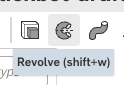
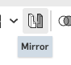

The torso gains shoulders and studs
====================================

The torso has been a plain box since page 1. This page gives it everything the rest of the robot
hangs off: a boss leaning out of each shoulder, a ball on the end of it, a ball under each hip and a
ball on top for the head. It also gives it five mate connectors, which are the five places the
assembly will join things to.

.. step: cad.hero
.. req: req.page.hero

Press **shift+7** for the corner view, where both shoulders show at once.

.. figure:: images/torso-joints/hero-01.png
   :alt: the finished torso from a corner: a shoulder standing out of each top corner, a ball on
         the neck, one on each shoulder and one under each hip
   :width: 1130px
   :class: shot

   **The body at the end of this page.** One part, with five balls on it. Every ball is the same
   ball, brought in from the ``ball and socket`` tab and put in five places.

Press **shift+1** to look at it from the front.

.. figure:: images/torso-joints/hero-02.png
   :alt: the same torso from the front, the five balls standing clear of it and the two shoulders
         cut off flush with the top
   :width: 1130px
   :class: shot

   **The same body, from the front.** The two shoulders match and the two hips match, because each
   pair is one part mirrored rather than two parts drawn.

This is the longest page in the guide, and it is long on purpose. The shoulder is built out of
geometry you can see and change: a line, a plane turned off another plane, and a rectangle leaning
against the line. A shorter way exists, and it hides the shoulder's angle inside numbers nobody can
read back.

Nine numbers go in along the way, and none of them is typed at the top of the page. Each arrives at
the step that first reads it, so you can see what it is for while you type it.

Two numbers to place the line
------------------------------

.. step: cad.parts.body.shoulders.pivot_variables
.. req: req.model.design_intent

Open the ``body`` tab. It is as page 1 left it, a block with ``torso outline`` and ``torso block``
in the feature list.

The shoulder starts from a short line at the torso's top corner, and two numbers say where that
line goes. No other tab reads either of them, so they belong to this tab rather than to
``robot sizes``.

Click **Search tools** at the right of the toolbar, or press **alt/⌥+c**, type ``variable``, and
pick **Variable**. Type ``shoulder_half`` into **Name** and ``#torsoW / 2`` into **Value**, then
press **Tab**. The title at the top of the dialog reads ``#shoulder_half = 36 mm``. That is the
torso's own side face, which is where a shoulder starts. Click the **green ✓**.

.. image:: images/torso-joints/parts.body.shoulders.pivot_variables-01.png
   :alt: the Variable dialog in the body tab, its title reading #shoulder_half = 36 mm,
         shoulder_half in the Name box and #torsoW / 2 in the Value box
   :class: shot

Do ``shoulder_drop`` the same way, at ``#torsoH / 12``. It comes to 8 mm, and it is how far below
the top corner the shoulder turns. Both rows land under ``torso block``.

.. image:: images/torso-joints/parts.body.shoulders.pivot_variables-02.png
   :alt: the body feature list with two new rows under torso block, reading #shoulder_half = 36 mm
         and #shoulder_drop = 8 mm
   :class: shot

Draw the line the shoulder turns about
---------------------------------------

.. step: cad.parts.body.shoulders.pivot_sketch
.. req: req.model.visible_geometry
.. req: req.page.view_keys

The shoulder turns about a line, and the line is worth drawing so you can see it. Pick the **Front**
plane in the feature list and open **Sketch**.

.. image:: images/toolbar/tb-sketch.png
   :alt: Close-up of the Sketch button at the left of the Part Studio toolbar, its tooltip reading
         Sketch
   :class: button

.. image:: images/torso-joints/parts.body.shoulders.pivot_sketch-01.png
   :alt: the body studio with the Front plane ringed in the feature list and lit up in the graphics
         area
   :class: shot

Name it ``pivot lines`` in the dialog's title before you draw anything. The plane field under the
title reads ``Front``.

.. image:: images/torso-joints/parts.body.shoulders.pivot_sketch-02.png
   :alt: the sketch dialog titled pivot lines, its plane field reading Front
   :class: shot

Press **n** to look square on at the plane. If the first press lands you on the far side, press it
again. The torso is a plain rectangle from here, with the origin at its middle.

Open **Line** and put the pointer inside the torso's outline, near its top right corner.

.. image:: images/torso-joints/parts.body.shoulders.pivot_sketch-03.png
   :alt: the line tool armed, the pointer inside the torso's outline near its top right corner
   :class: shot

Draw a short upright line there. Rough is fine; three dimensions will put it in place.

.. image:: images/torso-joints/parts.body.shoulders.pivot_sketch-04.png
   :alt: one short line standing upright inside the torso's outline, near its top right corner
   :class: shot

With the line still picked, press **q** to make it construction. It goes dashed. Construction
geometry guides other geometry and never becomes part of the solid, which is what this line is for.

.. image:: images/torso-joints/parts.body.shoulders.pivot_sketch-05.png
   :alt: the line now dashed rather than solid, which is what construction geometry looks like
   :class: shot

Now three dimensions, in this order: up, out, then long. Each one moves whatever it has not pinned
yet, so this order lets you aim every pick at a line that has not moved.

Dimension the origin to the line's top end at ``#torsoH / 2``. Put the label well to the left of
both points, which is what makes it the upright distance rather than the slant between them. It
reads 48.

.. image:: images/torso-joints/parts.body.shoulders.pivot_sketch-06.png
   :alt: the first dimension in, from the origin up to the top end of the line, reading 48
   :class: shot

Dimension the origin to the line itself at ``#shoulder_half``. It reads 36, and the line slides out
onto the torso's side face. Then dimension the line's own length at ``#shoulder_drop``. It reads 8,
and every line in the sketch goes black.

.. image:: images/torso-joints/parts.body.shoulders.pivot_sketch-07.png
   :alt: the third dimension in, the line 8 long, and every line black
   :class: shot

Accept it. ``pivot lines`` is the last row in the feature list, with one dashed line standing at the
torso's top right corner.

.. image:: images/torso-joints/parts.body.shoulders.pivot_sketch-08.png
   :alt: pivot lines the last row in the feature list, with one dashed line standing at the torso's
         top right corner
   :class: shot

.. admonition:: Why this sketch stands on Front and not on the torso
   :class: advice

   A sketch usually stands on a face of the robot, so that it follows the robot when the robot
   changes. This one needs the middle of the torso in depth, and there is no face there. ``Front``
   is that middle, so the sketch stands on it and takes its two lengths from variables instead.

One number for the swing
-------------------------

.. step: cad.parts.body.shoulders.yaw_variable
.. req: req.model.design_intent

The next dialog asks for an angle, so this one is an angle. Open **Variable** and pick **Angle**
along the top of the dialog instead of **Length**. That is what lets the value be typed in degrees.

.. image:: images/torso-joints/parts.body.shoulders.yaw_variable-01.png
   :alt: the Variable dialog with Angle picked instead of Length, which is what lets the value be
         typed in degrees
   :class: shot

Type ``yaw`` into **Name** and ``30 deg`` into **Value**. It is how far the arm swings forward from
square.

.. image:: images/torso-joints/parts.body.shoulders.yaw_variable-02.png
   :alt: the Variable dialog reading #yaw = 30 deg, with yaw in the Name box and 30 deg in the
         Value box
   :class: shot

The row lands under ``pivot lines``.

.. image:: images/torso-joints/parts.body.shoulders.yaw_variable-03.png
   :alt: #yaw = 30 deg the last row in the body feature list, under pivot lines
   :class: shot

Stand a plane on it
--------------------

.. step: cad.parts.body.shoulders.plane
.. req: req.model.design_intent
.. req: req.page.view_keys

The shoulder does not lean straight out to the side. It swings forward as well, and the way to say
that once is to draw the shoulder on a plane that is already turned. Press **shift+1** to look at
the torso from the front, then open **Plane** from the right of the Part Studio toolbar.

.. image:: images/torso-joints/parts.body.shoulders.plane-01.png
   :alt: the Plane dialog open, its Entities box empty and waiting
   :class: shot

Pick the pivot line first. Zoom in far enough to click the line itself rather than the face behind
it.

.. image:: images/torso-joints/parts.body.shoulders.plane-02.png
   :alt: the pivot line picked as the plane's first entity
   :class: shot

Pick **Front** as the second entity. A line and a plane make an angled plane, and the dialog changes
to **Line angle**: the new plane stands on the line and turns away from Front.

.. image:: images/torso-joints/parts.body.shoulders.plane-03.png
   :alt: the Front plane picked as the second entity, and the dialog reading Line angle
   :class: shot

Type ``#yaw`` into the angle box.

.. image:: images/torso-joints/parts.body.shoulders.plane-04.png
   :alt: #yaw typed into the plane's angle box, so the plane stands thirty degrees round from Front
   :class: shot

Name it ``plane for shoulder``.

.. image:: images/torso-joints/parts.body.shoulders.plane-05.png
   :alt: plane for shoulder typed into the dialog's name box
   :class: shot

Accept it. The plane stands on the line and cuts the corner of the torso.

.. image:: images/torso-joints/parts.body.shoulders.plane-06.png
   :alt: the new plane standing on the pivot line and turned away from Front, cutting the corner of
         the torso
   :class: shot

Four numbers for the profile
-----------------------------

.. step: cad.parts.body.shoulders.profile_variables
.. req: req.model.design_intent
.. req: req.page.typed_values

The next sketch draws the whole shoulder, boss and all, so it reads four numbers at once. Open
**Variable** four times.

The first is an angle again. Pick **Angle**, type ``tilt`` into **Name** and ``53 deg`` into
**Value**. It is how far the arm leans down from straight out.

.. image:: images/torso-joints/parts.body.shoulders.profile_variables-01.png
   :alt: the Variable dialog on Angle, tilt in the Name box and 53 deg in the Value box
   :class: shot

The other three are lengths, so put the dialog back on **Length**.

.. list-table::
   :header-rows: 1
   :widths: 22 34 44

   * - Name
     - Value
     - What it is
   * - ``shoulder_len``
     - ``#torsoH * 13 / 48``
     - how far the whole shoulder reaches, ball included
   * - ``boss_len``
     - ``#shoulder_len - #stand``
     - how far the boss reaches, which is the rest of it
   * - ``boss_d``
     - ``#ball * 4 / 3``
     - how thick the boss is, so there is material round the ball

.. image:: images/torso-joints/parts.body.shoulders.profile_variables-02.png
   :alt: the Variable dialog back on Length, its title reading #shoulder_len = 26 mm and
         #torsoH * 13 / 48 in the Value box
   :class: shot

They come to 26 mm, 16 mm and 16 mm, and the four rows land under ``plane for shoulder``.

.. image:: images/torso-joints/parts.body.shoulders.profile_variables-03.png
   :alt: the body feature list with four new rows under plane for shoulder, reading #tilt = 53 deg,
         #shoulder_len = 26 mm, #boss_len = 16 mm and #boss_d = 16 mm
   :class: shot

.. admonition:: A typed angle is not the same as a typed length
   :class: advice

   Every length on this page is written in terms of another length, so the whole shoulder grows when
   the robot does. ``#tilt`` and ``#yaw`` are typed, and that is right: an angle is exactly what
   stays the same when a length changes. Make the robot twice as big and the arm still leans 53°.

   These two are also the numbers on this page worth playing with. Change ``#tilt`` to 40 and watch
   both shoulders swing up together.

Draw the shoulder's profile
----------------------------

.. step: cad.parts.body.shoulders.profile_sketch
.. req: req.model.anchored
.. req: req.model.design_intent
.. req: req.page.view_keys

Pick ``plane for shoulder`` in the feature list and open **Sketch**.

.. image:: images/torso-joints/parts.body.shoulders.profile_sketch-01.png
   :alt: the body studio with plane for shoulder ringed in the feature list and lit up in the
         graphics area
   :class: shot

Name it ``torso shoulder profile``. The plane field reads ``plane for shoulder``.

.. image:: images/torso-joints/parts.body.shoulders.profile_sketch-02.png
   :alt: the sketch dialog titled torso shoulder profile, its plane field reading plane for shoulder
   :class: shot

Press **n** to look square on at the plane, twice if the first press lands you on the far side. The
pivot line is standing in the plane, with the torso behind it.

.. image:: images/torso-joints/parts.body.shoulders.profile_sketch-03.png
   :alt: the pivot line standing in the sketch plane, with the torso behind it
   :class: shot

The line belongs to the sketch before it, not to this one. Open **Use** from the **Search tools**
box and click the line. A copy of it arrives in this sketch, drawn in sketch color on top of the
line it came from.

.. image:: images/torso-joints/parts.body.shoulders.profile_sketch-04.png
   :alt: the pivot line copied into this sketch, drawn in sketch color on top of the line it came
         from
   :class: shot

Pick the copy and press **q**. It goes dashed, the same as the line it came from.

.. image:: images/torso-joints/parts.body.shoulders.profile_sketch-05.png
   :alt: the copied line dashed rather than solid, which is what construction geometry looks like
   :class: shot

.. admonition:: Use is what ties the shoulder to the torso
   :class: advice

   The rectangle you are about to draw stands on this copied line, and the line came off the torso.
   Move the torso and the whole shoulder follows, because everything here is measured from a line
   the torso owns.

   A rectangle placed by typed offsets instead lands in the same spot today and has to be worked out
   again the first time the robot changes size.

Open **Aligned rectangle** and put the pointer above the pivot line.

.. image:: images/toolbar/tb-rectangle.png
   :alt: Close-up of the Rectangle button in the Part Studio toolbar, its tooltip reading Rectangle
   :class: button

.. image:: images/torso-joints/parts.body.shoulders.profile_sketch-06.png
   :alt: the aligned rectangle tool armed, the pointer above the pivot line
   :class: shot

Draw a long thin rectangle lying across the line, near the angle it will end up at but not on it.
Three things hold it.

.. image:: images/torso-joints/parts.body.shoulders.profile_sketch-07.png
   :alt: a long thin rectangle lying across the pivot line, near the angle it will end up at but
         not on it
   :class: shot

Pick the pivot line's lower end and the rectangle's long side together. Press **shift+m** for
**Midpoint**. The rectangle slides along until that end is the middle of its long side. The boss
now reaches the same distance either side of where the arm turns.

.. image:: images/torso-joints/parts.body.shoulders.profile_sketch-08.png
   :alt: the rectangle slid along until the pivot line's lower end is the middle of its long side
   :class: shot

Dimension the long side ``2 * #boss_len``. It reads 32: a boss length each way from the pivot point.

.. image:: images/torso-joints/parts.body.shoulders.profile_sketch-09.png
   :alt: the long side dimensioned to 32, twice the length of the boss
   :class: shot

Dimension the angle between the long side and the pivot line as ``90 deg - #tilt``. Put the label in
the wedge between the two lines, up and inboard, and far enough out to clear the rectangle's far
side. It reads 37 degrees.

.. image:: images/torso-joints/parts.body.shoulders.profile_sketch-10.png
   :alt: the angle between the rectangle's long side and the pivot line dimensioned to 37 degrees
   :class: shot

Dimension the short side ``#boss_d / 2``. Half, not the whole: the revolve on the next step sweeps
this rectangle round its long side, so the short side is a radius. It reads 8, and every line goes
black.

.. image:: images/torso-joints/parts.body.shoulders.profile_sketch-11.png
   :alt: the short side dimensioned to 8, half the boss diameter, and every line black
   :class: shot

Accept it. The rectangle stands on the pivot line at the torso's corner.

.. image:: images/torso-joints/parts.body.shoulders.profile_sketch-12.png
   :alt: torso shoulder profile the last row in the feature list, its rectangle standing on the
         pivot line at the torso's corner
   :class: shot

.. admonition:: Where the shoulder's two angles live
   :class: advice

   ``#yaw`` is the angle of the plane. ``#tilt`` is a dimension in this sketch. Between them they
   are the whole aim of the arm, and both are on screen where you can find them and change them.

   That is what the line and the plane bought. A transform with two typed offsets in it would put
   the boss in the same place and tell a reader nothing about why it is there.

Spin it into a boss
--------------------

.. step: cad.parts.body.shoulders.revolve
.. req: req.model.named_features

Open **Revolve**.

.. image:: images/torso-joints/parts.body.shoulders.revolve-01.png
   :alt: the Revolve dialog open, waiting for something to revolve
   :class: shot

Pick the inside of the rectangle as the face to revolve.

.. image:: images/torso-joints/parts.body.shoulders.revolve-02.png
   :alt: the rectangle picked as the face to revolve
   :class: shot

Pick its long side as the axis. A round preview stands out from the torso's corner, turning about
the line the arm leans along, which is why the short side was a radius.

.. image:: images/torso-joints/parts.body.shoulders.revolve-03.png
   :alt: the long side picked as the axis, and a round preview standing out from the torso's corner
   :class: shot

Choose **New** and check that **Full revolve** is ticked. **New** makes the boss a part of its own,
which is what lets you mirror it before it joins the torso. **Full revolve** takes it all the way
round.

.. image:: images/torso-joints/parts.body.shoulders.revolve-04.png
   :alt: the Revolve dialog set to New with Full revolve ticked, so the shoulder arrives as a part
         of its own and goes all the way round
   :class: shot

Name it ``shoulder``.

.. image:: images/torso-joints/parts.body.shoulders.revolve-05.png
   :alt: shoulder typed into the dialog's name box
   :class: shot

Accept it. A round shoulder stands out of the torso's top corner.

.. image:: images/torso-joints/parts.body.shoulders.revolve-06.png
   :alt: a round shoulder standing out of the torso's top corner
   :class: shot

Put a connector on the end of it
---------------------------------

.. step: cad.parts.body.shoulders.connector
.. req: req.model.named_features
.. req: req.page.view_keys

The ball stud goes on the end of the boss, and it needs somewhere to aim at. Press **shift+7** for
the corner view, then the **up arrow** five times. Each press turns the camera fifteen degrees, and
five of them bring it round in front of the boss's flat end.

.. image:: images/torso-joints/parts.body.shoulders.connector-01.png
   :alt: the flat end of the boss facing the camera, a circle standing clear of the torso behind it
   :class: shot

Open **Mate connector**.

.. image:: images/toolbar/tb-mate-connector.png
   :alt: Close-up of the Custom features menu open, Mate connector near the bottom with its
         shortcut ctrl m beside it
   :class: button

.. image:: images/torso-joints/parts.body.shoulders.connector-02.png
   :alt: the Mate connector dialog open, its Origin entity box empty and waiting
   :class: shot

Click the boss's flat end, a few millimeters off its middle. Aimed at the middle, the pick takes the
center point Onshape offers there instead of the face. Either way the three arrows stand at the
middle of the circle: a connector picked on a full circle sits at its center.

.. image:: images/torso-joints/parts.body.shoulders.connector-03.png
   :alt: the boss's end picked, the connector's three arrows standing at the middle of it
   :class: shot

Name it ``mate for shoulder stud``.

.. image:: images/torso-joints/parts.body.shoulders.connector-04.png
   :alt: mate for shoulder stud typed into the dialog's name box
   :class: shot

Accept it. Its arrows stand on the end of the boss.

.. image:: images/torso-joints/parts.body.shoulders.connector-05.png
   :alt: mate for shoulder stud the last row in the feature list, its arrows standing on the end of
         the boss
   :class: shot

Mirror it to the other shoulder
--------------------------------

.. step: cad.parts.body.shoulders.mirror
.. req: req.model.same_structure

One shoulder is built and the other is a copy. Nothing about the second one is drawn. Press
**shift+7**, where both sides of the torso show, and open **Mirror**.

.. image:: images/torso-joints/parts.body.shoulders.mirror-01.png
   :alt: the Mirror dialog open, waiting for something to mirror
   :class: shot

Pick the shoulder in the parts list as the part to mirror.

.. image:: images/torso-joints/parts.body.shoulders.mirror-02.png
   :alt: the shoulder picked as the part to mirror
   :class: shot

Click **Mirror plane** and pick **Right**, the plane down the middle of the robot. A second shoulder
appears on the other side.

.. image:: images/torso-joints/parts.body.shoulders.mirror-03.png
   :alt: the Right plane picked as the mirror plane, with a second shoulder previewed on the other
         side
   :class: shot

The dialog arrives on **Add** with the torso already named as what to merge into, so there is
nothing to set here. Both bosses join the torso the moment the plane is picked, which is what the
cut two steps down the page needs.

Name it ``mirror shoulder``.

.. image:: images/torso-joints/parts.body.shoulders.mirror-04.png
   :alt: mirror shoulder typed into the dialog's name box
   :class: shot

Accept it. There is a shoulder standing out of each top corner, and the parts list holds one part.

.. image:: images/torso-joints/parts.body.shoulders.mirror-05.png
   :alt: a torso with a shoulder standing out of each top corner
   :class: shot

Draw the band to cut back
--------------------------

.. step: cad.parts.body.shoulders.trim_sketch
.. req: req.model.design_intent
.. req: req.page.view_keys

Each boss pokes a little above the torso's flat top. A band drawn across the top and cut away takes
both of them back level in one go. Pick **Front** in the feature list and open **Sketch**.

.. image:: images/torso-joints/parts.body.shoulders.trim_sketch-01.png
   :alt: the body studio with the Front plane ringed in the feature list and lit up in the graphics
         area
   :class: shot

Name it ``trim shoulder pattern``.

.. image:: images/torso-joints/parts.body.shoulders.trim_sketch-02.png
   :alt: the sketch dialog titled trim shoulder pattern, its plane field reading Front
   :class: shot

Press **n**, twice if the first press lands you on the far side. Open **Center point rectangle** and
put the pointer above the torso.

.. image:: images/torso-joints/parts.body.shoulders.trim_sketch-03.png
   :alt: the center point rectangle tool armed, the pointer above the torso
   :class: shot

Draw a wide flat rectangle above the torso. Make it wider than the torso, so it reaches past both
shoulders. Draw it clear of the top, so no corner of it snaps to an edge, and off to one side, so
the constraint that comes next has something to move.

.. image:: images/torso-joints/parts.body.shoulders.trim_sketch-04.png
   :alt: a wide flat rectangle sitting above the torso, wider than the torso and reaching past both
         shoulders
   :class: shot

Pick the rectangle's center point and the sketch origin together. Press **v** for **Vertical**. The
rectangle slides sideways until its center point stands straight above the origin.

.. image:: images/torso-joints/parts.body.shoulders.trim_sketch-05.png
   :alt: the rectangle slid sideways until its center point stands straight above the origin
   :class: shot

Dimension the origin to the rectangle's lower line at ``#torsoH / 2``. That is the torso's top face,
and it is what makes this a trim rather than a guess.

.. image:: images/torso-joints/parts.body.shoulders.trim_sketch-06.png
   :alt: the rectangle's lower edge pulled down onto the torso's top
   :class: shot

Dimension a side at ``#boss_d``. It reads 16, and no boss reaches further than that above the top
face.

.. image:: images/torso-joints/parts.body.shoulders.trim_sketch-07.png
   :alt: the rectangle dimensioned 16 tall, one boss diameter
   :class: shot

Dimension the upper line at ``#torsoW + 4 * #boss_d``. It reads 136, which reaches past both
shoulders at any size the robot is built at, and every line goes black.

.. image:: images/torso-joints/parts.body.shoulders.trim_sketch-08.png
   :alt: the rectangle 136 wide, reaching past both shoulders, and every line black
   :class: shot

Accept it. The band rests on the torso's top and crosses both shoulders.

.. image:: images/torso-joints/parts.body.shoulders.trim_sketch-09.png
   :alt: trim shoulder pattern the last row in the feature list, its rectangle resting on the
         torso's top and crossing both shoulders
   :class: shot

Cut the bosses level
---------------------

.. step: cad.parts.body.shoulders.trim
.. req: req.model.design_intent
.. req: req.page.view_keys

Press **shift+1** to look at the torso from the front, then open **Extrude**.

.. image:: images/toolbar/tb-extrude.png
   :alt: Close-up of the Extrude button in the Part Studio toolbar, its tooltip reading Extrude
   :class: button

.. image:: images/torso-joints/parts.body.shoulders.trim-01.png
   :alt: the Extrude dialog open, waiting for a region
   :class: shot

Pick the band as the region to extrude.

.. image:: images/torso-joints/parts.body.shoulders.trim-02.png
   :alt: the rectangle picked as the region to extrude
   :class: shot

Choose **Remove**, tick **Symmetric**, and type ``2 * #torsoD`` into the depth box. Symmetric sends
the cut both ways from Front, and twice the depth reaches through the torso and out the other side.

.. image:: images/torso-joints/parts.body.shoulders.trim-03.png
   :alt: the Extrude dialog on Remove, Symmetric ticked and its depth reading 2 * #torsoD, which
         reaches through the torso both ways
   :class: shot

Name it ``trim shoulder cut``.

.. image:: images/torso-joints/parts.body.shoulders.trim-04.png
   :alt: trim shoulder cut typed into the dialog's name box
   :class: shot

Accept it. Both shoulders are cut off flat, flush with the torso's top.

.. image:: images/torso-joints/parts.body.shoulders.trim-05.png
   :alt: both shoulders cut off flat, flush with the torso's top
   :class: shot

Two numbers for the hips
-------------------------

.. step: cad.parts.body.studs.hip_variables
.. req: req.model.design_intent

The hips are next, and a hip sits half a limb in from the side so that the leg's outside finishes
flush with the torso. That needs a number the limbs have not been built with yet.

Open ``robot sizes``. It holds the five rows tutorials 1 and 4 typed, with an empty one under them.

.. image:: images/torso-joints/parts.body.studs.hip_variables-01.png
   :alt: the robot sizes table as tutorial 4 left it, five rows and an empty one under them
   :class: shot

Type ``limbD`` into that row at ``#torsoH / 4``. It reads 24 mm. The limbs, the foot and the gripper
all read it later, so it belongs in the table rather than in one tab.

.. image:: images/torso-joints/parts.body.studs.hip_variables-02.png
   :alt: the table with limbD reading 24 mm under the rows the earlier tutorials typed
   :class: shot

Go back to the ``body`` tab and open **Variable**. Type ``hip_half`` into **Name** and
``#torsoW / 2 - #limbD / 2`` into **Value**. That is half the torso's width, less half a limb.

.. image:: images/torso-joints/parts.body.studs.hip_variables-03.png
   :alt: the Variable dialog in the body tab, its title reading #hip_half = 24 mm, hip_half in the
         Name box and #torsoW / 2 - #limbD / 2 in the Value box
   :class: shot

It reads 24 mm too, and that is a coincidence of this robot's shape rather than a rule. Drive
``#torsoW`` on its own and the two numbers part company.

.. image:: images/torso-joints/parts.body.studs.hip_variables-04.png
   :alt: the body feature list with #hip_half = 24 mm as its last row
   :class: shot

Mark where the hips go
-----------------------

.. step: cad.parts.body.studs.hip_sketch
.. req: req.model.anchored
.. req: req.page.view_keys

The rest of the page puts balls on the robot, and each one needs a place to stand. Press **shift+6**
to look at the torso from below, which is where the legs go. The flat underside fills the window.

.. image:: images/torso-joints/parts.body.studs.hip_sketch-01.png
   :alt: the torso from below, its flat underside filling the window
   :class: shot

Pick that face, open **Sketch** and name it ``hip stud location``. The plane field reads the face
you picked. Press **n** so the point lands where you think it lands.

.. image:: images/torso-joints/parts.body.studs.hip_sketch-02.png
   :alt: the sketch dialog titled hip stud location, its plane field reading the face that was
         picked
   :class: shot

Open **Point** from the **Search tools** box and put the pointer out to one side of the underside's
middle.

.. image:: images/torso-joints/parts.body.studs.hip_sketch-03.png
   :alt: the point tool armed, the pointer out to one side of the underside's middle
   :class: shot

Drop one point there, off to one side and off the axis.

.. image:: images/torso-joints/parts.body.studs.hip_sketch-04.png
   :alt: one point on the underside, off to one side and off the axis
   :class: shot

Pick the point and the sketch origin together and press **h** for **Horizontal**. The point slides
onto the axis, level with the origin, so the only thing left to say is how far out it sits.

.. image:: images/torso-joints/parts.body.studs.hip_sketch-05.png
   :alt: the point slid onto the axis, level with the origin
   :class: shot

Dimension it ``#hip_half`` out from the origin. It reads 24 and goes black.

.. image:: images/torso-joints/parts.body.studs.hip_sketch-06.png
   :alt: the point dimensioned 24 out from the origin, and black
   :class: shot

Accept it. One point stands on the torso's underside.

.. image:: images/torso-joints/parts.body.studs.hip_sketch-07.png
   :alt: hip stud location the last row in the feature list, one point standing on the torso's
         underside
   :class: shot

A connector on the hip point
-----------------------------

.. step: cad.parts.body.studs.hip_connector
.. req: req.model.named_features
.. req: req.page.view_keys

Press **shift+6** again, where the sketch put the point. It stands out to the right of the middle.

.. image:: images/torso-joints/parts.body.studs.hip_connector-01.png
   :alt: the torso from below with one point standing out to the right of the middle
   :class: shot

Open **Mate connector** and name it ``mate for hip stud`` before you pick anything. The dialog keeps
the name while you work.

.. image:: images/torso-joints/parts.body.studs.hip_connector-02.png
   :alt: the Mate connector dialog open and named mate for hip stud, its Origin entity box empty and
         waiting
   :class: shot

Click the point itself, not the face near it. The dialog reads ``Point``, and the three arrows stand
on it. Picking the point is what puts the connector exactly there.

.. image:: images/torso-joints/parts.body.studs.hip_connector-03.png
   :alt: the point picked, the connector's three arrows standing on it and the dialog reading Point
   :class: shot

Accept it. Its arrows stand out on the underside where a leg goes.

.. image:: images/torso-joints/parts.body.studs.hip_connector-04.png
   :alt: mate for hip stud the last row in the feature list, its arrows out on the underside where a
         leg goes
   :class: shot

Mark where the neck goes
-------------------------

.. step: cad.parts.body.studs.neck_sketch
.. req: req.model.anchored
.. req: req.page.view_keys

Press **shift+5** to look down on the torso's top, which is where the head goes. The two flats the
shoulders were cut down to are either side of it.

.. image:: images/torso-joints/parts.body.studs.neck_sketch-01.png
   :alt: the torso from above, its flat top filling the window with the two cut shoulders either
         side
   :class: shot

Pick the top face, open **Sketch** and name it ``neck stud location``. Press **n**.

.. image:: images/torso-joints/parts.body.studs.neck_sketch-02.png
   :alt: the sketch dialog titled neck stud location, its plane field reading the face that was
         picked
   :class: shot

Open **Point** and put the pointer right on the sketch origin.

.. image:: images/torso-joints/parts.body.studs.neck_sketch-03.png
   :alt: the point tool armed, the pointer right on the sketch origin
   :class: shot

Drop it there. It comes out black with no dimension at all: dropping a point on the origin is what
holds it there, and the middle of the face is where the neck goes.

.. image:: images/torso-joints/parts.body.studs.neck_sketch-04.png
   :alt: one point on the origin, black because dropping it there is what holds it there
   :class: shot

Accept it.

.. image:: images/torso-joints/parts.body.studs.neck_sketch-05.png
   :alt: neck stud location the last row in the feature list, one point standing in the middle of
         the torso's top
   :class: shot

A connector on the neck point
------------------------------

.. step: cad.parts.body.studs.neck_connector
.. req: req.model.named_features
.. req: req.page.view_keys

Press **shift+5** again, where the sketch put the point.

.. image:: images/torso-joints/parts.body.studs.neck_connector-01.png
   :alt: the torso from above with one point standing in the middle of the top face
   :class: shot

Open **Mate connector** and name it ``mate for neck stud`` first, the same as the last one.

.. image:: images/torso-joints/parts.body.studs.neck_connector-02.png
   :alt: the Mate connector dialog open and named mate for neck stud, its Origin entity box empty
         and waiting
   :class: shot

Click the point. The dialog reads ``Point``.

.. image:: images/torso-joints/parts.body.studs.neck_connector-03.png
   :alt: the point picked, the connector's three arrows standing in the middle of the top and the
         dialog reading Point
   :class: shot

Accept it. Its arrows stand where the head goes.

.. image:: images/torso-joints/parts.body.studs.neck_connector-04.png
   :alt: mate for neck stud the last row in the feature list, its arrows standing where the head
         goes
   :class: shot

Bring the ball stud in
-----------------------

.. step: cad.parts.body.studs.derive
.. req: req.model.derive
.. req: req.model.one_document

Three connectors stand on the torso and there is nothing on them yet. Press **shift+7**, where the
stud will show up when it arrives.

**Derived** is the tool page 5 used to bring the socket into the head. Open it from the
**Search tools** box. The dialog arrives with its **Select Part Studio** button red and empty,
**Placement** reading ``Base origin`` and both tick boxes ticked. Click the red button.

.. image:: images/toolbar/tb-derived.png
   :alt: Close-up of the Search tools panel with Derived typed into it, the Derived row matched on
         the left and its description on the right
   :class: button

.. image:: images/torso-joints/parts.body.studs.derive-01.png
   :alt: the Derived dialog open, its Select Part Studio button red and empty, Placement reading
         Base origin and both tick boxes ticked
   :class: shot

The panel opens on **Current document** and lists the other Part Studios in it.

.. image:: images/torso-joints/parts.body.studs.derive-02.png
   :alt: the Select Part Studio panel open on Current document, listing the other Part Studios in it
   :class: shot

Click the little arrow at the left of ``ball and socket``, not the name. The arrow opens the studio
and lists its two parts. The name takes the whole studio, which would bring the socket across as
well.

.. image:: images/torso-joints/parts.body.studs.derive-03.png
   :alt: the ball and socket studio opened by its caret, listing its two parts
   :class: shot

Click ``Ball stud``. The dialog fills with ``ball and socket``, and behind the panel the parts list
goes to ``torso`` and ``Ball stud``.

.. image:: images/torso-joints/parts.body.studs.derive-04.png
   :alt: Ball stud picked in the panel, the Derived dialog now reading ball and socket, and the
         parts list behind it reading torso and Ball stud
   :class: shot

Close the panel with the cross in its corner. Leave **Placement** on ``Base origin`` and
**Include mate connectors** ticked. The tick is what brings the stud's own connector across with it,
and the three steps after this one all read it.

.. image:: images/torso-joints/parts.body.studs.derive-05.png
   :alt: the Derived dialog with ball and socket in its Part Studio box, Placement on Base origin
         and Include mate connectors ticked
   :class: shot

Name it ``copy ball stud``.

.. image:: images/torso-joints/parts.body.studs.derive-06.png
   :alt: copy ball stud typed into the dialog's name box
   :class: shot

Accept it. The stud arrives at the origin, buried in the middle of the torso, waiting to be moved.

.. image:: images/torso-joints/parts.body.studs.derive-07.png
   :alt: the ball stud standing at the origin, buried in the middle of the torso, with copy ball
         stud the last row in the tree
   :class: shot

Move one onto the neck
-----------------------

.. step: cad.parts.body.studs.neck
.. req: req.model.design_intent
.. req: req.page.view_keys

Open ``copy ball stud`` in the feature list. ``stud connect to robot`` is under it: the connector
that came across with the part.

.. image:: images/torso-joints/parts.body.studs.neck-01.png
   :alt: copy ball stud opened in the tree, with stud connect to robot under it: the connector that
         came across with the part
   :class: shot

**Transform** moves a part. This one moves the stud by pointing one mate connector at another, so no
distance is typed. The dialog opens on **Translate by line** with its entity box empty.

.. image:: images/toolbar/tb-transform.png
   :alt: Close-up of the Transform button in the Part Studio toolbar, its tooltip reading Transform
   :class: button

.. image:: images/torso-joints/parts.body.studs.neck-02.png
   :alt: the Transform dialog open on Translate by line, its entity box empty
   :class: shot

Click ``Ball stud`` in the parts list to fill the entity box.

.. image:: images/torso-joints/parts.body.studs.neck-03.png
   :alt: Ball stud picked from the parts list into the Transform's entity box
   :class: shot

Open the list that says **Translate by line** and choose **Transform by mate connectors**. The
dialog changes and asks for a **From mate connector** and a **To mate connector**.

.. image:: images/torso-joints/parts.body.studs.neck-04.png
   :alt: Transform by mate connectors chosen, and the dialog now asking for a From mate connector
         and a To mate connector
   :class: shot

For **From**, pick ``stud connect to robot``, the row you just opened. That is the flat end of the
stud's stand, which is the part of it that sits on the robot.

.. image:: images/torso-joints/parts.body.studs.neck-05.png
   :alt: stud connect to robot picked as the From mate connector: the flat end of the stud's stand,
         which is what sits on the robot
   :class: shot

For **To**, pick ``mate for neck stud``. The stud goes down inside the torso with its ball out of
sight. Both connectors point out of their own material, so lining them up the plain way drives the
stud inward.

.. image:: images/torso-joints/parts.body.studs.neck-06.png
   :alt: mate for neck stud picked as the To mate connector, and the stud gone down inside the torso
         with its ball out of sight
   :class: shot

Under the **To mate connector** box are two small buttons. Hover the left one; its tooltip reads
**Flip primary axis**. Click it, and the stud stands on the torso's top with its ball above the
shoulders.

.. image:: images/torso-joints/parts.body.studs.neck-07.png
   :alt: Flip primary axis clicked, and the stud now standing on the torso's top with its ball above
         the shoulders
   :class: shot

Name it ``move neck stud``.

.. image:: images/torso-joints/parts.body.studs.neck-08.png
   :alt: move neck stud typed into the dialog's name box
   :class: shot

Accept it. Press **shift+7** and the stud is standing on top of the torso.

.. image:: images/torso-joints/parts.body.studs.neck-09.png
   :alt: the neck stud standing on top of the torso, and move neck stud the last row in the tree
   :class: shot

Copy one onto the hip
----------------------

.. step: cad.parts.body.studs.hip
.. req: req.model.design_intent
.. req: req.page.view_keys

The next two moves are the same move with **Copy part** ticked, so the stud already placed stays
where it is. Press **shift+7** again, so you can watch this one travel.

.. image:: images/torso-joints/parts.body.studs.hip-01.png
   :alt: the torso with its neck stud on, and copy ball stud still open in the tree
   :class: shot

Open **Transform** again. It arrives on **Translate by line** with an empty entity box, the same as
last time.

.. image:: images/torso-joints/parts.body.studs.hip-02.png
   :alt: the Transform dialog open on Translate by line, its entity box empty
   :class: shot

Click ``Ball stud`` in the parts list.

.. image:: images/torso-joints/parts.body.studs.hip-03.png
   :alt: Ball stud picked from the parts list into the Transform's entity box
   :class: shot

Choose **Transform by mate connectors**.

.. image:: images/torso-joints/parts.body.studs.hip-04.png
   :alt: Transform by mate connectors chosen, and the dialog now asking for a From mate connector
         and a To mate connector
   :class: shot

For **From**, pick ``stud connect to robot`` again.

.. image:: images/torso-joints/parts.body.studs.hip-05.png
   :alt: stud connect to robot picked as the From mate connector: the flat end of the stud's stand,
         which is what sits on the robot
   :class: shot

For **To**, pick ``mate for hip stud``. The stud moves down to the underside with its ball pointing
down, which is the way a leg hangs, so this one needs no flip.

.. image:: images/torso-joints/parts.body.studs.hip-06.png
   :alt: mate for hip stud picked as the To mate connector, and the stud moved down to the underside
         with its ball pointing down
   :class: shot

Tick **Copy part**. The neck stud comes back on top of the torso, with a second stud under it at the
hip.

.. image:: images/torso-joints/parts.body.studs.hip-07.png
   :alt: Copy part ticked, and the neck stud back on top of the torso with a second stud under it at
         the hip
   :class: shot

Name it ``copy for hip``.

.. image:: images/torso-joints/parts.body.studs.hip-08.png
   :alt: copy for hip typed into the dialog's name box
   :class: shot

Accept it. There is a stud under the torso at the left hip as well as the one on top, and both are
the same stud.

.. image:: images/torso-joints/parts.body.studs.hip-09.png
   :alt: a stud under the torso at the left hip as well as the one on top, and copy for hip the last
         row in the tree
   :class: shot

Copy one onto the shoulder
---------------------------

.. step: cad.parts.body.studs.shoulder
.. req: req.model.design_intent
.. req: req.page.view_keys

The connector at the end of the boss is still bare. Press **shift+7** once more.

.. image:: images/torso-joints/parts.body.studs.shoulder-01.png
   :alt: the torso with a neck stud and a hip stud on it
   :class: shot

Open **Transform** once more.

.. image:: images/torso-joints/parts.body.studs.shoulder-02.png
   :alt: the Transform dialog open on Translate by line, its entity box empty
   :class: shot

Click ``Ball stud`` in the parts list.

.. image:: images/torso-joints/parts.body.studs.shoulder-03.png
   :alt: Ball stud picked from the parts list into the Transform's entity box
   :class: shot

Choose **Transform by mate connectors**.

.. image:: images/torso-joints/parts.body.studs.shoulder-04.png
   :alt: Transform by mate connectors chosen, and the dialog now asking for a From mate connector
         and a To mate connector
   :class: shot

For **From**, pick ``stud connect to robot``.

.. image:: images/torso-joints/parts.body.studs.shoulder-05.png
   :alt: stud connect to robot picked as the From mate connector: the flat end of the stud's stand,
         which is what sits on the robot
   :class: shot

For **To**, pick ``mate for shoulder stud``. The stud sinks into the shoulder boss.

.. image:: images/torso-joints/parts.body.studs.shoulder-06.png
   :alt: mate for shoulder stud picked as the To mate connector, and the stud sunk into the shoulder
         boss
   :class: shot

Click **Flip primary axis**. The stud stands out of the end of the boss.

.. image:: images/torso-joints/parts.body.studs.shoulder-07.png
   :alt: Flip primary axis clicked, and the stud now standing out of the end of the shoulder boss
   :class: shot

Tick **Copy part**. All three studs are on the torso at once.

.. image:: images/torso-joints/parts.body.studs.shoulder-08.png
   :alt: Copy part ticked, and all three studs on the torso at once
   :class: shot

Name it ``copy for shoulder``.

.. image:: images/torso-joints/parts.body.studs.shoulder-09.png
   :alt: copy for shoulder typed into the dialog's name box
   :class: shot

Accept it. There are studs at the neck, the left hip and the left shoulder, and all three are the
same stud put in three places.

.. image:: images/torso-joints/parts.body.studs.shoulder-10.png
   :alt: studs at the neck, the left hip and the left shoulder, and copy for shoulder the last row
         in the tree
   :class: shot

.. admonition:: One part, three places, one tab to change it in
   :class: advice

   Nothing about the stud is drawn here. It was drawn once on page 4, brought in once by
   ``copy ball stud``, and pointed at three connectors. Change ``#ball`` in ``robot sizes`` and
   every one of these grows with it.

Mirror the hip and the shoulder
--------------------------------

.. step: cad.parts.body.studs.mirror
.. req: req.model.same_structure
.. req: req.page.view_keys

Two of the three have a partner on the other side. The neck's does not: it is on the middle line
already. Press **shift+7**, then the **up arrow** three times to drop the camera below the torso,
where the hip stud hangs clear of it.

.. image:: images/torso-joints/parts.body.studs.mirror-01.png
   :alt: the torso with three studs on it, one at the neck and one each at the left hip and the left
         shoulder
   :class: shot

Open **Mirror**. It arrives on **Part mirror** with its entity box empty.

.. image:: images/torso-joints/parts.body.studs.mirror-02.png
   :alt: the Mirror dialog open on Part mirror, its entity box empty
   :class: shot

Pick the hip's stud and the shoulder's. Leave the neck's alone, because it is already on the middle.

.. image:: images/torso-joints/parts.body.studs.mirror-03.png
   :alt: both studs picked, the neck one left out because it is already on the middle
   :class: shot

Pick **Right** as the mirror plane. A fourth and fifth stud stand on the other side of the torso.

.. image:: images/torso-joints/parts.body.studs.mirror-04.png
   :alt: Right picked as the mirror plane, and a fourth and fifth stud standing on the other side of
         the torso
   :class: shot

Choose **New** this time, not **Add**. The two copies stand as parts of their own rather than
melting into the torso, because the next step joins every ball to the torso in one go.

.. image:: images/torso-joints/parts.body.studs.mirror-05.png
   :alt: New chosen, so the two copies stand as parts of their own rather than melting into the
         torso
   :class: shot

Name it ``duplicate shoulder and hip``.

.. image:: images/torso-joints/parts.body.studs.mirror-06.png
   :alt: duplicate shoulder and hip typed into the dialog's name box
   :class: shot

Accept it. Five studs: one at the neck and one at each hip and each shoulder.

.. image:: images/torso-joints/parts.body.studs.mirror-07.png
   :alt: five studs on the torso, one at the neck and one at each hip and each shoulder
   :class: shot

Join them all to the torso
---------------------------

.. step: cad.parts.body.studs.combine
.. req: req.model.named_features
.. req: req.page.view_keys

Press **shift+1** to look at the front, where all five balls stand clear of the torso. The parts
list holds six parts: the torso and the five balls that touch it.

.. image:: images/torso-joints/parts.body.studs.combine-01.png
   :alt: the robot's body from the front, six parts: the torso and the five balls that touch it
   :class: shot

Open **Boolean**. It arrives on **Union** with its entity box empty.

.. image:: images/toolbar/tb-boolean.png
   :alt: Close-up of the Boolean button in the Part Studio toolbar, its tooltip reading Boolean
   :class: button

.. image:: images/torso-joints/parts.body.studs.combine-02.png
   :alt: the Boolean dialog open on Union, its entity box empty
   :class: shot

Pick the torso first. The part that comes out of a union keeps the name of the one picked first, and
this one has to stay ``torso``: the assembly and three later tutorials ask for it by that name.

.. image:: images/torso-joints/parts.body.studs.combine-03.png
   :alt: the torso picked first, so the part that comes out of the union keeps its name
   :class: shot

Then pick all five balls on the screen, one after another, with **Union** still chosen. Union joins
solids that touch into one.

.. image:: images/torso-joints/parts.body.studs.combine-04.png
   :alt: all five balls picked after the torso, one after another, with Union still chosen: it joins
         solids that touch into one
   :class: shot

Name it ``add neck to body``.

.. image:: images/torso-joints/parts.body.studs.combine-05.png
   :alt: add neck to body typed into the dialog's name box
   :class: shot

Accept it. One part, with a ball on the neck and on each shoulder and hip.

.. image:: images/torso-joints/parts.body.studs.combine-06.png
   :alt: the robot's body, one part, with a ball on the neck and on each shoulder and hip
   :class: shot

Name the five places the robot mates at
----------------------------------------

.. step: cad.parts.body.connectors.neck
.. req: req.model.named_features
.. req: req.page.view_keys

The connectors made earlier were scaffolding: they were there so the studs had somewhere to aim.
These five are the ones the assembly uses, and each one sits at the middle of a ball.

Press **shift+1**, where every ball stands clear of the torso, and open **Mate connector**.

.. image:: images/torso-joints/parts.body.connectors.neck-01.png
   :alt: the Mate connector dialog open, its Origin entity box empty and waiting
   :class: shot

Click the ball on top, where the head clips on. The three arrows stand at the middle of it: a
connector picked off a ball sits at its center, with no number typed.

.. image:: images/torso-joints/parts.body.connectors.neck-02.png
   :alt: the ball on top of the robot picked, and the connector's arrows standing at the middle of
         it: a connector picked off a ball sits at the middle of it, with no number typed
   :class: shot

Open the **Attachment** list, which reads ``To selection``, and set it to ``None``. The body then
holds the connector, rather than the one face it happened to be picked off.

.. image:: images/torso-joints/parts.body.connectors.neck-03.png
   :alt: Attachment set to None, so the body holds the connector rather than the one face it was
         picked off
   :class: shot

Name it ``neck``.

.. image:: images/torso-joints/parts.body.connectors.neck-04.png
   :alt: neck typed into the dialog's name box
   :class: shot

Accept it. Its arrows stand at the middle of the ball on top.

.. image:: images/torso-joints/parts.body.connectors.neck-05.png
   :alt: neck the last row in the feature list, its arrows at the middle of the ball on top
   :class: shot

Do the same four more times, one ball each.

.. step: cad.parts.body.connectors.l_shoulder

Press **shift+1** and open **Mate connector**.

.. image:: images/torso-joints/parts.body.connectors.l_shoulder-01.png
   :alt: the Mate connector dialog open, its Origin entity box empty and waiting
   :class: shot

Pick the ball out on the robot's left shoulder.

.. image:: images/torso-joints/parts.body.connectors.l_shoulder-02.png
   :alt: the ball on the robot's left shoulder picked, the arrows standing at the middle of it
   :class: shot

Set **Attachment** to ``None``.

.. image:: images/torso-joints/parts.body.connectors.l_shoulder-03.png
   :alt: Attachment set to None, so the body holds the connector rather than the one face it was
         picked off
   :class: shot

Name it ``left shoulder``.

.. image:: images/torso-joints/parts.body.connectors.l_shoulder-04.png
   :alt: left shoulder typed into the dialog's name box
   :class: shot

Accept it.

.. image:: images/torso-joints/parts.body.connectors.l_shoulder-05.png
   :alt: left shoulder the last row in the feature list, its arrows at the middle of the ball on
         that shoulder
   :class: shot

.. step: cad.parts.body.connectors.r_shoulder

Press **shift+1** and open **Mate connector**.

.. image:: images/torso-joints/parts.body.connectors.r_shoulder-01.png
   :alt: the Mate connector dialog open, its Origin entity box empty and waiting
   :class: shot

Pick the ball on the right shoulder.

.. image:: images/torso-joints/parts.body.connectors.r_shoulder-02.png
   :alt: the ball on the robot's right shoulder picked, the arrows standing at the middle of it
   :class: shot

Set **Attachment** to ``None``.

.. image:: images/torso-joints/parts.body.connectors.r_shoulder-03.png
   :alt: Attachment set to None, so the body holds the connector rather than the one face it was
         picked off
   :class: shot

Name it ``right shoulder``.

.. image:: images/torso-joints/parts.body.connectors.r_shoulder-04.png
   :alt: right shoulder typed into the dialog's name box
   :class: shot

Accept it.

.. image:: images/torso-joints/parts.body.connectors.r_shoulder-05.png
   :alt: right shoulder the last row in the feature list, its arrows at the middle of the ball on
         that shoulder
   :class: shot

.. step: cad.parts.body.connectors.l_hip

Press **shift+1** and open **Mate connector**.

.. image:: images/torso-joints/parts.body.connectors.l_hip-01.png
   :alt: the Mate connector dialog open, its Origin entity box empty and waiting
   :class: shot

Pick the ball under the left hip.

.. image:: images/torso-joints/parts.body.connectors.l_hip-02.png
   :alt: the ball under the robot's left hip picked, the arrows standing at the middle of it
   :class: shot

Set **Attachment** to ``None``.

.. image:: images/torso-joints/parts.body.connectors.l_hip-03.png
   :alt: Attachment set to None, so the body holds the connector rather than the one face it was
         picked off
   :class: shot

Name it ``left hip``.

.. image:: images/torso-joints/parts.body.connectors.l_hip-04.png
   :alt: left hip typed into the dialog's name box
   :class: shot

Accept it.

.. image:: images/torso-joints/parts.body.connectors.l_hip-05.png
   :alt: left hip the last row in the feature list, its arrows at the middle of the ball under that
         hip
   :class: shot

.. step: cad.parts.body.connectors.r_hip

Press **shift+1** and open **Mate connector**.

.. image:: images/torso-joints/parts.body.connectors.r_hip-01.png
   :alt: the Mate connector dialog open, its Origin entity box empty and waiting
   :class: shot

Pick the ball under the right hip.

.. image:: images/torso-joints/parts.body.connectors.r_hip-02.png
   :alt: the ball under the robot's right hip picked, the arrows standing at the middle of it
   :class: shot

Set **Attachment** to ``None``.

.. image:: images/torso-joints/parts.body.connectors.r_hip-03.png
   :alt: Attachment set to None, so the body holds the connector rather than the one face it was
         picked off
   :class: shot

Name it ``right hip``.

.. image:: images/torso-joints/parts.body.connectors.r_hip-04.png
   :alt: right hip typed into the dialog's name box
   :class: shot

Accept it.

.. image:: images/torso-joints/parts.body.connectors.r_hip-05.png
   :alt: right hip the last row in the feature list, its arrows at the middle of the ball under
         that hip
   :class: shot

.. admonition:: Attachment None is what keeps these five working
   :class: advice

   A connector left on ``To selection`` hangs off the one face it was picked from. Union, mirror and
   cut all replace faces, and a connector whose face has gone reports ``Cannot resolve entities``.

   On ``None`` the body holds it instead, and it survives whatever happens to the faces around it.
   Pages 7, 13 and 14 mate to these five by name, so it is worth being careful here.

   Left and right are the robot's, not yours. Facing the robot, its left shoulder is on your right.

Read the parts and the tree
----------------------------

.. step: cad.part_list

The parts list holds one part. The five studs are inside it now rather than beside it.

.. image:: images/torso-joints/part_list-01.png
   :alt: the parts list holding one part, torso, lit against the whole shape: the five studs are
         inside it now rather than beside it
   :class: shot

.. step: cad.tree

The feature list is long, and it reads as an account of the page. At the head are the numbers that
place the line, then the shoulder built from a line and a plane.

.. image:: images/torso-joints/tree-01.png
   :alt: the head of the feature list: the numbers first, then the shoulder built from a line and a
         plane
   :class: shot

At the foot is the stud, brought in and put in five places, then ``add neck to body`` and the five
connectors the assembly mates to. ``stud connect to robot`` sits under ``copy ball stud`` rather
than on its own, because it came across with the part instead of being made here.

.. image:: images/torso-joints/tree-02.png
   :alt: the foot of the same list: the stud brought in and put in five places, then add neck to
         body and the five connectors the assembly mates to
   :class: shot

Publish a version
------------------

.. step: cad.version
.. req: req.page.document

Click **Create version…** in the strip of icons down the far left. The dialog offers a name of its
own, already selected.

.. image:: images/toolbar/tb-create-version.png
   :alt: Close-up of the Create version button in the left icon strip, its tooltip reading Create
         version…
   :class: button

.. image:: images/torso-joints/version-01.png
   :alt: the Create version from Main dialog with the name Onshape offers already in the Name box
         and selected
   :class: shot

Type ``tutorial 6 - the torso gains shoulders and studs``, then click **Create**.

.. image:: images/torso-joints/version-02.png
   :alt: the same dialog with tutorial 6 - the torso gains shoulders and studs typed into the Name
         box
   :class: shot

The new version arrives at the top of the ``Versions and history`` panel.

.. image:: images/torso-joints/version-03.png
   :alt: the Versions and history panel listing Main with tutorial 6 - the torso gains shoulders and
         studs under it
   :class: shot

What you should be able to read off the body
---------------------------------------------

.. list-table::
   :header-rows: 1
   :widths: 40 32 28

   * - Check
     - Expected
     - Where to look
   * - parts in the tab
     - one, named ``torso``
     - the parts list
   * - the neck ball
     - on the middle line, 58 mm up
     - Measure, on the ball
   * - each hip ball
     - 24 mm out, 58 mm down
     - Measure, or ``#hip_half``
   * - each shoulder ball
     - out, forward and up from the corner
     - the front view, where the pair match
   * - every ball
     - 12 mm across
     - ``#ball`` in ``robot sizes``
   * - the torso's top
     - flat, with the shoulders cut level
     - the top view
   * - mate connectors for the assembly
     - five, one at each ball's middle
     - the feature list
   * - every sketch
     - black
     - the graphics area

Nothing on this page was typed as a length. The two angles were typed, and everything else came out
of ``#torsoH``, ``#torsoW`` and ``#ball``. That is what makes the shoulder worth building the long
way: change ``#tilt`` and both arms swing, and no other number has to be found and fixed.
