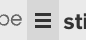
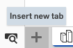
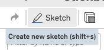
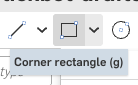
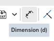
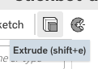

The torso, and the three numbers it is drawn from
==================================================

This is the first page, and it starts from nothing: an empty Onshape document. By the end of it
you have a **Variable Studio**. That is a tab holding numbers that every other tab can read.
You also have a torso, built from the three numbers you put in it.

.. step: cad.hero

.. figure:: images/torso/hero-01.png
   :alt: the finished torso, a shaded box seen from a corner, with the feature tree beside it
   :width: 1130px
   :class: shot

   **The torso.** Press **p** to hide the three planes, **shift+7** to look at it from a corner,
   and **f** to zoom until it fills the window. It is a box 72 mm wide, 48 mm deep and 96 mm tall,
   centered on the origin. Nothing is attached to it yet; the shoulders and the neck stud arrive on
   a later page, once the joint they use exists.

The shared numbers are the point of the page. Type one once, in one place, and every dimension
box in every tab from here on can take a **name** instead of a number: ``#torsoW`` for the
torso's width, ``#torsoH`` for its height. Change a number later and the whole robot changes
with it.

.. admonition:: The name in the title bar is not the one you typed
   :class: advice

   The pictures come from the documents this guide was built and checked in, and those have
   longer names than yours. Yours reads ``stickbot``. Everything else in the pictures is what
   you will see.

Start the document, and set the units
--------------------------------------

.. step: cad.document.units
.. req: req.page.units, req.page.document

Make a new Onshape document and name it ``stickbot``. Every page after this one comes looking for
that name.

.. image:: images/torso/document.units-01.png
   :alt: the empty document: Part Studio 1 and Assembly 1 on the tab strip, three default planes in
         the tree, and Parts (0)
   :class: shot

A new document arrives with two tabs already in it. A **Part Studio** is where parts get built, and
an **Assembly** is where they get put together. You use both, and you never need to make another
one of either.

It also arrives in **inches**, and you want millimeters. Click the **☰ menu** just left of the
document name.

Choose **Workspace units…**.

.. image:: images/torso/document.units-02.png
   :alt: the document menu open, with Workspace units… in it
   :class: shot

It opens on **Inch**, with **Display decimals** at ``0.123``.

.. image:: images/torso/document.units-03.png
   :alt: the Workspace units dialog as it arrives, Length default unit on Inch and Display
         decimals on 0.123
   :class: shot

Set **Length default unit** to **Millimeter** and **Display decimals** beside it to
``0.12345``. Five decimal places sounds fussy,
and it is the setting that lets you tell 4.996 from 4.9961 later on, when a joint's fit depends on
it. Leave the rows under **Angle** and **Mechanical** alone; this robot never asks for them.

.. image:: images/torso/document.units-04.png
   :alt: the same dialog with Length default unit on Millimeter and Display decimals on 0.12345
   :class: shot

Then click the **green ✓**. The red ✗ throws the change away and leaves you in inches. The dialog
closes and the document looks exactly as it did before, because a unit is not something you can
see. You find out it took the first time you type a size.

.. admonition:: Do this while the document is still empty
   :class: advice

   Units belong to the whole workspace rather than to one tab, so you set them once and never
   again. Opening this panel part-way through a sketch closes the sketch, which is a small
   annoyance you can skip entirely by doing it now.

Make the Variable Studio
-------------------------

.. step: cad.variables.studio

Click the **+** at the bottom left of the tab strip, the same button that makes a new Part Studio.

         Insert new tab
   :class: button

Choose **Create Variable Studio**.

.. image:: images/torso/variables.studio-01.png
   :alt: the tab strip's + menu open, with Create Variable Studio ringed
   :class: shot

You get a new tab holding an empty table. Its columns are **Name**, **Variable type**, **Value**
and **Description**.

.. image:: images/torso/variables.studio-02.png
   :alt: the new Variable Studio tab, its table empty with Name, Variable type, Value and
         Description columns
   :class: shot

Look along the bottom edge of that tab, at the control reading
**Insert into all Part Studios and Assemblies**.
It is the whole reason a Variable Studio is worth making, and the first one in a document arrives
with it already ticked.

.. image:: images/torso/variables.studio-03.png
   :alt: the Insert into all Part Studios and Assemblies control, its box holding a green tick
   :class: button

Ticked is what you want, so leave it alone. Untick it and the box empties, and the numbers stay
locked in this one tab where nothing else can read them.

.. image:: images/torso/variables.studio-04.png
   :alt: the same control clicked off, its box empty
   :class: button

.. admonition:: A second Variable Studio arrives unticked
   :class: advice

   Only the first one in a document is shared automatically. That is a good reason to keep one
   table rather than several, and it is also how a stray extra studio announces itself: its
   numbers reach nothing.

Type the three numbers
-----------------------

.. step: cad.variables.sizes

The table arrives empty, with one placeholder row waiting for a name.

.. image:: images/torso/variables.sizes-01.png
   :alt: the Variable Studio's table empty, one placeholder Name cell and nothing typed yet
   :class: shot

Click the empty **Name** cell, one click is enough on a row that does not exist yet, and type
``torsoH``. Leave the ``#`` off; Onshape puts it on when you use the name.

Press **Tab**. The row commits, its type is **Length**, and a fresh empty row appears underneath.
Now the **Value** cell. Double-click it, and if nothing happens double-click it again, because the
first click selects the cell and the second opens the box inside it. Type ``96 mm`` and press
**Enter**.

Do the same for the other two rows. Name, **Tab**, value, **Enter**.

.. list-table::
   :header-rows: 1
   :widths: 18 18 64

   * - Name
     - Value
     - What it means
   * - ``torsoH``
     - ``96 mm``
     - how tall the torso is, and the number the whole robot is sized from
   * - ``torsoW``
     - ``72 mm``
     - how wide it is, shoulder to shoulder
   * - ``torsoD``
     - ``48 mm``
     - how deep it is, front to back

Click somewhere empty below the table when you are done, so the last row is not still being
edited. You should see three rows of type **Length** and an empty one waiting underneath.

.. image:: images/torso/variables.sizes-02.png
   :alt: the table with torsoH, torsoW and torsoD typed, each on Length, reading 96 mm, 72 mm
         and 48 mm
   :class: shot

.. admonition:: The table grows as you go
   :class: advice

   Three numbers is what the torso is drawn from, and it is all this page asks you to type. A
   later page comes back to this tab and adds a row when the part it is building first needs
   one. By the end the table holds twenty-three.

.. admonition:: A value that reads in inches means the units did not take
   :class: advice

   Typing ``96 mm`` is always accepted, and in an inch document the cell then shows ``3.78 in``.
   The number underneath is right, so nothing breaks, but every later reading is in a unit you did
   not choose. Go back to **Workspace units…** and set Millimeter.

Name the Part Studio
---------------------

.. step: cad.parts.body.rename

Your document already has a Part Studio, made when the document was, and it is called
``Part Studio 1``. That is not a name. Right-click its tab along the bottom and choose **Rename**.

.. image:: images/torso/parts.body.rename-01.png
   :alt: the Part Studio tab's context menu, with Rename ringed
   :class: shot

Call it ``body``. Later pages ask for this tab by that name.

.. image:: images/torso/parts.body.rename-02.png
   :alt: the tab strip reading body, Variable Studio 1 and Assembly 1
   :class: shot

Rename it before you draw anything. Every picture you take in this tab from here on shows the tab
strip, and so does every screen you show a teacher.

Sketch the torso's outline
---------------------------

.. step: cad.parts.body.outline
.. req: req.page.view_keys, req.model.design_intent

Open the ``body`` tab. In the feature list on the left, click **Front** to select it.

.. image:: images/torso/parts.body.outline-01.png
   :alt: the feature list with the Front plane ringed
   :class: shot

Then click **Sketch** in the toolbar.

         Create new sketch shift+s
   :class: button

The sketch opens, and because Front was picked first, its **Sketch plane** field is already filled
in. You do not have to choose a plane in the dialog.

.. image:: images/torso/parts.body.outline-02.png
   :alt: the Sketch dialog, its plane field already reading Front
   :class: shot

Press **n** to look **n**\ ormal, which means square on, at the Front plane. The camera swings
around and the origin sits in the middle with the two axes crossing through it.

Look at the view cube in the top right corner, and at the sketch's name written on the plane. The
cube reads **Front** and the name reads the right way round, which is the side you are standing
on. A plane has two square-on views, and **n** is how you get from one to the other: press it
again and the cube reads **Back**, the name reads backwards, and you are looking at the same
sketch from behind. Press it once more to come back. Nothing you have drawn moves; only the
camera does.

Now name the sketch. Hover the dialog's title, ``Sketch 1``, and a small pencil appears to the
right of it. Click the pencil, and the title turns into a box you can type in. Change it to
``torso outline``. Naming a feature before you fill it in is a habit worth building, because the
tree stays readable even when a step goes wrong part-way through.

.. image:: images/torso/parts.body.outline-03.png
   :alt: the sketch dialog titled torso outline
   :class: shot

Open the small arrow beside the rectangle button.

         tooltip reading Corner rectangle g
   :class: button

There are three kinds, and you want **Center point rectangle**, the middle one. Move the pointer
onto the **origin**, the small circle where the two axes cross, and wait for it to light up before
you click.

.. image:: images/torso/parts.body.outline-04.png
   :alt: the rectangle tool armed, the pointer on the origin point
   :class: shot

Click the origin, then move out and click again. Starting at the origin is what makes the box come
out centered. The rectangle's middle is now fixed to the middle of the world, so you never have to
position it again.

.. image:: images/torso/parts.body.outline-05.png
   :alt: the rectangle drawn, centered on the origin, undimensioned
   :class: shot

The rectangle is blue, which means it can still be dragged; it has a middle but no size. Click
**Dimension**.

Click the left edge, then the right edge, then once more to drop the dimension somewhere you can
read it. A box opens with Onshape's guess at what you drew already in it. Do not type a number.
Type ``#torsoW`` and press **Enter**. The name turns into the number it holds, the dimension reads
``72``, and the rectangle snaps to that width. The small ``fx`` in front of it is Onshape saying
the number came from an expression rather than from your fingers.

.. image:: images/torso/parts.body.outline-06.png
   :alt: the width dimension reading 72 across the top edge
   :class: shot

Click **Dimension** again, because the tool turns itself off once a dimension is placed. Then do
the same from the top edge to the bottom edge, with ``#torsoH``. Two dimensions, and the rectangle
turns **black**. Black means fully defined: there is nothing left about this shape that Onshape
does not know, and nothing you can drag by accident.

.. image:: images/torso/parts.body.outline-07.png
   :alt: both dimensions on the rectangle, 72 across and 96 up
   :class: shot

Click the **green ✓**. The sketch closes and ``torso outline`` takes its place in the feature list.

.. image:: images/torso/parts.body.outline-08.png
   :alt: the closed sketch torso outline in the feature list
   :class: shot

.. admonition:: This is the payoff, and it is easy to miss
   :class: advice

   Nothing else on the screen shows that the Variable Studio did anything. It adds no feature to
   the tree, and this tab's own variable list stays empty, because that list reports only variables
   declared *here*. A name resolving in a dimension box is the visible proof that the table reached
   this tab, and it reached it without anybody typing anything into it.

Extrude it into a block
------------------------

.. step: cad.parts.body.block
.. req: req.page.view_keys

Press **shift+7** for the isometric view before you go on. What you are about to add is depth, and
depth is the one thing you cannot see from straight ahead. Then click **Extrude**.

         shift+e
   :class: button

The dialog opens with its first field waiting for you to pick something. The field is called
**Faces and sketch regions to extrude**. Move the pointer inside the rectangle, into the middle of
the region rather than onto one of its edges.

.. image:: images/torso/parts.body.block-01.png
   :alt: the pointer inside the torso outline region, before the click
   :class: shot

Click. The field fills in with ``Face of torso outline``, the region turns orange, and a preview
grows out of the plane in one direction.

.. image:: images/torso/parts.body.block-02.png
   :alt: the region picked, drawn in orange
   :class: shot

Name this one ``torso block`` from the dialog's pencil, the same habit as the sketch. Then tick
**Symmetric**, and watch the preview. It stops growing one way out of the Front plane and
straddles it instead, half the depth each side.

.. image:: images/torso/parts.body.block-03.png
   :alt: the Extrude dialog with Symmetric ticked
   :class: shot

Symmetric is worth the extra click. The torso ends up centered on the origin in all three
directions. Everything mated to it later, the head above and an arm on each side, is then measured
from the middle rather than from a face.

Now click into **Depth** and type ``#torsoD``, the third of your three numbers. The preview grows
to 48 mm, 24 mm forward of the Front plane and 24 mm behind it; symmetric splits the depth rather
than doubling it.

.. image:: images/torso/parts.body.block-04.png
   :alt: the depth field reading the variable name
   :class: shot

Click the **green ✓**. One more name to fix: down in **Parts**, the solid you just made is called
``Part 1``. Right-click it, choose **Rename**, and call it ``torso``.

.. image:: images/torso/parts.body.block-05.png
   :alt: the parts list holding one part called torso
   :class: shot

That is the whole part: one box, standing on the origin, built from three numbers you can change.

Name the Variable Studio too
-----------------------------

.. step: cad.variables.rename

The tab holding your three numbers is still called ``Variable Studio 1``. Right-click it and
choose **Rename**.

.. image:: images/torso/variables.rename-01.png
   :alt: the right-click menu on the Variable Studio 1 tab, with Rename ringed
   :class: shot

Call it ``robot sizes``. Your three tabs now read ``body``, ``robot sizes`` and ``Assembly 1``.

.. image:: images/torso/variables.rename-02.png
   :alt: the tab strip reading body, robot sizes and Assembly 1
   :class: shot

.. admonition:: Change one number and watch
   :class: advice

   Open ``robot sizes`` and change ``torsoW`` to ``50``. Come back to ``body``. The box is
   narrower, still centered, still fully defined, and you did not touch the sketch. Put it back to
   ``72`` when you have had a look; the rest of the robot is built around that.

   That is the test of whether a model is any good: change a driving number and see whether the
   model follows. One built out of typed numbers does not follow.

Check the tree
---------------

.. step: cad.tree

Look back at the picture at the top of this page, at the list down the left of it. Yours should
read the same way: **Default geometry**, then ``torso outline``, then ``torso block``, and under
**Parts (1)** a single part called ``torso``. Two named features, one named part, and no
``Sketch 1`` or ``Extrude 1`` anywhere.

Publish a version
------------------

.. step: cad.version
.. req: req.page.document

Look at the strip of icons down the far left. Click **Create version…**, the second one, under
**Versions and history**.

.. image:: images/toolbar/tb-create-version.png
   :alt: Close-up of the Create version button in the left icon strip, its tooltip reading Create
         version…
   :class: button

The dialog opens with a name of Onshape's own already in the box. It is selected, so whatever you
type replaces it.

.. image:: images/torso/version-01.png
   :alt: the Create version dialog, with a name of Onshape's own already in the Name box and
         selected
   :class: shot

Type a name you will recognize instead. This document's is
``tutorial 1 - variables and torso``. Then click **Create**.

.. image:: images/torso/version-02.png
   :alt: the same dialog with tutorial 1 - variables and torso typed into the Name box
   :class: shot

Open **Versions and history**, the icon just above the one you used to make the version. The
new version is in the list under **Main**, above the ``Start`` that Onshape made with the
document. The list shows as much of the name as fits.

.. image:: images/torso/version-03.png
   :alt: the Versions and history panel, Main at the top, then the new version, then Start
   :class: shot

A version is a snapshot that can never change. That is what
makes it safe to point at. It is also why later pages ask for a version of this document, and not
for the workspace you are still editing.

What you should be able to read off the model
----------------------------------------------

.. list-table::
   :header-rows: 1
   :widths: 42 28 30

   * - Check
     - Expected
     - Where to look
   * - the box
     - 72 mm × 48 mm × 96 mm
     - the bounding box
   * - and where it sits
     - x ±36 mm, y ±24 mm, z ±48 mm
     - the same box; it is centered on the origin
   * - parts in the tab
     - one, named ``torso``
     - the **Parts** list
   * - the sketch
     - fully defined
     - its color, and the tree

A document in millimeters, three numbers every tab can read, and a torso sitting on the origin.
Two features, both named. One part, named.

The next page builds the head. It types numbers of its own, one at a time, each one right
before the shape it drives.
